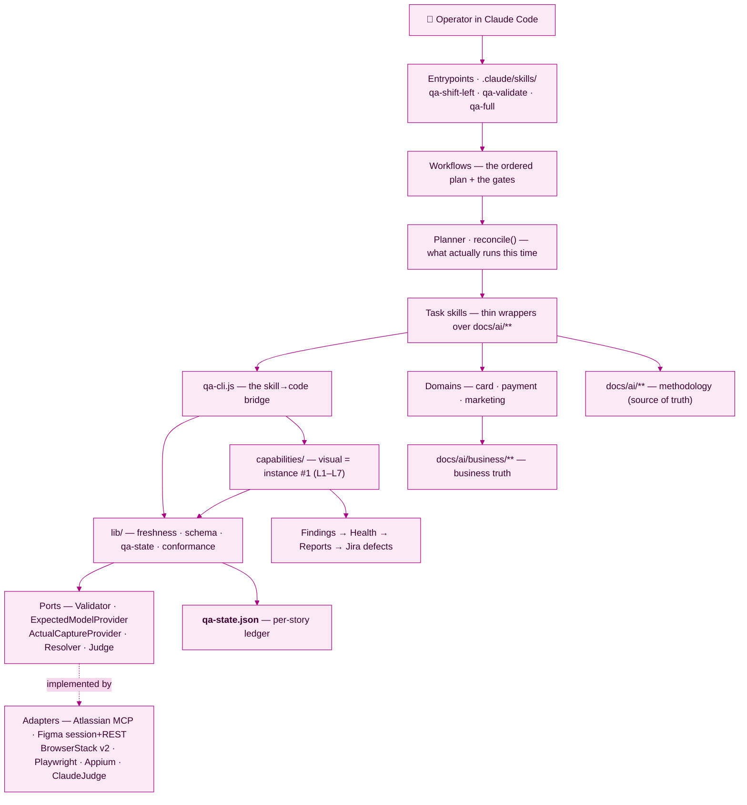
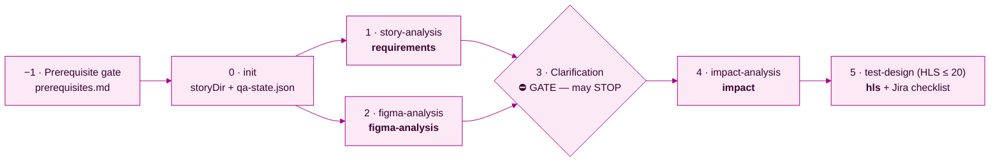
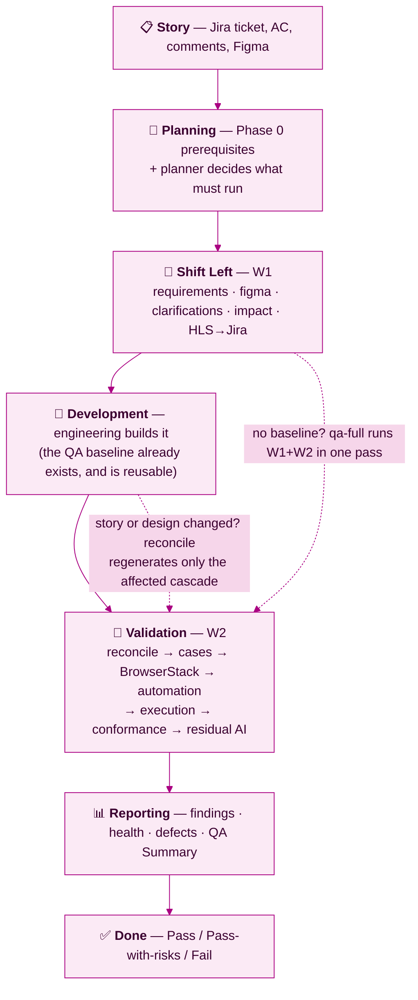
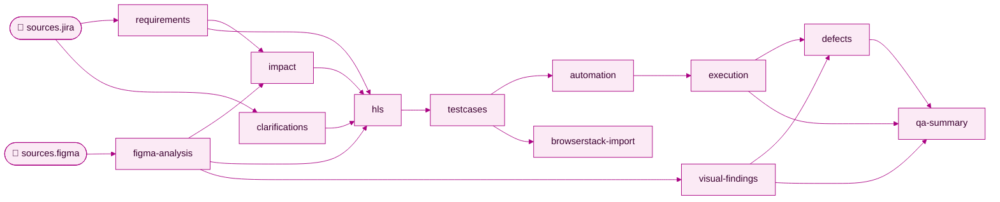
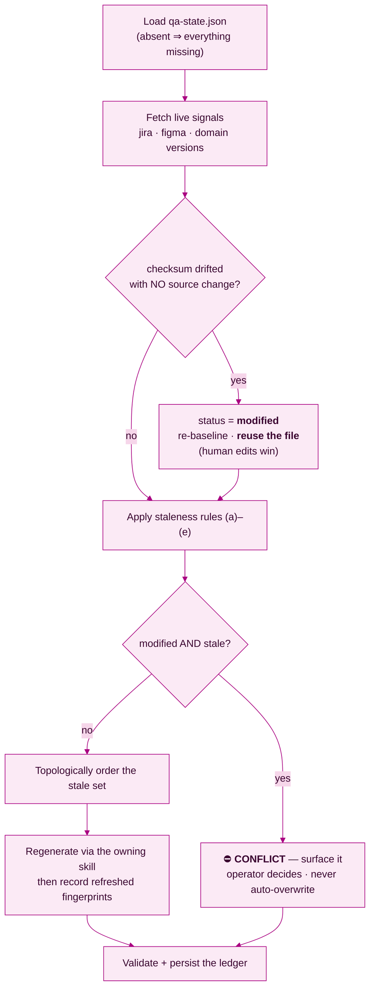
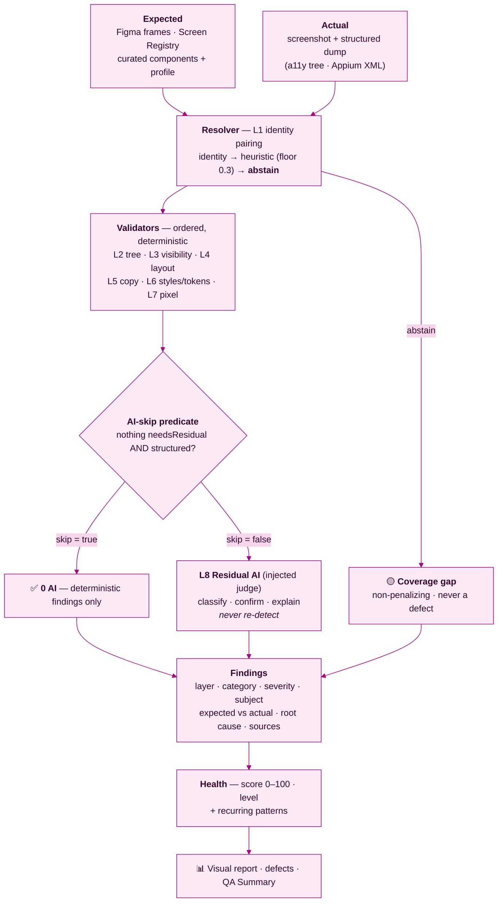
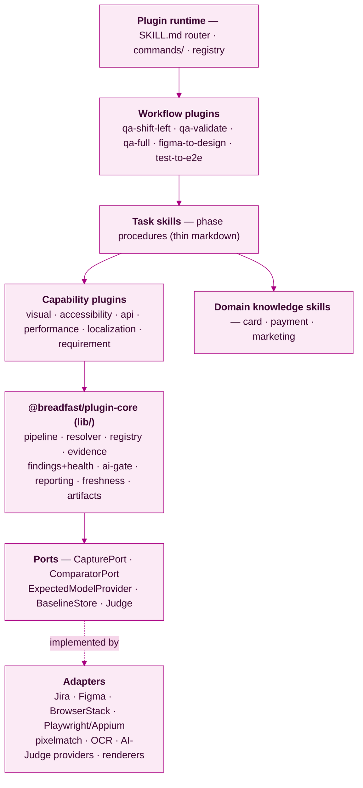

# 🟣 Breadfast QA Platform — Engineering Handbook

> **Breadfast Engineering · Quality Engineering**
> **Status:** canonical entry point for this repository. Read this first; read ADRs for the spec.
> **Audience:** QA engineers, SDETs, engineers joining the QA Platform — and the AI agents that run it.
> **Accent:** Breadfast Magenta `#AA0082`, the brand colour recorded in [`docs/ai/business/products.md`](docs/ai/business/products.md). It themes every diagram here.

> 🟣 **THE ONE-PARAGRAPH VERSION**
> Breadfast QA is a **story-scoped, artifact-based QA engine driven from Claude Code**. Three workflows
> (`/qa-shift-left`, `/qa-validate`, `/qa-full`) run the same **seven-phase methodology** over the same
> **planner** and the same **artifact ledger** (`qa-state.json`). Analysis is produced once and *reused
> unless its source actually changed*. Design conformance is decided by a **deterministic Conformance
> Engine** (L1–L7); the LLM is confined to the **residual** it cannot evaluate. Everything is shaped to
> move into the **Breadfast QA Plugin** as moves, not a rewrite.

---

## Contents

**1** [🧭 Vision](#1--vision) — why this exists · **2** [🏗 Architecture](#2--architecture-overview) — every
subsystem and how they interact · **3** [🚀 Quickstart](#3--quickstart) — run a story now ·
**4** [🔁 The Three Workflows](#4--the-three-official-workflows) — shift-left, validation, full ·
**5** [🧬 Artifact System](#5--the-artifact-system) — freshness, DAG, reuse ·
**6** [🧮 Conformance Engine](#6--the-conformance-engine) — deterministic-first, AI residual ·
**7** [🛠 Way of Working](#7--way-of-working) — read before your first PR ·
**8** [🗂 Repository Tour](#8--repository-tour) · **9** [🔌 Future QA Plugin](#9--the-future-breadfast-qa-plugin)
· **10** [🧑‍🚀 New Engineer Journey](#10--new-engineer-journey) · **11** [🔍 Debugging](#11--debugging) ·
**12** [📎 Appendix](#12--appendix)

---

# 1 · 🧭 Vision

## 1.1 The problem we had

QA on a Breadfast story is a **lifecycle**, not an activity: read the story and its comments, interrogate
the ambiguity, read the Figma, decide what "correct" means, design coverage, publish it, seed data, drive
four platform × locale combos, compare every screen to its design, file grounded defects, produce a
defensible verdict. By hand, that has four chronic failure modes:

| Failure mode | What it looks like |
|---|---|
| **Analysis is thrown away** | requirements/Figma/impact work redone at full cost every retest — nothing recorded *what it was derived from* |
| **Verdicts aren't reproducible** | "does this match the design?" answered by eyeball or unconstrained LLM; different answer each day, nothing to audit |
| **QA starts too late** | ambiguity found during execution (costs a bug and a sprint) instead of grooming (costs a question) |
| **Runs die on the trivial** | a missing folder id, unseeded data, a wrong API version — reported as *"blocked"* after a full analysis pass was paid for |

## 1.2 What we built instead

1. **QA artifacts as a build system.** Every artifact records the **fingerprints of its inputs**; a later run
   invalidates only what changed and regenerates the minimal set plus its cascade. Analysis becomes an asset.
2. **Deterministic conformance; AI as residual.** An ordered pipeline of deterministic validators decides
   conformance; the LLM runs **only** where determinism is impossible.
3. **Split at the implementation boundary.** Shift-left produces the reusable baseline and publishes scenarios
   to Jira *before* code lands; post-dev reconciles that baseline and validates the delivery.
4. **Never block; always ask.** A prerequisite gate runs *first*, proves each access item with one real
   authenticated call, and asks for what's missing **in a single batch**.

## 1.3 How this differs from traditional QA automation

| | Traditional | Breadfast QA Platform |
|---|---|---|
| **Unit of work · scope** | a test script, execution only | a **story**, Phases 0–6: prerequisites → requirements → design → test design → execution → visual → summary |
| **State / re-runs** | none; redo everything | `qa-state.json` ledger; **reconcile** reuses what's valid and regenerates the stale cascade |
| **Design validation** | pixel-diff or an eyeball | **L1–L7 deterministic pyramid**, AI on the residual |
| **AI's role** | absent, or the whole judgement | orchestrator + **residual** classifier, never the detector |
| **Human edits** | overwritten | **authoritative** — edits win; edit + source change ⇒ **conflict** |
| **Failures · gaps** | pass/fail; gaps silently pass | grounded findings, severity **derived by rule**, cited to an AC or frame; gaps reported as non-penalizing |
| **Extensibility** | a new script per case | a new **capability** in one engine (visual = instance #1) |

## 1.4 The principles everything follows

> 🟣 **Load-bearing.** A change that violates one changes the platform's identity — that needs an ADR.

| # | Principle | Consequence |
|---|---|---|
| 1 | **Deterministic-first** | exact reproducible checks preferred; AI only where determinism is impossible |
| 2 | **Evidence-based** | no claim without a persisted artifact |
| 3 | **Traceable** | every finding cites what it violates (AC · design element · rule) and its origin |
| 4 | **Explainable** | severity and root cause derived **by rule** — same evidence ⇒ same verdict |
| 5 | **Coverage gap ≠ defect** | "we couldn't check this" is a gap, never a failure |
| 6 | **Scope is a fact about the app** | platforms × locales established against the real app in Phase 0 |
| 7 | **Ask, never block** | a run may end "asked, awaiting X"; never "blocked on X" unasked |
| 8 | **One home per fact** | methodology in `docs/ai/**`; business rules in `domains/`; orchestration in workflows; contracts in ADRs |

Authority: [`QA_PROCESS.md`](docs/ai/QA_PROCESS.md) (1–6) · [`CLAUDE.md`](CLAUDE.md) (6–8).

---

# 2 · 🏗 Architecture Overview

## 2.1 The two planes

| Plane | Language | Holds | Executed by |
|---|---|---|---|
| **Skill / workflow** | Markdown | orchestration + knowledge: *what*, in what order, with which gates | Claude Code (agent-followed) |
| **Code** | Zero-dependency Node | deterministic engines: freshness, schema, conformance, capabilities | `node qa-workflow/bin/qa-cli.js …` |

Markdown orchestrates; **code decides.** A skill never re-implements engine logic in prose; the engine never
holds orchestration. Comparison logic living in a prompt is a bug — the fork ADR-003 closed.

## 2.2 Platform map



Arrows are **dependency direction**: everything points down toward the code plane and its ports; adapters
implement ports and are never imported by the core. Fallback rule: **the core never imports a capability.**

## 2.3 Subsystem catalog

| Subsystem | What it is today | Where |
|---|---|---|
| **QA Workflow** | three workflows + nine task skills + thin entrypoints | [`workflows/`](qa-workflow/workflows/) · [`skills/`](qa-workflow/skills/) |
| **Planner** | `reconcile()` — sorts artifacts into `reuse / stale / modified / conflicts` with reasons, then topologically orders the work | [`reconcile.js`](qa-workflow/lib/freshness/reconcile.js) |
| **Freshness Engine + DAG** | fingerprints sources + artifacts, detects human edits, cascades invalidation through the declared graph | [`lib/freshness/`](qa-workflow/lib/freshness/) |
| **Artifact Ledger** | `qa-state.json` — source fingerprints + one record per artifact | [`qa-state.js`](qa-workflow/lib/qa-state.js) |
| **Conformance Engine** | Expected → Resolver → Validators → AI residual gate → Findings → Health | [`lib/conformance/`](qa-workflow/lib/conformance/) |
| **Capabilities** | a concrete `(Expected, Actual, Validators)` triple; visual = #1 | [`capabilities/visual/`](qa-workflow/capabilities/visual/) |
| **AI Residual** | L8 — runs only over the residual worklist via an injected judge | [`residual.js`](qa-workflow/lib/conformance/residual.js) |
| **Screen Registry** | `screenId` → frames per platform/locale + curated components + profile | [`docs/ai/screens/`](docs/ai/screens/) |
| **Jira · Figma · BrowserStack** | Atlassian MCP (story, HLS, defects) · capture with browser session **PRIMARY**, REST fallback, MCP last · Test Management **API v2** + App Automate | MCP · [`figma-connect.js`](qa-workflow/bin/figma-connect.js) · [`automation/`](automation/) |
| **Automation** | generated **inside the Java framework** (web→Selenium, mobile→Appium; path configurable, default `D:\projects`); legacy Playwright at `D:\Playwright\b55168_pom` maintained, new Playwright on explicit request only | [automation-generation.md](docs/ai/automation/automation-generation.md) · [`automation/`](automation/) |
| **Reporting** | per-screen verdicts, findings, patterns, gaps, health, QA Summary | [`finding.js`](qa-workflow/lib/conformance/finding.js) |
| **Execution engine** | one continuous session owns one browser/app session per story | [execution-engine.md](docs/ai/execution-engine.md) |

Authorities: ADR-001 (workflow) · [artifact contract](docs/ai/architecture/qa-artifact-contract.md) (planner,
freshness, ledger) · ADR-003 (conformance) · QA_PROCESS 5–6 (reporting).

## 2.4 How they interact on one run

An operator runs `/qa-validate`; the **workflow** clears **Phase 0**, then hands live Jira + Figma signals to
the **planner**, which returns `reuse / stale / modified / conflicts`. Only the stale set is regenerated —
each by its **skill**, as a subagent returning an artifact path recorded into the **ledger**. Execution
captures screenshots + structured dumps; the **Conformance Engine** runs L1–L7 deterministically and L8 on the
residual only; the workflow files defects and writes the QA Summary. Per-step flows:
[§5.5](#55-the-planner-algorithm) and [§6.1](#61-the-reframe--the-load-bearing-idea).

## 2.5 The invariants holding this shape

The **core never imports a capability** (else visual becomes a special case and capability #2 needs a
redesign); a **capability depends on the core, never the reverse** (which keeps the core portable into the
plugin); the **core depends on ports, never adapters** (so transports swap with zero engine change); a
**markdown skill holds no engine logic** (the LLM orchestrates, it does not compare); a **workflow never
reaches into core internals** (it talks to skills and `qa-cli`); and there is **one** freshness engine, **one**
registry framework, **one** finding model — a second is prohibited (ADR-001 rejected exactly that).

---

# 3 · 🚀 Quickstart

## 3.1 One-time setup

1. **Open the repo root in Claude Code** (VS Code extension). The three workflow entrypoints — plus the
   `grill-me` clarification skill they call — live in [`.claude/skills/`](.claude/skills/) and are discovered
   **only when the repo root is the open folder**.
2. **Node.js 18+** (verified on v22.12). `qa-workflow/` is **zero-dependency**; root `package.json` deps are
   for *automation execution*, not the engine.
3. **Authenticate your MCP connectors** — **Jira (Atlassian)**, **Figma**, **Slack** (per-user, via
   claude.ai connector settings or `/mcp`). Without them a run can't fetch the story, export the design, or
   read login OTPs.
4. **Credentials** for Jira/BrowserStack writes are wired through
   [`automation/config/credentials.js`](automation/config/credentials.js) — **the loader comes first**, so
   nothing already configured is ever asked for. A value that is genuinely missing, or that fails its Phase 0
   verification call, is **asked for in the batch** — never treated as a blocker.

## 3.2 Verify your install

```bash
shopt -s globstar                            # bash / Git Bash
node --test qa-workflow/**/*.test.js
```

Expect **128 tests pass, 0 fail** (verified 2026-07-27, Node v22.12 — `node:test`, no framework). Narrower:
`qa-workflow/lib/**/*.test.js` (machinery, 62) · `qa-workflow/capabilities/visual/**/*.test.js` (visual, ~46).

## 3.3 Pick your entrypoint

| Your situation | Command | Stops to ask? |
|---|---|---|
| Story groomed, **not built yet** | `/qa-shift-left B10-XXXXX` | yes — at the clarification gate |
| Built, and a baseline **exists** | `/qa-validate B10-XXXXX` | only on a conflict or genuine blocker |
| Built, **no baseline exists** | `/qa-full B10-XXXXX` | once, at the clarification gate |

All three write to `D:\breadfast-qa\<TICKET>\` and record into that story's `qa-state.json`. `/qa-validate`
**does not redo analysis** unless Jira or Figma actually changed.

> 🟣 **`grill-me` is not a fourth entrypoint — it *is* the clarification phase.** W1/W3 invoke it **inline and
> automatically** at Step 3 and will not proceed until scope is locked, and reconcile re-fires it only when a
> Jira change is **material** ([§5.5](#55-the-planner-algorithm)). Invoking it directly is for ad-hoc
> interrogation outside a run.

## 3.4 The CLI surface

| Command | What it does |
|---|---|
| `init <storyDir> <TICKET>` | create the story folder + a `qa-state.json` skeleton |
| `show <storyDir>` | print the ledger — artifacts, status, generators, fingerprints |
| `reconcile <storyDir> [--figma-file/--figma-nodes/--figma-version] [--immaterial] [--apply-modified]` | **the planner.** Live Jira JSON on stdin; prints `{ reuse, stale, modified, conflicts, reasons }` |
| `record <storyDir> <key> --path <rel> --generator <skill@x.y> [--derive-sources] [--derive-artifacts] [--domains]` | register an artifact with the fingerprints it derives from |
| `fingerprint-jira` · `fingerprint-figma` · `checksum` | the primitives those two are built on |
| `figma-export --url <figmaUrl> (--story\|--out) [--scale 2] [--page N] [--nodes a:b]` | REST frame export at 2× (**fallback** channel); prints a manifest + `framesHash` |
| `visual-compare [--in <file>]` | the **deterministic** pipeline over `{expected, actual}`. **No AI** |
| `visual-evaluate [--in <file>] [--judge claude] [--figma-url <url>]` | full flow: registry-driven expected → L1–L7 → **L8 residual only** with `--judge claude` |

```bash
node qa-workflow/bin/qa-cli.js show "B10-XXXXX"        # what state is this story in?
node qa-workflow/bin/qa-cli.js reconcile "B10-XXXXX"   # what would a re-run actually redo?
```

---

# 4 · 🔁 The Three Official Workflows

> 🟣 **All three run the same machine** — same seven phases, same task skills, same planner, same ledger,
> same contract. They differ only in the lifecycle slice they cover and where they may stop. Workflow 3 owns
> **no phase logic of its own**.

## 4.1 Shared anatomy

| Element | Rule |
|---|---|
| **Phase 0 first, then gates** | the prerequisite gate runs before everything — access, destinations, targets, test data, backend state, design links, locale scope — each access item proved by **one real authenticated call**, writing `prerequisites.md`. No phase is entered until the previous gate passes |
| **Subagent model** | read-heavy phases run as **subagents returning the artifact by path** + a compact summary, never full content; browser-touching phases run **inline** (a subagent may get its own browser) |
| **Record everything** | every artifact goes through `qa-cli record` with `derivedFrom`, stamped `<skill>@<version>` — never the workflow's name |
| **Scope is conditional** | mobile = iOS + Android × en/US + ar/EG. Web-admin surfaces (card panel / control room / admin portal) = **web + English only**; Arabic is in scope as *content* (`*_ar` fields), not a UI sweep — report **Not Applicable with evidence**, never "passed" |

## 4.2 Workflow 1 — Shift Left (pre-development)

**File:** [`qa-shift-left.md`](qa-workflow/workflows/qa-shift-left.md) · **Run:** `/qa-shift-left B10-XXXXX`

| | |
|---|---|
| **Purpose** | validate the story *before* implementation; produce the **reusable analysis baseline**; move ambiguity discovery to grooming time |
| **Inputs** | `ticket` (required) · `figmaUrl` (optional override, else from **this** ticket) · `appUrl` |
| **Outputs** | the five baseline artifacts + the HLS checklist **published to Jira** |
| **Artifacts** | `requirements` · `figma-analysis` · `clarifications` · `impact` · `hls` |
| **When to use** | story is groomed and not built (or is being built) |
| **Stopping point** | **Step 3, the clarification gate** — may STOP and ask; must not proceed until scope is locked. The only planned stop |



- **HLS cap = 20.** Consolidate and prioritise the highest-risk coverage; do not pad.
- **HLS is a separate checklist — never edit the original AC.** The "Acceptance criteria" checklist is a Jira
  **plugin** field and is *not API-writable*: publish via a paste block or comment.
- **Figma file keys are per-story** — derive from *this* ticket's URL; reusing another story's key is a classic
  false-finding generator. **Enumerate the whole canvas cluster** when capturing frames, since a name-search
  under-reports and partial design evidence breeds confident false findings.

## 4.3 Workflow 2 — Post-Development Validation

**File:** [`qa-implementation-validation.md`](qa-workflow/workflows/qa-implementation-validation.md) · **Run:** `/qa-validate B10-XXXXX`

| | |
|---|---|
| **Purpose** | reconcile the baseline (regenerating only what changed), then validate the delivery end-to-end |
| **Inputs** | `ticket` (required) · `appUrl` (web) · `mobileAppIds` (iOS + Android BrowserStack app IDs) |
| **Outputs** | `testcases` · `browserstack-import` · `automation` · `execution` · `visual-findings` · `defects` · `qa-summary` (+ the reused baseline) |
| **When to use** | implementation delivered **and** a baseline exists |
| **Discipline** | after Reconcile, runs **end-to-end without stopping** — pause only for a genuine blocker (unknown OTP/BCID, a required backend status change, content not found) or a conflict |

**Step 0 · Reconcile is the whole point.** Fetch live signals (Jira via MCP; Figma `lastModified`/`version`
via one cheap `depth=1` call — metadata only), then plan:

```bash
echo '<current-jira-issue-json>' | node qa-workflow/bin/qa-cli.js reconcile "<storyDir>" \
     --figma-file <key> --figma-nodes <ids> --figma-version <v> [--immaterial]
```

> 🟣 **The trap worth memorising.** If the Figma metadata call **429s** (Starter-plan quota), the Figma
> signal is **unknown — not "unchanged."** Passing the stored fingerprint as live makes `reconcile` report a
> **false `reuse`**. Either read `version` through the authenticated browser session, or treat
> `figma-analysis` as candidate-stale and re-capture. Record which you did.

| # | Execution phase / skill | Runs as | Artifact |
|---|---|---|---|
| 1 | `exploratory-testing` — charter notes feeding test design | inline | (notes) |
| 2 | `test-design` Phase B — granular cases, **every step with its own expected result** | subagent | `testcases` |
| 3 | `browserstack-mgmt` — build the CSV, upload via **API v2**, **verify the import landed** | inline | `browserstack-import` |
| 4 | `automation-gen` — reuse framework assets; titles = the **exact** BrowserStack case name | subagent | `automation` |
| 5 | **Execution** across in-scope combos; a screenshot **and a structured dump** per screen state | inline | `execution` |
| 6 | `visual-testing` — the Conformance Engine, deterministic-first | subagent | `visual-findings` |
| 7 | `defect-reporting` — functional + Design bugs with annotated evidence | inline | `defects` |
| 8 | **QA Summary** — results, coverage, risks, health, recommendation | inline | `qa-summary` |

- **Conformance Engine.** Phase 6 eyeballs nothing; it runs `visual-evaluate --judge claude --figma-url …`:
  L1 pairing → L2–L7 validators → **then** the L8 residual runner, returning reproducible findings, verdicts,
  `coverageGaps`, a `residual` worklist, `health`. **Never re-derive deterministic findings by eye.**
- **Residual AI.** `--judge claude` injects `ClaudeJudge`: it sees **only** the residual screens, gets the
  deterministic findings as context so it does **not** re-detect them, and classifies/confirms/explains —
  separating defects from dynamic data/state. Omit the flag for a deterministic-only pass (zero AI).
- **Reporting.** Severity → penalty → score → level; recurring findings grouped by shared root cause
  (component or design **token**); gaps listed separately as non-penalizing; one verdict:
  **Pass / Pass-with-risks / Fail**.

## 4.4 Workflow 3 — Full QA Process

**File:** [`qa-full.md`](qa-workflow/workflows/qa-full.md) · **Run:** `/qa-full B10-XXXXX`

The original end-to-end process expressed as **W1 → handoff → W2**. A **composition, not a third
methodology**: it owns no phase logic, and its only structural difference is replacing W2's Reconcile with a
**continuity assertion** — the baseline was produced minutes ago, so the same `reconcile` call must come back
**all-`reuse`**.

All five keys `reuse` ⇒ proceed to Phase B. Anything `stale` means the story or design changed **mid-run** —
regenerate the stale set + cascade, re-record, re-run the check, and **report the drift in the QA Summary**.
Anything in `conflicts` ⇒ **STOP and ask**; never silently overwrite.

Artifacts stay stamped with their **producing skill's** generator (`story-analysis@1.0`, …), never
`qa-full@1.0`; only the state-level `generatedBy` records the orchestrating workflow. That's what makes a W3
run **contract-indistinguishable** from a W1+W2 pair, so a later `/qa-validate` reconciles it identically.



**Interruption & resume.** State lives in `qa-state.json`, not the session. Interrupted during Phase A → run
`/qa-full` (or `/qa-shift-left`) again; completed artifacts reconcile as `reuse`. Interrupted after Gate A or
in Phase B → run **`/qa-validate`**, whose Reconcile finds the fresh baseline and continues. There is no
`qa-full`-only state, so nothing is stranded by resuming through a different entrypoint.

---

# 5 · 🧬 The Artifact System

**Authority:** [artifact contract](docs/ai/architecture/qa-artifact-contract.md) ·
[schema](docs/ai/architecture/qa-state.schema.json) · **Code:** [`lib/freshness/`](qa-workflow/lib/freshness/)

## 5.1 Mental model: QA as a build system

W1 produces artifacts **and records the fingerprints of the inputs they were derived from**. W2 recomputes
them, invalidates only what changed, and regenerates the minimal set plus its cascade. That's `make`, applied
to QA analysis.

## 5.2 The ledger — `<TICKET>/qa-state.json`

| Field | Meaning |
|---|---|
| `path` | artifact path, relative to the story dir |
| `status` | `complete` · `modified` (hand-edited, reused) · `partial` · `missing` · `stale` |
| `generator` | `<skill>@<version>` that produced it — the **lock seam** |
| `derivedFrom` | source/upstream fingerprints **at generation time** |
| `checksum` | sha256 of the file — detects on-disk drift/tamper |
| `domains` | which business domains it consumed |

`complete` **and** `modified` are both reusable — that second one is the whole human-edit story.

## 5.3 Fingerprints

| Source | Cheap signal | Content fingerprint |
|---|---|---|
| **Jira** | issue `updated` | `sha256(normalize(summary + description + AC + comments[]))`; `fieldsHashed` records which fields fed it |
| **Figma** | one `depth=1` call → `lastModified` + `version` | `framesHash` = sha256 over the exported frame PNGs |
| **Domain** | domain skill `version:` | sha256 of the domain skill content |
| **Artifact** | — | `checksum` = sha256 of the file |

**Jira normalization** trims, collapses whitespace, strips volatile markup and sorts comments by id, so a
cosmetic re-render never looks like a change. **Prefer `framesHash` over Figma `version`:** `version`
increments on *any* edit anywhere in the file, so a version-only comparison regenerates `figma-analysis` even
when the compared frames are untouched. Use `lastModified`/`version` as the cheap first pass; when they
differ, re-export and compare `framesHash` to **confirm** before regenerating.

## 5.4 The dependency DAG



One edge is deliberately **not** a cascade edge: `requirements` and `figma-analysis` are *context* for
`clarifications`, not triggers. Its only staleness trigger is a **material** Jira change — so regenerating
requirements doesn't needlessly re-open the interactive clarification gate.

## 5.5 The planner algorithm



**The five staleness rules** — an artifact is stale if **any** hold:

| Rule | Trigger | Plain English |
|---|---|---|
| **(a)** | missing, status ∈ {`missing`,`partial`,`stale`}, or file absent | it isn't there / isn't finished |
| **(b)** | a source in its `derivedFrom` changed | Jira changed / Figma changed |
| **(c)** | an upstream artifact is stale | **transitive cascade** |
| **(d)** | generator `version` > stored version | methodology refined (the `lock` seam) |
| **(e)** | a consumed domain's fingerprint changed | business rules changed |

Otherwise it's **reused**. **Materiality gate (clarifications only):** any Jira change marks `clarifications`
*candidate-stale*; a lightweight diff-classification then decides **regenerate** (new/changed requirements)
vs **carry forward** (a typo) — keeping the interactive grill-me gate from firing on cosmetic edits.
`--immaterial` forces carry-forward.

## 5.6 Human edits and conflicts

> 🟣 **Human edits win. Always.** Detected *before* staleness, treated as authoritative, never overwritten.

| Situation | Outcome |
|---|---|
| Hand-edited; **no** source changed | status → `modified`, checksum **re-baselined**, file **reused** |
| Hand-edited **and** a source changed | **CONFLICT**, never auto-resolved. You choose: regenerate (lose edits) · keep edits (accept staleness) · merge. Default: keep edits, warn |

## 5.7 Worked examples

| What happened | What reconcile does |
|---|---|
| Nothing changed since shift-left | all five keys → `reuse`; validation starts immediately, zero analysis cost |
| PM fixed a typo in the description | `requirements` stale (b) → `impact`, `hls` (c); `clarifications` cosmetic → **carried forward**, gate stays closed |
| A comment adds a new requirement | same cascade, but **material** → `clarifications` regenerates → the gate re-opens |
| Designer edits an **unrelated** frame in the same file | `version` differs → re-export → `framesHash` identical → `figma-analysis` **reused**. Change the **compared** frame and it cascades into `impact`, `hls`, `visual-findings` |
| You hand-tuned `hls/hls.md` (nothing else changed / **and** the AC changed) | `modified` and reused / **conflict** — the run stops and asks |

---

# 6 · 🧮 The Conformance Engine

**Authority:** [ADR-003](docs/ai/architecture/adr-003-visual-conformance-engine-plugin-aligned.md) ·
**Core:** [`lib/conformance/`](qa-workflow/lib/conformance/) · **Capability #1:** [`capabilities/visual/`](qa-workflow/capabilities/visual/)

## 6.1 The reframe — the load-bearing idea

> 🟣 **The platform's real primitive is not "visual testing."** It is: **compare an `Actual` against an
> `Expected`, via a `Resolver` (identity pairing) + an ordered `Validator` pipeline + an `AI residual gate`,
> emitting `Findings` scored into `Health`.**
>
> Visual Testing is that engine specialised to `(Expected = Figma, Actual = screenshot + structured dump,
> Validators = L1–L7)`. Accessibility, API, performance, localization, and requirement validation are the
> **same engine** with different triples.

That's what makes "don't optimise visual in isolation" concrete: **visual stops being special by
construction.**



## 6.2 Layer by layer

**Expected — `ExpectedModelProvider`.** Figma frames → expected screens carrying `texts` (L5) and
`components` (L2–L6). **Registry-driven is preferred**: the Screen Registry supplies curated components + a
per-screen `ValidationProfile`, and live Figma node ids are resolved at execution time from the ticket URL
(`--figma-url`) matched by `figmaFrameName` — so the registry stays a *stable screen description* with
placeholder ids. Alternative: **frames-only** (`{figmaFrames: […]}`), seeded from extraction, uncurated.

**Resolver — L1 identity.** Three passes, and it **abstains rather than guessing**: (1) identity match on
`screenId`, confidence `1`; (2) heuristic similarity strictly above the floor (default **0.3**), where a
platform/locale conflict scores `0`; (3) **abstain** → coverage gap. Each actual is consumed at most once and
unrelated screens are **never** force-paired — the choice that stops the engine inventing defects.

**Validators — the deterministic pipeline.** An ordered `Validator[]`, cheapest/most-structural first,
**collect-all** (no early exit across layers). A stage declared without a `run` is recorded `pending` and
skipped — never a crash — so a capability is wired one layer at a time; a profile's `enabledLayers` gates
layers per screen.

**Residual AI — L8.** `runResidual`/`evaluateStory` process **only** the residual worklist via an
**injected** judge.

> 🟣 **Transport independence is the point.** The deterministic engine (`resolver` · `pipeline` · `run`)
> imports **nothing** from the residual module and has zero knowledge of any LLM. The judge is a parameter.
> `ClaudeJudge` (Claude Code CLI `Read` over the paired frame + screenshot) is today's transport; a
> Messages-API transport replaces it with **zero engine change**.

A screen enters the residual for exactly two reasons: `unstructured-surface` (no deterministic layer can read
it) or `no-expected-model` (nothing to compare, so deterministic layers would be dormant and silently
"pass"). The judge gets the deterministic findings as context precisely so it does **not** re-detect them.

**Findings — one shape for every capability:** severity, subject, location, expected vs actual, description,
recommendation, confidence, `source` (`deterministic|ai|ocr`), `layer`, cited `sources[]`, `coverageGap`,
`needsResidual`, plus an `extension{}` bag. Visual extends it with `component` and `token`, so a recurring
problem is attributed to **the design token that is the root cause**.

**Health — deterministic scoring.** Penalties `critical` 25 · `major` 10 · `minor` 3 · `info` 0;
`score = clamp(100 − Σ penalties, 0, 100)`; level **high** ≥ 80, **medium** ≥ 50, else **low**. **Coverage
gaps never penalise health.** Findings sharing a key (≥ 2 occurrences) group into **patterns** so reviewers
fix the shared component or token once.

## 6.3 The pyramid — visual as capability #1

| Layer | Checks | Typical severity |
|---|---|---|
| **L1 Identity** | correct frame ↔ screenshot pairing | coverage-gap if unpaired |
| **L2 Component tree** | required components present, once, right order/nesting | missing/duplicate = major; order/hierarchy = minor |
| **L3 Visibility** | required component present but zero-area | major |
| **L4 Layout** | position/size within tolerance | by magnitude |
| **L5 Text / copy** | copy matches exactly (NFC + whitespace normalised) | casing/whitespace/punctuation = **minor**; word/meaning/number/localized = **major**; missing/empty = major |
| **L6 Styles / tokens** | colour ΔE · font family · lengths, normalised + tolerant | by magnitude; emits the **token** as root cause |
| **L7 Pixel** | advisory whole-image diff, only when sizes match | info (advisory) |
| **L8 AI residual** | classify · confirm · explain | as judged, labelled `source: ai` |

Magnitude severity is itself a rule — delta ÷ tolerance **≥ 3× ⇒ major, > 1× ⇒ minor, else info** — and a
component flagged missing at L2 isn't re-flagged downstream.

## 6.4 Why AI is residual — and why that's not a compromise

**Reproducibility:** same two images ⇒ same findings, and a verdict you can re-derive is one you can defend in
a bug review. **Auditability:** severity and root cause come from rules, not a sampled generation. **Cost:** a
clean, fully-structured surface consumes **zero** AI — the residual should be rare. **Division of labour:**
detection is a comparison problem (deterministic), while classifying *ambiguous* difference — "defect or
dynamic data?" — is judgement (AI).

"Primary path = Claude Code" never meant "primary path = unconstrained LLM." It means Claude Code
**orchestrates** and calls the deterministic core as a tool.

## 6.5 The Screen Registry — the actual critical path

A **Screen** has a stable semantic `id` (**never changes**), a `profileId`, `expectedComponents[]`, and one
**variant per platform × locale** — EN/AR/iOS/Android are *different frames*, so `figmaNodeId` lives per
variant. Each **ExpectedComponent** drives specific layers: `accessibleName` → L5, `order` → L2,
`maxCardinality` → L2 duplicates, optional `bounds` → L4, `styles` → L6 — and **`componentId` should be the
app's real test-id** so matching is exact. The **ValidationProfile** supplies `mode`, `enabledLayers[]`, and
`tolerances`. Files starting with `_` are ignored, ids must be unique, and unregistered screens still run via
heuristic pairing. Full schema: [`docs/ai/screens/README.md`](docs/ai/screens/README.md).

> 🟣 **Highest-leverage contribution available today.** The registry holds **one** real entry
> ([`perks.perk-details.json`](docs/ai/screens/perks.perk-details.json)). Curation is the documented critical
> path — the engine's determinism is capped by it, so authoring entries for the top screens beats any amount
> of engine tuning.

## 6.6 Status — what is wired, what is dormant

| Piece | Status |
|---|---|
| Generic core (`finding` · `capability` · `resolver` · `pipeline` · `run` · `residual` · `judge`) | ✅ implemented + tested |
| Visual L2–L7 validators, registry loader, expected-build, dump parsers, pixel adapter; L8 `ClaudeJudge`; the `visual-compare`/`visual-evaluate` bridge | ✅ implemented, validated end-to-end (`phase2-e2e.test.js`), AI opt-in via `--judge claude` |
| Screen Registry **data** · L7 pixel | ⚠️ one real entry — the critical path · advisory, dormant without an injected diff |
| Legacy `qa-platform` pyramid | 🗄 built, wired, and **dormant** there (empty registry · hard-coded `screenId` · extraction off) — exactly why ADR-003 relocated it |
| ADR-003 itself | 🟡 Proposed; both implementation decisions **ratified 2026-07-26** — `ClaudeJudge` behind the generic `Judge`, and registry Figma ids as placeholders resolved at execution time |

## 6.7 Run it yourself

`visual-compare --in ./input.json` runs the deterministic pipeline over
`{figmaFrames:[{screenId,texts,components}], rawDumps:[{screenId,raw}]}` with **no AI**; `visual-evaluate
--in ./story.json --judge claude --figma-url <ticket-url>` runs the full registry-driven flow with residual
AI on the gaps only ([§3.4](#34-the-cli-surface)). Read the output in this order: `screens[].verdict` →
`coverageGaps` → `residual` → `findings` → `health`. A long `residual` is a **registry/dump** problem, not an
AI problem.

---

# 7 · 🛠 Way of Working

## 7.1 How contributors work

| Rule | Detail |
|---|---|
| **Read the authority first** | methodology → `QA_PROCESS.md`; reuse → artifact contract; engine → ADR-003; workflow → ADR-001 |
| **Change the source of truth, not the copy** | a phase's *how* changes in `docs/ai/**`; skills must not re-inline methodology |
| **Reuse before build** | search [`reusable-components.md`](docs/ai/automation/reusable-components.md) first; never duplicate a page object, helper, fixture, or API client |
| **Shared code lives once** | generated Java classes live in the Java framework, never copied per story; legacy Playwright page objects/helpers/config in [`automation/`](automation/), not per story |
| **Bump `version:` when methodology changes** | rule (d) invalidates exactly the affected artifacts; changing behaviour without bumping leaves stale artifacts looking fresh |
| **Additive schema · zero-dependency engine** | extend, never repurpose or remove (old ledgers must keep validating); Node built-ins only in `qa-workflow/` — a new npm dependency needs an ADR |

## 7.2 How AI agents work here

| Rule | Why |
|---|---|
| **Artifacts by path, not by value** | subagents write the file and return path + summary — context stays lean |
| **Browser-touching phases run inline** | a subagent may get its own browser, breaking one-session-per-story |
| **Ask, never block** | prove each input with one real call, ask for the rest **in one batch**. A `401`/`404` is at least as likely our own wrong base URL, **API version**, path, or payload shape as a permissions problem — check the vendor's API reference first |
| **Never re-derive findings by eye, never invent evidence** | the engine's output is authoritative; partial design capture ⇒ say so, don't infer missing frames |
| **Clarify-first, then auto-run** | analysis may stop and grill; after scope is locked, execution runs end-to-end |
| **Never silently overwrite human work** | not artifacts, not `CLAUDE.md`, not docs. Surface the conflict and ask |

## 7.3 Adding a new feature — where does it go?

| What you're adding | Home |
|---|---|
| Something **accessibility testing would want unchanged** | `lib/` — the generic platform core |
| Something naming **Figma, pixel, screen, or token** | `capabilities/<id>/` |
| A phase **procedure** | `skills/<phase>/SKILL.md` (thin) + the *how* in `docs/ai/**` |
| A **business rule** | `domains/` wrapping `docs/ai/business/**` — never inlined into a phase skill |
| A new **ordering of existing phases** | `workflows/` — compose, never restate |
| A change to a **contract, boundary, or principle** | write an **ADR first** |

**Adding a whole new capability** (the a11y case) is deliberately small: declare a `ConformanceCapability`
descriptor, implement each stage as a `Validator`, supply an `ExpectedModelProvider` + `ActualCaptureProvider`,
register it — and **change nothing in the core.** Needing to modify `lib/` means your abstraction is off, not
that the core needs an exception.

## 7.4 ADRs

ADRs are the **authoritative design specifications**. This handbook explains concepts; ADRs decide them.

| ADR | Subject | Status |
|---|---|---|
| [ADR-001](docs/ai/architecture/adr-001-qa-workflow-independent-plugin-aligned.md) | QA workflow: independent build, plugin-aligned (W1/W2 split, +W3) | Proposed |
| [ADR-003](docs/ai/architecture/adr-003-visual-conformance-engine-plugin-aligned.md) | Visual Testing → Conformance Engine decomposition & fork resolution | Proposed; decisions ratified 2026-07-26 |
| ADR-002 Rev.2 / AIP-002 | the L1–L7 pyramid design + migration plan (`qa-platform/docs/design/`) | methodology **kept**, home changed by ADR-003 |

**Write an ADR when** you change a contract, module boundary, dependency direction, governing principle, or
add a runtime dependency to the engine — not for a validator implementation, a doc fix, or a bug fix. Each one
carries: context (verified current state, with file references) · problem · decision · consequences (positive
**and** risks) · alternatives **with why they were rejected** · a definition of done. That alternatives
section isn't ceremony — ADR-001 rejecting "two freshness engines" is what stops someone building a second.

## 7.5 How documentation evolves

| Home | Holds | Never holds |
|---|---|---|
| [`CLAUDE.md`](CLAUDE.md) | orchestration: roles, lifecycle, routing, decision rules, governance | framework detail, coordinates, story data |
| [`docs/ai/**`](docs/ai/) (+ `architecture/**`) | methodology + reusable knowledge (source of truth); contracts and ADRs | point-in-time state, credentials; how-to procedure in `architecture/` |
| memory (`MEMORY.md`) | session state, credential locations, story-specific facts | anything the repo already records |

**The governance protocol — before editing any doc:** check whether the information already exists → detect
duplicates → detect contradictions → **present the conflict** → ask which instruction takes precedence →
update, explaining *why*.

> 🟣 **Never silently override documented behaviour.** If a new instruction contradicts existing docs or
> memory: stop, present the conflict, explain the impact, ask. This binds AI agents most of all.

After every story, persist only **reusable** knowledge to the right doc; story-specific state goes to memory.

## 7.6 How tests are written

**`node:test` only, co-located** (`foo.js` → `foo.test.js`) — no framework, so the engine stays
zero-dependency and portable. **Test purity, not plumbing:** `reconcile()` takes injected `io`, the pipeline
injected stages, the residual an injected judge — use fixtures, don't mock the filesystem or network.
**Cover the rules, not the happy path:** the freshness tests exist for human-edit detection, conflict
surfacing, cascade, materiality, `version:`-bump and domain-change invalidation, and topological order — that
list *is* the contract. **A new validator ships with its own test**, including the severity boundaries
(≥3× / >1×) and the dormant case (no expected data ⇒ no findings, not a crash). **Green before you push:**
`node --test qa-workflow/**/*.test.js` → 128/128.

Automated *story* tests have one extra hard rule: **every test's title must be the exact BrowserStack
test-case name, verbatim**, one test per case — that's how results map back by name. Verify offline with
`check_test_name_parity.js`.

## 7.7 🚨 Principles that must never be violated

1. **Deterministic-first.** Never move detection into the LLM; AI classifies the residual.
2. **The core never imports a capability.** No visual special case, ever.
3. **One freshness engine, one registry framework, one finding model.** A second is prohibited.
4. **Human edits win.** Hand-edit + source change is a **conflict** for a human to resolve.
5. **Never modify the original Acceptance Criteria.** HLS is a separate checklist.
6. **Coverage gap ≠ defect**; a not-applicable sweep is **Not Applicable with evidence**, never *passed*.
7. **Ask, never block.** No "blocked on X" the operator was never asked about.
8. **One story = one folder = one ledger = one browser session.** Never share a session across stories.
9. **`screenId` is forever.** Once used it never changes — it is identity.
10. **Additive schema changes only.**
11. **Workflow 3 never accumulates phase logic.** A phase changes in W1/W2 or the skill; W3 inherits.
12. **Evidence or it didn't happen.** No claim, verdict, or defect without a persisted artifact.

---

# 8 · 🗂 Repository Tour

## 8.1 Top level

| Path | What belongs there | Caution |
|---|---|---|
| [`CLAUDE.md`](CLAUDE.md) · `ONBOARDING.md` | orchestration (roles, story process, routing, governance) · **this handbook**, the single entry point | **never** edit CLAUDE.md silently; keep this handbook cohesive — expand sections, don't add documents |
| [`qa-workflow/`](qa-workflow/) · [`docs/ai/`](docs/ai/) | the engine + workflows + skills · all methodology, knowledge, contracts | the migration unit, kept self-contained · the **source of truth**; skills reference it, never duplicate it |
| [`automation/`](automation/) | **shared** JS page objects, helpers, config (+ [`config/framework.js`](automation/config/framework.js) — Java framework path resolver) | lives here **once**; generated Java automation lives in the Java framework (default `D:\projects`); the legacy runnable Playwright project is `D:\Playwright\b55168_pom` |
| `<TICKET>/` | one folder per story: `requirements-analysis/ figma-analysis/ hls/ browserstack/ testcases/ automation/ execution-reports/ screenshots/ defects/ evidence/` + `qa-state.json` | all story output goes here and is reused on retest |
| [`qa-platform/`](qa-platform/) · `.claude/skills/` | the **legacy** execution engine · the thin Claude Code entrypoints | 🗄 in-flight work, certification, critical fixes only · the only Claude-Code glue, **discarded on migration** |

## 8.2 Inside `qa-workflow/`

| Path | Contents | Never modify casually |
|---|---|---|
| [`workflows/`](qa-workflow/workflows/) · [`skills/`](qa-workflow/skills/) | the three workflows · nine thin task skills with `version:` frontmatter | W3 must stay a composition; bumping `version:` invalidates artifacts |
| [`domains/`](qa-workflow/domains/) · [`registry/domains.yaml`](qa-workflow/registry/domains.yaml) | `card`/`payment`/`marketing` wrapping `docs/ai/business/**` · the domain + skill index | business rules are **consumed, never re-encoded**; keep the registry in sync |
| [`lib/freshness/`](qa-workflow/lib/freshness/) | `dag.js` · `fingerprint.js` · `reconcile.js` | ⚠️ **highest-stakes code here**: a wrong `reuse` silently ships stale analysis. Pure + fully tested — keep it so |
| [`lib/schema/`](qa-workflow/lib/schema/) · [`lib/qa-state.js`](qa-workflow/lib/qa-state.js) · [`lib/conformance/`](qa-workflow/lib/conformance/) | ledger validation · the only ledger writer · the capability-neutral engine contract | additive only, in sync with `qa-state.schema.json`; conformance ⚠️ **must never import a capability** |
| [`capabilities/visual/`](qa-workflow/capabilities/visual/) · [`bin/`](qa-workflow/bin/) · [`templates/`](qa-workflow/templates/) | L2–L7 validators, Figma providers, dump parsers, registry loader, pixel adapter, `ClaudeJudge` · `qa-cli.js` + `figma-connect.js` · plugin-shaped templates | visual-specific only (generic parts belong in `lib/`); the CLI is the surface skills depend on — changes are breaking |

## 8.3 Inside `docs/ai/`

[`QA_PROCESS.md`](docs/ai/QA_PROCESS.md) is **the authoritative methodology** (seven gated phases, artifacts,
exit gates, DoD). [`architecture/`](docs/ai/architecture/) holds ADR-001, ADR-003, the artifact contract and
`qa-state.schema.json`; [`screens/`](docs/ai/screens/) the Screen Registry;
[`visual-testing/`](docs/ai/visual-testing/) the operator playbook (pairing, dynamic-vs-defect exclusions,
finding schema, annotated evidence); [`business/`](docs/ai/business/) the single source of business truth;
[`automation/`](docs/ai/automation/) the framework catalogs (start at **reusable-components**);
[`execution-engine.md`](docs/ai/execution-engine.md) the session/browser lifecycle; and
`testing-process` · `browserstack-process` · `exploratory-testing` · `regression-strategy` · `bug-reporting` ·
`release-validation` the per-discipline depth.

---

# 9 · 🔌 The Future Breadfast QA Plugin

## 9.1 Where this is going

A **Breadfast Workflow Plugin** (`breadfast-workflow`) is under development: this QA process becomes **one of
its workflows**, and the engine becomes a set of plugin capabilities. It is **not ready for integration**, and
nothing here depends on it today — so the strategy is **build independently, but structurally isomorphic**,
mirroring the plugin's names, shapes and contracts so migration is mostly `git mv` + one schema re-validation +
one adapter swap. Governing principle: **structural isomorphism + dependency inversion** — depend on nothing
the plugin hasn't shipped.

## 9.2 The plugin concepts this architecture aims at



| Plugin concept | What it will be | What becomes it |
|---|---|---|
| **Capability plugins** | a declared triple, dropped in with no core change | `ConformanceCapability` + `capabilities/visual/` |
| **Workflow plugins** | centrally-authored, composable workflows | the three workflows + `composes:` in `domains.yaml` |
| **BrowserStack / Jira / Figma adapters** | pluggable test-management, tracker, and expected-model transports, one port each | `browserstack-mgmt` + API v2 client · Atlassian MCP behind the skill boundary · the three Figma channels |
| **AI Judge providers** · **custom validators** · **reporting plugins** | swappable residual transports · team-authored stages · per-capability renderers over one finding/health model | the **injected `judge`** · `Validator` · `renderer` + `computeHealth`/`detectPatterns` |

## 9.3 Why today's architecture enables this **without a redesign**

| Seam | Today | Becomes |
|---|---|---|
| **`lock` → `version:` frontmatter** | bumping forces targeted regeneration (rule d) | the plugin's `lock` formalises the same field |
| **`host-emitter` → thin CLAUDE.md** | hand-authored, orchestration-only, no detail | generated from skills/domains; the swap is small *because* it's thin |
| **Judge injection** · **ports over adapters** | `evaluateStory(capability, input, { judge })`; the pipeline takes a `PixelComparator` *interface* | any AI provider or adapter swaps with zero engine change |
| **Registry-driven discovery** | `domains.yaml` indexes domains, workflows, skills | merges into the plugin registry |
| **Artifact-based communication** | phases talk through files + `qa-state.json`; the Evidence Manifest ignores which framework captured the screen | stateless execution survives any host; any producer can satisfy it |
| **Env-var seams in place** | `QA_SCREEN_REGISTRY_DIR`, `FIGMA_AUTH_PATH` | the plugin just sets them |

**The migration is a checklist, not a project** — eight `git mv`/merge steps, spelled out in the
[artifact contract §7](docs/ai/architecture/qa-artifact-contract.md), whose §7.1 also lists the **three
coupling seams deliberately NOT hardened yet** — they break on a naive `git mv` and are fixed **at** migration,
because hardening now would aim at a plugin shape inferred from a diagram rather than shipped files.
`qa-workflow/` has **zero runtime coupling** to the deferred `qa-platform/`.

## 9.4 What would break the plugin future

A **second** freshness engine, registry framework, or finding model · `lib/` importing from `capabilities/` ·
comparison logic in a prompt instead of a validator · an npm dependency in `qa-workflow/` without an ADR · a
hard-coded AI transport · `qa-full` growing phase logic · methodology re-inlined into a skill.

---

# 10 · 🧑‍🚀 New Engineer Journey

## 10.1 Reading order

**This handbook (§1, §2, §4)** → [`CLAUDE.md`](CLAUDE.md) (operating manual + routing table) →
[`QA_PROCESS.md`](docs/ai/QA_PROCESS.md) (the authoritative seven phases + gates) →
[artifact contract](docs/ai/architecture/qa-artifact-contract.md) +
[ADR-001](docs/ai/architecture/adr-001-qa-workflow-independent-plugin-aligned.md) (reuse and the split) →
[ADR-003](docs/ai/architecture/adr-003-visual-conformance-engine-plugin-aligned.md) +
[`lib/conformance/README.md`](qa-workflow/lib/conformance/README.md) (the engine, if you touch visual) → a
real story folder and its `qa-state.json` → the `SKILL.md` of the phase you're changing.

## 10.2 Your first week

**Day 1:** repo root open in Claude Code with `/qa-shift-left` resolving · MCP connectors authenticated for
**your** user · `node --test qa-workflow/**/*.test.js` → **128 pass** · `qa-cli show`/`reconcile` on a real
story, explaining every `reason`.

**Week 1:** run `/qa-shift-left` and watch the clarification gate stop the run · inspect the five baseline
artifacts and their `derivedFrom` fingerprints · hand-edit `hls/hls.md`, re-run `reconcile`, watch it become
`modified` and be **reused** · run `visual-evaluate` without then with `--judge` and compare what the residual
added · run `/qa-validate` on a story with a baseline and confirm analysis was **not** redone.

## 10.3 Your first contribution — good candidates

**Author a Screen Registry entry** for a high-traffic screen (highest leverage available; unblocks L2–L6
determinism; pure data with validator feedback) · **add a validator test** covering a severity boundary
(teaches the finding model and the ratio rule, no blast radius) · **tighten a skill's methodology link** where
prose drifted from `docs/ai/**` (teaches the two-plane discipline) · **wire an injected adapter** such as a
real pixel diff into L7 (teaches ports/adapters without touching the core).

## 10.4 You should now be able to answer

What the platform is and which four problems it solves (§1) · how to run it and which entrypoint to pick (§3) ·
what the three workflows output and where each may stop (§4) · where artifacts come from and why one was reused
(§5) · how the Conformance Engine decides a screen passes (§6) · exactly where AI is used and where it's
forbidden (§6.4, §7.2) · how to contribute without breaking an invariant (§7) · how to debug a failure (§11) ·
how to extend the platform (§7.3, §9) · and how this fits into Breadfast Engineering: it is the quality gate for
Card, Pay and Marketing surfaces, and the migration target for the Breadfast QA Plugin.

---

# 11 · 🔍 Debugging

## 11.1 Symptom → cause → fix

| Symptom | Likely cause | Fix |
|---|---|---|
| `/qa-shift-left` not found | repo root isn't the open folder | open the **repo root** so `.claude/skills/` is discovered |
| "can't fetch story / design / OTP" | MCP connectors not authenticated for **your** user | authorize Jira / Figma / Slack via `/mcp` or claude.ai settings |
| Reconcile reports a **conflict** | you edited an artifact **and** its source changed | choose: regenerate (lose edits) · keep edits (accept staleness) · merge |
| Says `reuse`, but analysis is clearly stale | the Figma metadata call **429'd** and stored fingerprints were passed as live | read `version` via the browser session, or treat `figma-analysis` as candidate-stale and re-capture |
| Everything regenerates every run, or the clarification gate re-opens on a typo | comparing Figma `version` instead of `framesHash` · materiality classified the change as material | compare `framesHash` to confirm the frames changed; verify the diff and pass `--immaterial` |
| Wrong Figma frames / partial findings | a file key from another story, or only some sibling frames captured | keys are **per-story**; enumerate the **whole canvas cluster** and capture the outer frame |
| Figma capture "blocked" | REST quota exhausted (Starter-plan PAT) | never report blocked — the **session is PRIMARY**: `figma-connect.js --status`, reconnect, else ask the operator to sign in |
| BrowserStack `401` + SSO redirect, or steps empty, or results don't map | API **v1** (doesn't exist) · steps sent as `steps` · titles ≠ case names | use **v2** + Basic auth; put steps in **`test_case_steps`**; titles must be the **exact** case name, one test per case |
| Everything lands in `residual`, or a validator emits nothing | screens unregistered, no structured dumps, or no expected components — the layer is **dormant** by design | register the screens; capture a dump per screen state; author `expectedComponents` with real test-ids. A **data** problem, not an AI one |
| Findings differ run-to-run, or the browser session is lost mid-story | someone re-derived findings by eye · a browser-touching phase ran in a subagent | use `visual-compare`/`visual-evaluate` (deterministic findings are reproducible); run browser phases **inline** |
| A run reports "blocked" | Phase 0 skipped, or a `401`/`404` misdiagnosed | run the prerequisite gate; diagnose a wrong base URL / **API version** / path on our side. A missing credential is an **ask**, never a blocker — but check the loader before asking |

## 11.2 How to read a reconcile plan

```json
{ "reuse": ["requirements","figma-analysis"], "stale": ["impact","hls"],
  "modified": ["clarifications"], "conflicts": [],
  "reasons": { "impact": "upstream figma-analysis stale", "hls": "cascade" },
  "sourceChanged": { "figma": true } }
```

Read in this order: **`conflicts` first** (a conflict stops the run) → `sourceChanged` → `reasons` → `stale`
(the topologically ordered regeneration list) → `modified` (your edits, honoured). If a `reason` surprises you,
[§5.5](#55-the-planner-algorithm) names every possible cause — there are exactly five.

## 11.3 How to read a conformance result

`screens[].verdict` is the per-screen roll-up (`pass`/`minor`/`major`/`coverage-gap`) and `.method` says how
it paired — `identity` (registry, good), `heuristic` (unregistered, register it), `none`. `coverageGaps` is
what you **couldn't** check: non-penalizing, but it caps confidence. `residual[].reason` is why deterministic
couldn't evaluate a screen. On each finding, `source` (`deterministic` vs `ai`) and `layer` say what produced
it, and `extension.token` names the root-cause design token — fix once, close many. Read `health.score`
**with** `coverageGaps`, never alone. `aiInvoked` should be **false** on a clean, structured story.

---

# 12 · 📎 Appendix

## 12.1 Quick reference

`D:\breadfast-qa\<TICKET>\` story folder (+ `qa-state.json`) · `D:\breadfast-qa\automation\` shared code ·
`D:\Playwright\b55168_pom` runnable Playwright · `D:\projects` Java/Appium framework + config source of truth ·
`automation/config/credentials.js` · `auth/figma-auth.json` (`FIGMA_AUTH_PATH`) · `docs/ai/screens/`
(`QA_SCREEN_REGISTRY_DIR`) · BrowserStack `…/api/v2` (**v2 only**) · HLS cap 20 · resolver floor `0.3` ·
penalties 25/10/3/0 · health ≥ 80 high, ≥ 50 medium · **128** tests. Device matrix, locale caps, OTP channels
and coordinates: [`browserstack-process.md`](docs/ai/browserstack-process.md) · [`CLAUDE.md`](CLAUDE.md) §7.

## 12.2 Visual identity

**Breadfast Magenta `#AA0082`** is the primary accent — diagram borders, connectors, emphasis — with derived
tints Magenta Deep `#7A005E`, Wash `#FBEAF5` (fills), and Ink `#3B0030` (text on wash). `#AA0082` is the brand
magenta recorded in [`products.md`](docs/ai/business/products.md); every Mermaid diagram here is themed with
these, so the diagrams carry the brand where markdown can't. Iconography is consistent throughout — one fixed
icon per concept (🟣 principle/callout, 🧮 conformance, 🧬 artifacts, 🔁 workflows, 🚨 never violate, …).

## 12.3 Good to know

- **`/qa-validate` end-to-end is still being shaken out.** `/qa-shift-left` has been exercised; the first
  clean validate run on live systems is the next proof point.
- **Two status banners lag reality:** `qa-workflow/README.md` and `qa-workflow/skills/README.md` still call
  the tree a "scaffold" with "stub" skills. The skills are authored and the engine is tested (128 tests) —
  trust the code until those banners are refreshed.

---

<sub>🟣 **Breadfast Engineering · Quality Engineering.** This handbook explains concepts, architecture, workflows
and practice; **ADRs remain the authoritative design specifications** and `docs/ai/QA_PROCESS.md` the
methodology authority. Revised 2026-07-27 (engine status and test count verified that day).</sub>
