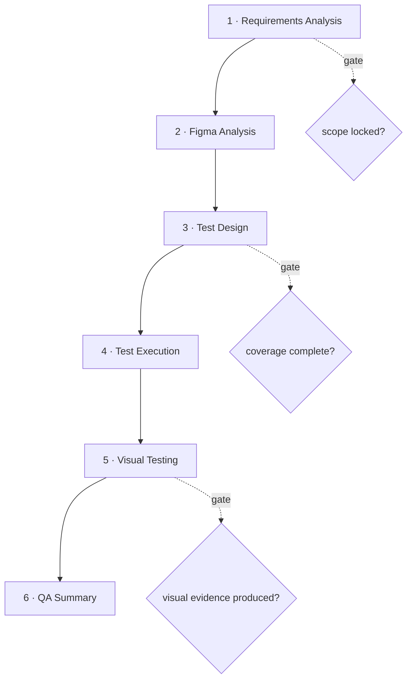

# Canonical QA Process

> **Status:** Canonical QA methodology. Every implemented story follows this process.
> **Nature:** Platform-agnostic. It can be executed **manually**, via **Claude Code**, or by **any orchestration system** — it defines *what* each phase produces and *when* a phase is complete, never *which tool* runs it.
> **Relationship to other docs:** This operationalizes the QA lifecycle into six gated phases and makes **Visual Testing** a first-class phase. It governs the per-story methodology. Detailed test-design/business rules live in the `docs/ai/**` knowledge base; tool-specific operation of the deterministic visual engine lives in the Visual Testing Operations Manual; session/browser-lifecycle requirements for Claude Code as executor live in [`execution-engine.md`](execution-engine.md).
> **Workflow architecture:** the split into **Pre-Development (shift-left)** and **Post-Development (implementation-validation)** workflows, the reusable-artifact contract, and the plugin-alignment strategy are defined in [`architecture/adr-001-qa-workflow-independent-plugin-aligned.md`](architecture/adr-001-qa-workflow-independent-plugin-aligned.md) (contract: [`architecture/qa-artifact-contract.md`](architecture/qa-artifact-contract.md), schema: [`architecture/qa-state.schema.json`](architecture/qa-state.schema.json)). QA_PROCESS.md remains authoritative on *phase methodology*; the ADR governs *workflow orchestration and artifact reuse*.

---

## Principles (apply to every phase)

1. **Deterministic-first.** Prefer exact, reproducible checks over judgement. Use AI **only** where a deterministic check is impossible or genuinely ambiguous.
2. **Evidence-based.** Every result is backed by a persisted artifact (a requirement mapping, a manifest row, a structured dump, a finding). No claim without evidence.
3. **Traceable.** Every finding cites what it violates (an Acceptance Criterion, a design element, or a rule) and which screen it came from.
4. **Explainable.** Severity and root cause are derived by rule from the evidence, so the same evidence always yields the same verdict.
5. **Default scope = four combos.** Mobile stories are validated on **iOS + Android** in **English (en) + Arabic (ar)** — all four — unless a story explicitly narrows scope. Web stories are validated per supported browser/locale.
6. **Coverage gap ≠ defect.** "We could not check this screen" is reported as a *coverage gap*, never as a UI failure.

---

## Per-story artifact set

Each story produces this set of artifacts (folder names are conventions; the *artifacts* are what matter):

| Artifact | Produced in phase | Purpose |
|---|---|---|
| Requirements summary + AC map | 1 | what must be true, and how each AC is testable |
| Impact & constraints note | 1 | affected areas, regression risk, architecture limits |
| Exported design frames | 2 | the expected visual reference |
| Structured design extraction | 2 | expected components (bounds/styles/text) per frame |
| Screen Registry entries | 2 | stable `screenId` → design frame + expected components + validation profile |
| High-Level Scenarios (HLS) | 3 | risk-ranked coverage outline |
| Functional test cases (+ edge + negative) | 3 | executable, step-by-step, each with an expected result |
| Execution results (per combo) | 4 | pass/fail/blocked + evidence per API/Web/Mobile |
| Evidence Manifest | 5 | one row per captured screen (identity + screenshot + structured dump) |
| Structured dumps | 5 | machine-readable structure of each actual screen |
| Visual findings + visual report | 5 | deterministic findings (+ residual AI where required) |
| QA Summary | 6 | functional + visual results, coverage, risks, recommendation |

---

## Process flow

Each phase has an **exit gate**. Do not enter the next phase until the current gate passes.

---

# Phase 1 — Requirements Analysis

**Purpose:** fully understand what the story must deliver and constrain the QA effort before any test is designed.

### Inputs
- The Jira story (description, comments, attachments, linked tickets).
- Acceptance Criteria (AC).
- The existing implementation/behavior of the affected area.
- Architecture constraints (dependencies, permissions, data prerequisites, platform limits).

### Activities
1. **Jira Story analysis** — extract the business objective, functional and non-functional requirements, dependencies, and risks. **Comments may override or invalidate the original AC — always analyze them.**
2. **Acceptance Criteria analysis** — restate each AC as an atomic, testable statement. Flag any AC that is ambiguous, untestable, or missing.
3. **Existing implementation review** — determine current behavior so "expected vs actual" is grounded, and identify regression surface.
4. **Architecture constraints** — record prerequisites (roles, seeded data, feature flags, environment), platform differences, and anything that limits how a case can be executed.
5. **Clarify** — if scope, business logic, edge cases, validations, permissions, state transitions, or test data are not fully pinned down, **stop and ask**. Do not proceed on ambiguity.

### Outputs / Artifacts
- Requirements summary (objective, functional/non-functional, dependencies, risks, missing requirements).
- **AC map:** each AC → testable statement → intended verification.
- Impact & constraints note (impacted areas, regression areas, prerequisites).

### Exit gate ✅
- [ ] Business objective and every AC are understood and testable.
- [ ] Comments reconciled against the AC.
- [ ] Constraints, prerequisites, and regression surface recorded.
- [ ] All ambiguities resolved (scope locked).

---

# Phase 2 — Figma Analysis

**Purpose:** turn the design into the **expected side** of visual validation — a stable, machine-comparable definition of each screen.

### Inputs
- The story's Figma link (file key + node ids are **per story**, taken from the design URL).
- The requirements/AC from Phase 1.

### Activities
1. **Export frames** — export each relevant design frame (one image per screen, per locale/platform variant). EN and AR are **different frames** — export both.
2. **Structured extraction** — extract each frame's structure: text content, element bounds, colors, fonts, spacing. This yields the expected component data used by the deterministic layers.
3. **Expected components** — curate the meaningful components per screen (identity, role, expected copy, required?, order, cardinality, and — where available — bounds/styles). Prefer the application's **real test-ids** as component identities so matching is exact. Extraction may *seed* this; curation makes it reliable.
4. **Validation profile** — choose/define the comparison profile for the screen: mode (design-conformance / regression / hybrid), which layers apply, and tolerances (pixel, colour, font, spacing).
5. **Register the screen** — record a stable **`screenId`** mapped to its design frame (per variant) + expected components + validation profile. `screenId` is semantic and **never changes** once used.

### Outputs / Artifacts
- Exported design frames (per variant).
- Structured design extraction (per frame).
- **Screen Registry entries** (`screenId` → frame + expected components + profile), unique and validated.

### Exit gate ✅
- [ ] Frames exported for every in-scope screen and locale.
- [ ] Expected components defined for the target screens (identities = real test-ids where possible).
- [ ] A validation profile is assigned to each screen.
- [ ] Registry entries are unique and pass validation (no duplicate ids, no dangling profile references).

> **Note:** If a screen is not registered, it still runs — but pairing falls back to a heuristic and it may become a coverage gap. Register **highest-traffic screens first**; coverage grows incrementally.

---

# Phase 3 — Test Design

**Purpose:** design coverage that is complete, risk-ranked, and executable.

### Inputs
- The AC map + constraints (Phase 1).
- The screens + expected components (Phase 2).

### Activities
1. **High-Level Scenarios (HLS)** — enumerate the highest-risk coverage as a concise, risk-ranked outline: happy paths, negatives, edge cases, state transitions, validations, navigation, permissions, localization, error handling, and regression risks. Consolidate — do not pad.
2. **Functional test cases** — expand HLS into granular, step-by-step cases. **Every step has its own expected result.** Never combine actions; navigation/validation/verification are explicit steps.
3. **Edge cases** — boundary values, empty/maximum states, slow/interrupted flows, locale-specific rendering (RTL), and derived-field logic.
4. **Negative cases** — invalid input, unauthorized access, missing prerequisites, failure/error states, and cancellation paths.
5. **Map cases to screens** — tag each case with the `screenId`(s) it exercises, so visual validation and functional execution share identity.

### Outputs / Artifacts
- HLS (risk-ranked).
- Functional test cases (granular, expected-result-per-step).
- Edge-case and negative-case sets.
- Case → `screenId` mapping.

### Exit gate ✅
- [ ] Every AC is covered by at least one case.
- [ ] Happy, edge, and negative paths are represented.
- [ ] Each case is executable and has expected results per step.
- [ ] Cases are mapped to `screenId`s.

---

# Phase 4 — Test Execution

**Purpose:** execute the designed cases against the live system and capture evidence, across every applicable interface and combo.

### Scope
Execute across the applicable surfaces:
- **API** — service/contract behavior behind the UI.
- **Web** — the web application (per supported browser/locale).
- **Mobile** — iOS and Android, EN and AR (the four-combo default).

### Activities
1. **Prepare state** — provision prerequisites (roles, data, flags) from Phase 1; execute only against the intended environment.
2. **API execution** — verify status codes, payloads, contracts, and side effects for the flows under test.
3. **Web execution** — drive each case step-by-step; compare live result to the expected result; **capture a screenshot per screen state**.
4. **Mobile execution** — run each case on iOS and Android for each locale; capture a screenshot per screen state.
5. **Record outcomes** — mark each case **pass / fail / blocked / skipped** with the precise reason, and attach evidence (screenshots, and a short recording for multi-step/state defects).
6. **Defect grounding** — a finding becomes a **defect** only if it violates a specific AC, design element, or rule; is not test data; and reproduces. Otherwise record it as an observation.

### Outputs / Artifacts
- Execution results per combo (pass/fail/blocked/skipped + reasons).
- Screenshots per screen state (named so each maps to its `screenId`).
- Candidate defects (grounded, reproducible).

### Exit gate ✅
- [ ] Every case executed on every applicable combo (or explicitly marked blocked with reason).
- [ ] A screenshot captured per screen state.
- [ ] Outcomes and grounded defects recorded.

---

# Phase 5 — Visual Testing

**Purpose:** validate that each actual screen matches its expected design — **deterministically first, AI only on the residual** — and produce a visual report.

> **Executor paths:** the platform pyramid engine (legacy) is operated per [`visual-testing/OPERATIONS_MANUAL.md`](visual-testing/OPERATIONS_MANUAL.md). When **Claude Code** performs this phase directly (the primary path), follow the operator playbook [`visual-testing/CLAUDE_CODE_OPERATOR.md`](visual-testing/CLAUDE_CODE_OPERATOR.md) — it operationalizes this phase (dynamic-vs-defect exclusion rules, finding schema, annotated evidence, Design-Bug output). This methodology stays authoritative on any conflict.

### Inputs
- Screenshots captured during Test Execution (Phase 4).
- Exported design frames + Screen Registry entries (expected components + validation profile) from Phase 2.

### 5.1 Generate the Evidence Manifest
Produce one manifest **row per captured screen**, carrying:
`screenId` · platform · locale · screenshot path · (optional) test-case id · (optional) structured-dump path.
The manifest is the **producer-agnostic contract**: it does not care whether capture came from web, mobile, or any framework. It is what links the actual evidence to its screen identity.

### 5.2 Generate Structured Dumps
For each screen, capture a **structured dump** of the *actual* rendered UI:
- **Web** — the accessibility/DOM structure (roles, names, hierarchy, and where available bounds/styles).
- **Mobile** — the platform UI hierarchy / page source (ids, labels, text, bounds).
- **Unstructured surfaces** (canvas/image/native-drawn) — fall back to OCR only where no structured data exists.
Reference each dump from its manifest row. **A screen with no structured dump becomes a residual** (deterministic layers cannot evaluate it).

### 5.3 Run the Validation Pyramid
For each screen, pair the expected design frame with the actual screenshot (**by `screenId`** — deterministic; heuristic only when unregistered; abstain to a coverage gap when no confident pair exists). Then run the deterministic layers:

| Layer | Checks | Typical severity |
|---|---|---|
| **L1 Identity** | correct frame ↔ screenshot pairing | coverage-gap if unpaired |
| **L2 Component Tree** | required components present, once, in the right order/nesting | missing/duplicate = major; order/hierarchy = minor |
| **L3 Visibility** | required components actually visible (non-zero) | major |
| **L4 Layout** | position/size within tolerance | by magnitude (major/minor) |
| **L5 Text / Copy** | visible copy exactly matches expected | major |
| **L6 Styles / Tokens** | colour/font/size within tolerance | by magnitude (major/minor) |
| **L7 Pixel** | advisory whole-image difference (only when sizes match) | info (advisory) |

Layers run cheapest/most-structural first; a component flagged missing at L2 is not re-flagged downstream.

> **L5 copy severity sub-class:** a **pure casing / whitespace / punctuation-spacing** difference (e.g. `Card Perks` vs `Card perks`, `ID*` vs `ID *`, `Insert Arabic Text Here` vs `Insert Arabic text here`) is **minor**. A difference that changes a **word, meaning, number, or localized string** is **major**. Missing/empty required copy remains **major**.

### 5.4 Run Residual AI (only when required)
Invoke AI **only** for screens the deterministic layers could not fully evaluate — no structured dump, no expected data, or an unstructured surface — plus an optional small audit sample of clean screens. A fully-evaluated screen consumes **zero** AI. AI findings are labelled as AI-sourced.

### 5.5 Produce deterministic findings
Each finding records: layer, category/dimension, **severity** (critical/major/minor/info — derived by rule), the affected component **and, when identifiable, the design token that is the root cause** (a color/typography/spacing/etc. token — not just the component it surfaced on), **expected vs actual**, a self-explaining difference description, a root-cause-level recommendation, and its sources (AC / design frame). Recurring findings that share a root cause (component or token) are grouped so reviewers fix the shared component/token once.

### 5.6 Produce the visual report
Assemble a visual report: per-screen verdict (pass / minor / major / no-frame / coverage-gap), findings by severity and category, recurring-pattern summary, coverage gaps (listed separately, non-penalizing), and an expected-vs-actual view per screen.

### Outputs / Artifacts
- Evidence Manifest · Structured dumps · Visual findings · Visual report.

### Exit gate ✅
- [ ] A manifest row exists for every captured screen (with identity).
- [ ] Structured dumps captured where the surface supports them.
- [ ] Validation Pyramid run for every in-scope screen.
- [ ] Residual AI invoked only where deterministic evaluation was impossible.
- [ ] Deterministic findings + visual report produced; coverage gaps listed.

---

# Phase 6 — QA Summary

**Purpose:** a single, decision-ready summary of the story's quality.

### Inputs
- Execution results (Phase 4) + visual findings/report (Phase 5) + coverage mapping (Phases 2–3).

### Contents
1. **Functional Results** — cases run vs passed/failed/blocked per combo (API/Web/Mobile), and grounded defects with severity.
2. **Visual Results** — per-screen verdicts, findings by severity/category, recurring patterns, and coverage gaps.
3. **Coverage** — AC coverage (every AC → case(s) → result), screen coverage (registered vs residual vs coverage-gap), and combo coverage (which of the four combos were validated).
4. **Risks** — untested/blocked areas, regression exposure, environment or data limitations, and any coverage gaps that matter.
5. **Story Health & Review Confidence** — a deterministic, evidence-derived quality rollup (e.g. requirements/coverage/execution/visual/defects/traceability dimensions) plus a confidence signal for how well-evidenced the verdict itself is — the same evidence always yields the same score.
6. **Recommendation** — a clear, root-cause-level verdict: **Pass / Pass-with-risks / Fail**, with the specific blockers and the fastest path to green.

### Outputs / Artifacts
- The QA Summary (the story's canonical QA record).

### Exit gate ✅
- [ ] Functional + visual results consolidated.
- [ ] Coverage quantified (AC, screen, combo).
- [ ] Risks stated.
- [ ] Story Health / Review Confidence rolled up.
- [ ] A single, justified recommendation given.

---

## Execution modes (same process, any operator)

This process is **operator-agnostic**. The phases, artifacts, and gates are identical whether run by:

| Mode | How the phases are carried out |
|---|---|
| **Manual** | A QA engineer performs each phase by hand, producing the artifacts and checking the gates. |
| **Claude Code** | An AI operator drives the phases, emitting the same artifacts; deterministic phases are reproducible, AI is confined to residual visual judgement and clarification. |
| **Any orchestration system** | A future system automates the phases; because artifacts (manifest, dumps, findings) are producer-agnostic contracts, any producer can satisfy them. |

The **artifacts are the interface** between phases — not any specific tool. A phase is complete when its artifacts exist and its gate passes, regardless of who produced them.

---

## Definition of Done (whole story)

- [ ] Requirements understood; scope locked (Phase 1 gate).
- [ ] Screens registered with expected components + profile (Phase 2 gate).
- [ ] Coverage designed: HLS + cases + edge + negative, mapped to screens (Phase 3 gate).
- [ ] Executed across all applicable combos with evidence (Phase 4 gate).
- [ ] Visual validation run deterministic-first with a report; residual AI only where required (Phase 5 gate).
- [ ] QA Summary produced — Story Health/Review Confidence rolled up, with a clear recommendation (Phase 6 gate).

---

*Canonical QA process. Test-design depth and business rules: `docs/ai/**`. Deterministic visual-engine operation (registry authoring, structured extraction, shadow/cutover): the Visual Testing docs under `docs/ai/visual-testing/` and `docs/ai/screens/`.*
