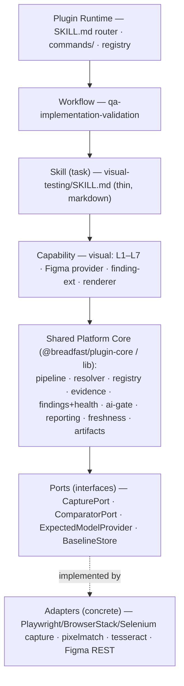
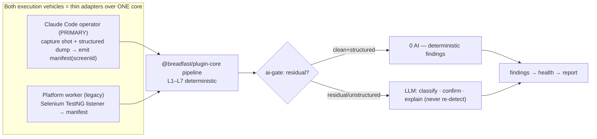
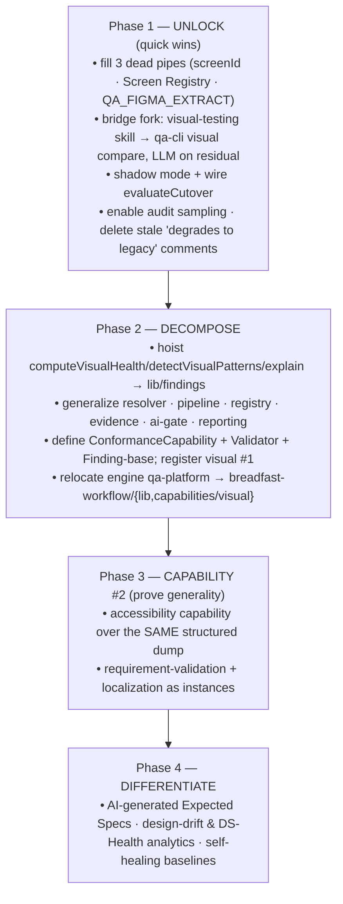

# ADR-003 — Visual Testing → Conformance Engine: Plugin-Aligned Decomposition & Fork Resolution

- **Status:** 🟡 **Proposed (design-only; no code).** Draft for QA-Lead ratification.
- **Date:** 2026-07-26
- **Deciders:** QA Lead (Ahmed Essam) + Claude Code (Principal Architect review)
- **Relationship to prior ADRs:**
  - **Extends & re-homes** [ADR-002 Rev.2](../../../qa-platform/docs/design/adr-002-visual-testing-redesign-rev2.md) (the deterministic pyramid design) and [AIP-002](../../../qa-platform/docs/design/adr-002-implementation-plan.md) (its migration plan). ADR-002's **methodology is kept**; this ADR changes only *where the engine lives* and *how it is invoked*.
  - **Continues** [ADR-001](./adr-001-qa-workflow-independent-plugin-aligned.md) (plugin-aligned QA workflow) — the visual engine becomes one plugin capability under the same primitives.
  - **Related:** [`QA_PROCESS.md` Phase 5](../QA_PROCESS.md), [`CLAUDE_CODE_OPERATOR.md`](../visual-testing/CLAUDE_CODE_OPERATOR.md), [`qa-artifact-contract.md`](./qa-artifact-contract.md), [`../../../CLAUDE.md`](../../../CLAUDE.md).
- **Governing principles (inherited):** deterministic-first / AI-on-residual (ADR-001 §ADR-001 frugality); structural isomorphism + dependency inversion (ADR-001 §3); additive-only schema (ARCHITECTURE.md principle 10); single source of business truth (domains consumed, not re-encoded).

---

## 1. Context

Three findings from an end-to-end review of the visual-testing engine (code + design docs, verified 2026-07-26) motivate this ADR.

### 1.1 The deterministic engine is built, wired, and dormant
The L1–L7 Validation Pyramid designed in ADR-002 Rev.2 **exists as code and is wired into the run path** (`runPyramidComparison` at `qa-platform/apps/worker/src/nodes.ts:2084`; layer functions in `packages/shared/src/pyramid.ts`; pairing in `visual-resolver.ts`; structured comparison in `structured.ts`/`dump-parse.ts`; pixel in `apps/worker/src/pixel.ts`). But it **emits nothing on a normal run**, because three input pipes are unconnected:

1. **Screen Registry is empty** — `docs/ai/screens/` holds only `_`-prefixed files, and the loader *skips* `_` files (`screen-registry-loader.ts:39`) → `{ screens: [], profiles: [] }`.
2. **Evidence-manifest `screenId` is hard-coded `''`** in both builders (`packages/shared/src/manifest.ts:77,99`) → the resolver's registry-pairing branch never activates.
3. **Figma structured extraction is off by default** (`QA_FIGMA_EXTRACT`), and even when on emits `required:false` components → no L2 "missing" signal.

Consequently the **default engine is `legacy` = the LLM vision comparator** (`resolveVisualEngine` default `'legacy'`; dispatch at `nodes.ts:2128`). `evaluateCutover` is **orphaned** (0 shadow runs; sits at NO-GO), so the default can never flip. Stale comments in `visual-engine.ts` and `nodes.ts:1669-1678` claim shadow/pyramid "degrade to legacy" — they do not; the dispatch is implemented.

### 1.2 The fork
Two execution paths compare screens, and they do not share code:
- **Platform pyramid** (ADR-002/AIP-002) — deterministic L1–L7 in `@qa/shared` + `apps/worker`, fed by a Selenium/TestNG manifest emitter. Lives in the **legacy `qa-platform`**.
- **Claude Code operator** (per `CLAUDE.md`, the **primary** path going forward) — a separate tree (`qa-workflow/skills/visual-testing/`) that performs holistic **LLM reasoning** + `automation/helpers/VisualComparisonHelper.js`, and **never calls the pyramid**.

The determinism concern (nondeterministic, un-auditable comparison on the primary path) is therefore **self-inflicted by the platform→operator pivot**: the fix already exists as code, on the wrong side of the fork.

### 1.3 The plugin direction
Per [ADR-001](./adr-001-qa-workflow-independent-plugin-aligned.md), QA is migrating into the **`breadfast-workflow` plugin**. The plugin's generic primitives already exist in the `qa-workflow/` scaffold: `lib/freshness/` (fingerprint · reconcile · dag — the drift/baseline-as-code engine), `lib/schema/validate.js`, `lib/qa-state.js`, `registry/domains.yaml`, `templates/`, `workflows/`, and **nine task skills of which `visual-testing` is one**. The plugin architecture mandates: workflows orchestrate · skills encapsulate · shared libs · registry-driven discovery · artifact-based communication · stateless execution · portable deterministic cores · pluggable adapters · separation of orchestration / deterministic / AI.

**The tension:** ADR-002 Rev.2 is platform-centric (it assumes the `qa-platform` worker runs the engine); the current direction is plugin- and operator-centric. Left unreconciled, the engine stays dormant in a deprecated platform while the primary path runs an unconstrained LLM.

---

## 2. Problem

How do we, in one coherent move:

1. Make the **already-built determinism** actually run on the **primary (Claude Code operator)** path — confining the LLM to the residual, per QA_PROCESS Phase 5?
2. Do so **without creating a "visual special case"** — no duplicated registry/freshness/finding machinery, no dual freshness engine (the anti-pattern ADR-001 alternative #2 explicitly rejected)?
3. **Align to the plugin** so visual testing is *one capability*, and future capabilities (accessibility, API, performance, localization, requirement validation) are drop-ins, not redesigns?

---

## 3. Decision

**Reframe the engine as a generic *Conformance Engine* and decompose it along the plugin's generic/domain seam. Visual Testing becomes Conformance-instance #1. Both the legacy worker and the primary operator invoke the same portable core; the LLM is confined to the residual.**

### 3.1 The Conformance Engine reframe (the load-bearing idea)

> The platform's real primitive is: **compare an `Actual` against an `Expected`, via a `Resolver` (identity pairing) + an ordered `Validator` pipeline + an `AI residual gate`, emitting `Findings` scored into `Health`.**
>
> **Visual Testing is that engine specialized to `(Expected = Figma, Actual = screenshot, Validators = L1–L7)`.** Accessibility, API, Performance, Localization, and Requirement testing are the *same engine* with different `(Expected, Actual, Validators)` triples.

This is what makes "don't optimize visual in isolation" concrete: visual stops being special by construction.

### 3.2 Generic / domain split — verdict: split `@qa/visual-core` in two

There is **no** visual-owned `@qa/visual-core` monolith. Its generic ~70% moves to the platform; its visual ~30% stays a capability.

| Concern | Home | Rationale |
|---|---|---|
| Freshness / drift / artifact cache | **Platform** — `lib/freshness` (✅ exists) | capability-agnostic; visual **rides** it (§3.6) |
| Schema validators | **Platform** — `lib/schema` (✅ exists) | generic |
| Registry framework (load · validate · drift · reverse-index) | **Platform** (generalize) | Screen Registry is one *instance*; `domains.yaml` another |
| Evidence envelope + collection | **Platform** | identity+provenance generic; payload schema per-capability |
| Resolver (identity → confidence-floor → abstain) | **Platform** (generalize `visual-resolver`) | API pairs endpoint↔response; a11y pairs rule↔element |
| Comparator **pipeline harness** (ordered validators · collect-all · per-item short-circuit · AI-skip predicate) | **Platform** | generic execution pattern |
| AI residual gate (+ verdict cache · audit-sample) | **Platform** (generalize `visual-ai-gate`) | policy is capability-agnostic |
| Finding model · health · pattern-grouping · explain | **Platform** (hoist from `visual.ts`) | severity rollup / pattern-by-key / citations are generic |
| Reporting framework | **Platform** | renderers are per-capability |
| Subagent-returns-by-path execution | **Platform** (✅ ADR-001 §3.4) | generic |
| Host-emitter / reanchor adapters | **Platform** | generic surface layer |
| **L1–L7 layer logic** | **Visual** | the comparison rules |
| **Figma expected-model provider / figma-extract** | **Visual** | Figma is visual's Expected source |
| **Pixel / OCR / structured-dump comparators** | **Visual** (adapters behind platform ports) | domain implementations |
| **Screen Registry schema + data** | **Visual** (instance of platform Registry) | domain schema |
| **VisualFinding extension** (component / token / dimension) | **Visual** | extends the base Finding |
| **Visual report renderer** (expected/actual side-by-side) | **Visual** | domain renderer |

**Rule of thumb:** if accessibility-testing would want it unchanged, it's Platform. If it names "Figma", "pixel", "screen", or "token", it's Visual.

Target package layout:

```
breadfast-workflow/lib/            (the "@breadfast/plugin-core" code plane)
├── freshness/   ✅ EXISTS  fingerprint · reconcile · dag
├── schema/      ✅ EXISTS  declarative validators
├── registry/    ~ generalize domains.yaml loader → Registry<T>
├── artifacts/   artifact envelope + cache (qa-state model)
├── evidence/    Evidence envelope; capability supplies payload schema
├── resolver/    identity-first → floor → abstain
├── pipeline/    ordered Validator[] harness + AI-skip predicate
├── ai-gate/     shouldInvokeResidual · audit-sample · verdict-cache
├── findings/    Finding base · computeHealth · detectPatterns · explain
└── reporting/   report framework + explainability/citations

breadfast-workflow/capabilities/visual/
├── layers/      L1–L7 as Validator implementations
├── expected/    Figma provider (figma-extract) + Screen Registry schema
├── adapters/    pixel (pixelmatch) · ocr · structured-dump parsers
├── finding-ext  component/token/dimension extension of Finding
└── renderer     expected/actual side-by-side report renderer
```

> Note the two planes: the **skill/workflow plane** (markdown — orchestration + knowledge, Claude-Code-native) and the **code plane** (`lib/` + `capabilities/` — invoked by skills via `bin/qa-cli.js`). The plugin already embodies this split (`lib/` vs `skills/`).

### 3.3 Layering & dependency direction



**Invariants (dependencies point down; adapters implement ports — inversion):**

| Invariant | Status / action |
|---|---|
| Platform core must **not** import any capability | ❌ **Violated today** — `computeVisualHealth`/`detectVisualPatterns`/`explainVisualFinding` (generic) live in visual `visual.ts` typed to visual schemas → **hoist to `lib/findings`**, leave a thin visual caller |
| Capability depends on core, not vice versa | ✅ after hoist |
| Core depends on **Ports**, never concrete adapters | ✅ already good — `pyramid.ts` takes a `PixelComparator` *interface*; `apps/worker/pixel.ts` implements it. Extend the pattern to capture + expected-model |
| Adapters never import capability/skill | ✅ |
| Skill (markdown) holds no engine logic; invokes core via CLI/contract | ⚠️ the **operator path violates this today** by comparing inside the LLM — §3.4 restores it |
| Workflow never reaches into core internals | ✅ (talks to skills) |

### 3.4 Fork resolution — verdict: one core, two thin adapters

The visual-testing **skill** (markdown, orchestration) calls the platform **pipeline** via `qa-cli`; the pipeline runs deterministic validators; **`ai-gate`** invokes the LLM on the residual only. Orchestration / deterministic / AI are cleanly separated across the three plugin layers.



"Primary path = Claude Code" no longer means "primary path = unconstrained LLM." It means Claude Code **orchestrates** and calls the deterministic core as a tool.

### 3.5 Relocation out of legacy `qa-platform` — the migration *is* the rescue

Move the engine modules from `qa-platform/**` into the plugin-aligned homes:
- **→ `breadfast-workflow/lib/`** (generic): the generalized resolver, pipeline harness, registry framework, evidence, findings+health (hoisted), ai-gate, reporting. Ride the existing `lib/freshness` + `lib/schema`.
- **→ `breadfast-workflow/capabilities/visual/`** (domain): `pyramid.ts` layers, `figma-extract.ts`, `structured.ts`/`dump-parse.ts` parsers, `screen-registry` schema, pixel/ocr adapters, VisualFinding extension.

This resolves the "engine trapped in the deprecated platform" problem as a side effect of aligning to the plugin.

### 3.6 Ride the existing freshness engine — no dual freshness

Visual baseline-as-code (incremental validation, design-drift) is a **consumer of `lib/freshness`**, not a peer. Register visual artifacts (exported frames, structured dumps, findings) as nodes in the existing fingerprint/reconcile DAG (`qa-artifact-contract.md` §2–5). Building a second freshness engine is prohibited — ADR-001 rejected exactly that as its alternative #2.

### 3.7 The one new artifact — the `ConformanceCapability` contract

Introduce a capability-agnostic contract and **register visual as instance #1** (in `registry/`):

```
ConformanceCapability = {
  id,                         // "visual" | "accessibility" | "api" | ...
  expectedProvider,           // ExpectedModelProvider  (Figma | WCAG ruleset | OpenAPI | ...)
  actualCapture,              // ActualCaptureProvider   (screenshot+dump | a11y tree | response | ...)
  resolver,                   // identity pairing (frame↔shot | rule↔element | endpoint↔response)
  stages: Validator[],        // ordered; Validator = (expected, actual, ctx) → Finding[]
  findingSchema,              // base Finding + capability extension
  renderer                    // report renderer
}
```

The four abstractions to lock in **now** (their shapes already exist in visual form — this is generalization, not invention): `ConformanceCapability`, `Validator`, `ExpectedModelProvider`/`ActualCaptureProvider`, and a **capability-neutral `Finding`** base.

### 3.8 Kept verbatim (no rework)

From ADR-002 Rev.2 / current code: the L1–L7 **methodology**, the Screen Registry **domain model**, the AI-skip **predicate** (§5 of ADR-002), the dynamic-vs-defect **exclusion rules**, `computeVisualHealth`/`detectVisualPatterns`/`rootCauseFor`/`explainVisualFinding` **logic** (relocated, not rewritten), the `VisualFinding`/`VisualComparison` **schemas** (extended additively), and `renderReport`. The Strangler-Fig + shadow-mode + additive-schema **migration discipline** of AIP-002 is retained.

---

## 4. Consequences

### Positive
- **The primary path becomes deterministic** — the built engine finally runs; the LLM is confined to the residual (QA_PROCESS Phase 5 honored in fact, not just in doc).
- **The fork closes** — one core, two thin adapters; no divergent comparison logic.
- **The engine leaves the deprecated platform** as a consequence of plugin alignment, not a separate project.
- **Capability #2 is near-free** — accessibility reuses the *same* structured dump; requirement-validation (`run-evaluation.ts` coverage) and EN/AR localization are already partially built, proving the generalization is real.
- **No dual engines** — one freshness engine, one registry framework, one finding model across all capabilities.

### Negative / risks
| Risk | Severity | Mitigation |
|---|---|---|
| **Relocation churn** across `qa-platform → breadfast-workflow` | Med | Do it as `git mv` under the AIP-002 Strangler-Fig flag; keep the worker importing from the new home during the bake period |
| **Contract-abstraction bet** — generalizing before capability #2 exists | Med | Ground every generic shape in an existing visual shape; ship visual first as the sole instance; treat the contract as provisional until a11y validates it (ADR-001 §schema-guess-risk pattern) |
| **Registry curation remains the critical path** (empty today) | **High** | Fill the three pipes first (§6); AI-generated Expected Specs (roadmap Phase 4) to defeat the curation bottleneck; drift diagnostic in the pre-execution gate |
| **Operator→core transport** (CLI invocation of the pipeline from the skill) | Low-Med | `bin/qa-cli.js visual compare` already the pattern; residual LLM vision transport is the only open question (carried from ADR-002 Rev.2 §10) |
| **Dependency-hoist regressions** (moving `computeVisualHealth` etc.) | Low | Pure functions with existing tests (`visual.test.mjs`); hoist is mechanical + covered |

### Human decisions owed before freeze
1. **ADR-003 ratification** — confirm the Conformance Engine reframe and the generic/domain split as the target.
2. **Package boundary** — confirm `breadfast-workflow/lib/` (generic) vs `capabilities/visual/` (domain), or an interim `@qa/*` package pair if the plugin tree is not yet writable.
3. **Registry ownership & location** — carried from ADR-002 Rev.2 §10 (recommend shared git `docs/ai/screens/`, QA-lead-owned).
4. **Residual-LLM vision transport** — CLI `Read`-path vs Messages API (carried; low-stakes now that residual is rare).

**Ratified 2026-07-26 (implementation):** (1) **Vision transport → the Claude Code CLI `Read` workflow**, implemented as `ClaudeJudge` behind the generic `Judge` interface (`qa-workflow/lib/conformance/judge.js` `composeJudge`); the deterministic engine and `evaluateStory` stay provider-agnostic, and a Messages-API transport can replace it with zero engine change. (2) **Registry Figma identifiers stay placeholders**, resolved at execution time from the story's Figma URL by the exporter (`qa-workflow/capabilities/visual/expected/figma-resolve.js` `enrichRegistryWithFigma`, matched by `figmaFrameName`) — the registry remains a stable screen description.

---

## 5. Alternatives considered

1. **Visual-owned `@qa/visual-core` monolith** — *rejected.* Duplicates the platform's registry/freshness/schema primitives (dual freshness = ADR-001's rejected alternative #2) and re-creates the "visual special case."
2. **Stay platform-primary (ADR-002/AIP-002 as-is), abandon the operator** — *rejected.* Contradicts the `CLAUDE.md` pivot (Claude Code primary, platform legacy) and leaves the primary path with no visual capability.
3. **Keep the operator LLM-only; don't wire the pyramid** — *rejected.* This is the status quo; it is exactly the determinism/auditability problem and wastes a built asset.
4. **Conformance-Engine decomposition (this ADR)** — *chosen.* Closes the fork, rescues the engine, aligns to the plugin, and makes future capabilities drop-ins — one coherent move.

---

## 6. Migration outline & follow-ups

Sequenced with AIP-002 (still valid; re-homed). Highest-leverage first.



Migration mechanics reuse the checklist in [`qa-artifact-contract.md` §7](./qa-artifact-contract.md) (`git mv qa-workflow/* → breadfast-workflow/*`; `lib/freshness → drift`; `lib/schema → lib/schema`). The engine relocation adds two rows: `qa-platform` generic modules → `lib/`; visual modules → `capabilities/visual/`.

**Immediate follow-ups (design-only until ratified):**
- Draft the four §3.7 interfaces as a small spec (the freeze point for Phase 2).
- Author Screen Registry entries for the top ~15 screens (unblocks L2/L3/L5).
- Fix `manifest.ts` to emit a real `screenId`; default `QA_FIGMA_EXTRACT=true` as the seed expected-model.
- Prototype `qa-cli visual compare <screenId>` over `runPyramid` and wire the skill deterministic-first.

---

## 7. Definition of Done (ADR-003)

1. Visual comparison runs **deterministic-first on the primary (operator) path**; LLM invoked only on the residual; same inputs → same deterministic findings.
2. The generic core (`pipeline · resolver · registry · evidence · findings+health · ai-gate · reporting`) lives in the plugin's `lib/`; visual specifics live in `capabilities/visual/`; **no platform module imports a capability**.
3. Visual baseline freshness rides `lib/freshness` — **one** freshness engine, one registry framework, one finding model.
4. `ConformanceCapability`/`Validator`/`Finding`-base defined; **visual registered as instance #1**; a second capability (accessibility) demonstrably plugs in with no core change.
5. The engine no longer depends on `qa-platform/**`; ADR-002 Rev.2 methodology preserved (relocated, not rewritten); `computeVisualHealth`/patterns/explain hoisted with tests green.
6. Stale "degrades to legacy" comments removed; `evaluateCutover` fed by real shadow metrics; audit sampling active.

---

### Appendix — relationship ledger

| Doc | Status after ADR-003 |
|---|---|
| [ADR-001](./adr-001-qa-workflow-independent-plugin-aligned.md) | **Unchanged.** ADR-003 continues its plugin alignment for the visual capability. |
| [ADR-002 Rev.2](../../../qa-platform/docs/design/adr-002-visual-testing-redesign-rev2.md) | **Methodology kept; home changed.** The L1–L7 design, Screen Registry model, and AI-skip predicate stand; they relocate to the plugin and are reframed as Conformance-instance #1. (Recommend adding a status banner pointing here — a human edit, not made by this ADR.) |
| [AIP-002](../../../qa-platform/docs/design/adr-002-implementation-plan.md) | **Valid; re-homed.** Its phases/Strangler-Fig discipline apply to the relocated engine. |
| [`QA_PROCESS.md` Phase 5](../QA_PROCESS.md) | **Unchanged & now honored in fact** (deterministic-first on the primary path). |

---
*Design-only decision record. Detailed reuse/freshness contract: [`qa-artifact-contract.md`](./qa-artifact-contract.md). Verified current-state basis: review of 2026-07-26 (see `visual-engine-state` in project memory).*
