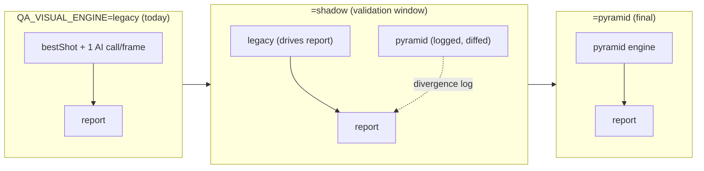
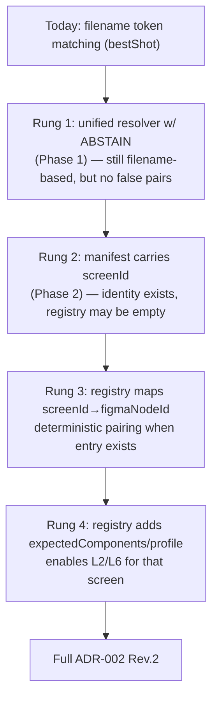
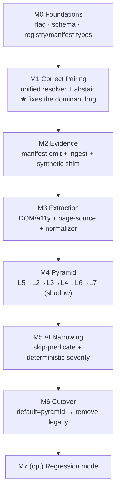

# AIP-002 — Visual Testing: Architecture Implementation Plan (ADR-002 Rev.2 migration)

> **Status:** 🟢 **Implementation plan — for scheduling. NOT yet implemented.**
> **Author role:** Principal Engineer (migration planning)
> **Date:** 2026-07-21
> **Target architecture:** [ADR-002 Rev.2](./adr-002-visual-testing-redesign-rev2.md) (approved). Current-state facts: [ADR-002 Rev.1 Parts 1–2](./adr-002-visual-testing-redesign.md).
> **Reference implementation:** Selenium Java (`D:\projects`). Architecture stays framework-independent.
> **This is NOT an architecture review.** ADR-002 Rev.2 is frozen; this plan builds it with maximum reuse and minimum risk.

---

## Guiding strategy — Strangler Fig + Shadow Mode + additive schema

Three rules govern every phase so the pipeline never breaks:

1. **Strangler Fig.** The new pyramid is built *beside* the legacy path behind a config flag `QA_VISUAL_ENGINE = legacy | shadow | pyramid` (default `legacy`). Legacy `runVisualComparison` keeps working until the new engine is proven, then default flips, then legacy is removed after a bake period.
2. **Shadow Mode.** In `shadow`, **both** engines run; the legacy result is what the report uses, the pyramid result is **logged and diffed** against it. We gather divergence evidence on real stories with zero user-facing risk before ever switching.
3. **Additive-only schema** (ARCHITECTURE.md principle 10). Every new field on `VisualFinding`/`VisualComparison`/manifest is optional with a default → old runs keep validating; `computeVisualHealth`/`detectVisualPatterns` consume the widened shape unchanged.



---

# PART 1 — Current asset inventory & disposition

| Asset (file:seam) | Disposition | Why |
|---|---|---|
| `computeVisualHealth()` [`visual.ts:133-179`] | **KEEP AS-IS** | Pure, tested, correct. Consumes findings by severity — agnostic to how findings were produced. Only later gains a *coverage-gap* branch (small, Phase 4). |
| `detectVisualPatterns()` / `rootCauseFor()` [`visual.ts:211-276`] | **KEEP AS-IS** | Deterministic root-cause grouping. Works on any `VisualFinding[]`, whether AI- or layer-produced. |
| `explainVisualFinding()` [`visual.ts:279-316`] | **KEEP AS-IS** | Maps findings to explanations; input-shape stable. |
| `VISUAL_CATEGORIES` / `VISUAL_CHECKS` [`visual.ts:43-110`] | **KEEP AS-IS** | The taxonomy is reused as the layer/finding vocabulary; each pyramid layer maps to categories already defined. |
| `VisualFinding` / `VisualScreenComparison` / `VisualComparison` schemas [`schemas.ts:324-382`] | **KEEP WITH SMALL CHANGES** | Extend additively: `layer?`, `source? (deterministic|ai|ocr)`, `coverageGap?`, widen `verdict` enum with `'coverage-gap'`. Back-compatible. |
| `renderReport()` visual sections [`nodes.ts:2089-2147`] | **KEEP WITH SMALL CHANGES** | Deterministic templating stays. Add: per-layer diagnostic chips, coverage-gap rows, and a single-source Expected/Actual embed (fed by the unified resolver, ending the two-matcher divergence). |
| Figma export (`figma.ts` tiers, container expansion) [`figma.ts:56-137`, `nodes.ts:735-943`] | **KEEP WITH SMALL CHANGES** | Already exports **by node-id** — exactly what the registry needs. Small change: export the **registry's** `figmaNodeId` set for the story's screens instead of the whole expanded container. |
| `html_report` node call site [`nodes.ts:1560-1567`] | **KEEP WITH SMALL CHANGES** | Keep the best-effort invocation; route it through the flag to `legacy` / `shadow` / `pyramid`. |
| `execution` node + prompts [`nodes.ts:1402-1533`, `prompts.ts:400-478`] | **KEEP WITH SMALL CHANGES** | Keep capture; add a screen-identity + manifest-emit instruction (web/mobile). Selenium path is external (the TestNG listener); the node ingests the manifest. |
| `run-evaluation` visual signal [`run-evaluation.ts:123-126,318-342`] | **KEEP WITH SMALL CHANGES** | Consume coverage-gaps as a distinct signal (not a defect, not silent pass). |
| `runVisualComparison()` orchestrator [`nodes.ts:1815-1859`] | **REFACTOR** | Its aggregation tail (passRate/patterns/componentsAffected) is reused; its **core (pair→single AI call)** is replaced by the pyramid orchestrator. Becomes a thin dispatcher over the flag. |
| Unified frame↔shot resolution | **REFACTOR (merge)** | `bestShot` [`nodes.ts:1790-1804`] and `matchExpected` [`nodes.ts:1945-1956`] merge into **one** resolver so the AI-judged pair == the report-shown pair. |
| `bestShot()` force-pairing (`bestScore=-1`, always returns) | **REPLACE** | Root cause of wrong-frame findings. Replaced by registry lookup → heuristic-with-confidence-floor → **abstain (coverage-gap)**. |
| `matchExpected()` (≥1-keyword heuristic) | **REPLACE** | Superseded by the unified resolver; survives only as the legacy-fallback branch during migration, removed at cleanup. |
| Single free-hand AI detection call [`nodes.ts:1834-1845`, prompt `prompts.ts:506-539`] | **REPLACE (narrow)** | Replaced by deterministic layers; AI narrowed to L8 residual classifier on unstructured/ambiguous cases only. |
| Path-based image delivery ("(READ it)" + agentic `Read`) [`prompts.ts:516-517`, `nodes.ts:1840-1842`] | **REMOVE (for common case)** | Kept only for the rare L8 canvas call (direct-image if API transport ratified). |
| Legacy dual-matcher force-pairing | **REMOVE (post-bake)** | Deleted only after `pyramid` is default and stable across the validation window. |

**Net:** ~70% of the value-producing code (aggregation, patterns, explain, report, schemas, Figma export) is **KEEP / KEEP-small**. The **REPLACE** set is exactly the two broken seams identified in Rev.1 (pairing + free-hand detection). Nothing is a big-bang rewrite.

---

# PART 2 — Migration phases

Each phase is independently shippable, independently testable, and leaves a working pipeline. Format per phase: **Goal · Scope · Deliverables · Dependencies · Risk · Rollback · Validation · Success.**

### Phase 0 — Foundations (no behavior change)
- **Goal:** land the scaffolding with zero pipeline change.
- **Scope:** add `QA_VISUAL_ENGINE` flag (default `legacy`); add optional schema fields (`layer`, `source`, `coverageGap`, widened verdict); add empty `ScreenRegistry` + `EvidenceManifest` types/loaders in `@qa/shared`.
- **Deliverables:** flag plumbing in `html_report`; additive schema; registry/manifest type modules; no-op loaders.
- **Dependencies:** none.
- **Risk:** ⬇ minimal (dead code + optional fields).
- **Rollback:** remove flag reads; optional fields are ignored.
- **Validation:** existing `visual.test.mjs` + `phase2-validate.mjs` still green; old runs still validate against widened schema.
- **Success:** flag present, default `legacy`, all existing tests pass unchanged.

### Phase 1 — Unified resolver + abstain (fixes the #1 bug even in legacy)
- **Goal:** stop force-pairing; unify the two matchers.
- **Scope:** one `resolvePair(screen, frames, shots, registry?)` = registry-first → confidence-floored heuristic → **abstain ⇒ coverage-gap**. Both the AI data path and the report embed call it. Applies in `legacy` too (a strict low-risk fix), gated by a `QA_VISUAL_ABSTAIN` sub-flag if we want it opt-in first.
- **Deliverables:** `resolvePair`; coverage-gap finding type wired into `computeVisualHealth` (non-penalizing) + report row.
- **Dependencies:** Phase 0 schema.
- **Risk:** ⬆ moderate — changes which pairs get compared (that's the point). Mitigate with shadow logging of old-vs-new pairing.
- **Rollback:** flip `QA_VISUAL_ABSTAIN` off → old `bestShot` behavior.
- **Validation:** unit tests for resolver (registry hit, heuristic hit, abstain); shadow-diff pairing decisions on a golden-story set.
- **Success:** zero forced pairs with <confidence-floor; AI pair == report pair on every screen.

### Phase 2 — Evidence Manifest (Selenium emitter + engine ingester)
- **Goal:** structured evidence with stable identity.
- **Scope:** TestNG listener emits the manifest (web first); engine ingests; **synthetic-manifest shim** derives a manifest from legacy `evidence[]` when none present (back-compat).
- **Deliverables:** manifest schema (Phase 0) + emitter contract + ingester in the execution/report seam.
- **Dependencies:** Phase 0.
- **Risk:** ⬆ moderate (touches the external Java framework) — isolated to the listener; engine tolerates absence.
- **Rollback:** ingester ignores manifest → synthetic shim → legacy behavior.
- **Validation:** manifest round-trip test; a real Selenium run produces a valid manifest; engine consumes both real and synthetic.
- **Success:** manifest present for reference web story; pipeline identical when absent.

### Phase 3 — Structured extraction capture
- **Goal:** capture DOM/a11y (web) + page-source (mobile) into the manifest; add OCR-fallback module.
- **Scope:** capture only (no comparison yet); persist the structured dump; normalization utilities stubbed.
- **Deliverables:** web CDP/a11y extractor, mobile page-source extractor, OCR fallback, style normalizer.
- **Dependencies:** Phase 2 manifest.
- **Risk:** ⬇ low (data capture, unused by comparison yet).
- **Rollback:** stop populating the dump field (optional).
- **Validation:** golden dumps for reference screens; normalizer unit tests (color/unit/font).
- **Success:** structured dump present + parseable for reference web + mobile screens.

### Phase 4 — Validation Pyramid, layer by layer (see Part 5 for order)
- **Goal:** deterministic layers produce findings; AI still runs on residual.
- **Scope:** L1→L5→L2→L3→L4→L6→L7 incrementally; each appends `VisualFinding` (with `layer`+`source:'deterministic'`) to the same `VisualComparison`.
- **Deliverables:** one layer function + tests per sub-phase.
- **Dependencies:** Phases 1–3.
- **Risk:** ⬆ moderate per layer; contained because each is additive and shadow-compared.
- **Rollback:** disable a layer via `validationProfile.enabledLayers`.
- **Validation:** per-layer unit tests; shadow-diff deterministic findings vs legacy AI findings.
- **Success:** each layer detects its defect class deterministically on the golden set with ≥ parity to AI.

### Phase 5 — AI-skip predicate + AI narrowing
- **Goal:** AI disappears for clean structured screens; severity/root-cause become deterministic.
- **Scope:** wire the §5 seven-clause predicate; move severity (magnitude×category×layer) + root-cause template to deterministic where a layer produced the finding; AI limited to residual + unstructured + audit-sample.
- **Dependencies:** Phase 4.
- **Risk:** ⬆ moderate (changes AI economics + severity source).
- **Rollback:** predicate off ⇒ AI runs as in Phase 4.
- **Validation:** assert 0 AI calls on all-clean golden screens; audit-sample logging present.
- **Success:** measured AI-call reduction ≥ target; deterministic severity matches reviewer expectation on golden set.

### Phase 6 — Flip default → `pyramid`, then remove legacy (post-bake)
- **Goal:** make the pyramid canonical; delete dead code.
- **Scope:** default `pyramid` after the shadow window shows non-regression; remove `bestShot`/`matchExpected` force-pairing + path-based image delivery (except L8 canvas).
- **Dependencies:** Phases 1–5 + a clean shadow window.
- **Risk:** ⬇ low if bake criteria met.
- **Rollback:** flag back to `shadow`/`legacy` (kept for one release before deletion).
- **Validation:** full regression suite; parity certification unchanged or improved.
- **Success:** legacy removed; ADR-002 Rev.2 DoD met (Part 8).

### Phase 7 (optional, future) — Regression mode / baselines
- **Goal:** `baselineRef` + pixel-as-gate for same-app regression.
- **Scope:** approved-baseline storage; pixel promoted to gate in regression profile.
- **Risk:** ⬇ low (net-new profile; design-conformance untouched).

---

# PART 3 — Screen Registry rollout (without breaking old stories)

**Migration ladder — each rung works standalone:**



**How old stories keep working (three-tier resolution, always terminating):**
1. **Registry hit** — `screenId` (from manifest) resolves to a `figmaNodeId` → deterministic pair.
2. **Manifest-but-no-registry** — `screenId` present but unregistered → heuristic pair with **confidence floor**; below floor ⇒ coverage-gap. (No worse than today, and honest about it.)
3. **No manifest (legacy story)** — synthetic manifest from `evidence[]`; legacy heuristic with abstain. Old stories run exactly as before, minus false force-pairs.

**Registry location & authoring:** declarative data in **shared git** (`docs/ai/screens/…`), QA-lead-owned; loader/types in `@qa/shared` (same pattern as Prompt/Workflow registries). **Progressive population:** author entries **highest-traffic screens first**; an unregistered screen never fails — it degrades to a heuristic + coverage-gap. **Drift guard:** a registry-validation diagnostic (pre-execution gate) flags `screenId`s referenced but missing and `figmaNodeId`s Figma no longer serves.

---

# PART 4 — Evidence Manifest rollout

**Contract (thin, framework-agnostic; one row per captured screen):**
`{ testCaseId, screenId, platform, locale, screenshotPath, structuredDumpPath?, viewport, dpr, timestamp }` — the engine resolves `figmaNodeId`/profile/`expectedComponents` from the registry, so the manifest never carries Figma detail.

- **How Selenium Java emits it:** a **TestNG `ITestListener` / method interceptor** captures at each `@VisualScreen("screenId")` assertion: `getScreenshotAs(BYTES)` + the structured dump (Phase 3) + `screenId`, and appends a manifest row. Drops into the existing `D:\projects` TestNG framework — no new runner, no per-test boilerplate beyond the annotation.
- **How BrowserStack integrates:** the BrowserStack test case gains a `screen` field/label = `screenId`; the registry derives coverage from it; mobile screenshots captured via `bs_helper.js` land as manifest rows with the same `screenId`. No BrowserStack API change — it's a metadata convention + the existing capture.
- **How existing execution changes:** minimally. The `execution` node still drives capture; it now (a) instructs/consumes `screenId` and (b) writes a manifest alongside `evidence[]`. When absent, the **synthetic shim** builds a manifest from `evidence[]` → nothing breaks.
- **How reports consume it:** `renderReport` reads the manifest (via the unified resolver) for the single-source Expected/Actual embed and per-screen identity — ending the two-matcher divergence. Coverage-gaps render as an explicit report row.

---

# PART 5 — Validation Pyramid implementation order

Ordered by **(highest deterministic value + lowest risk) first**, so AI responsibilities fall away early:

| Order | Layer | Code change | Tests | Reuses |
|---|---|---|---|---|
| 1 | **L1 Identity** | already in Phase 1 (`resolvePair`) | resolver unit tests | registry, manifest |
| 2 | **L5 Text/Copy** | Figma text-layer (REST) vs `getText()`/dump; exact compare + Unicode-normalize | string-compare + RTL cases | `VisualFinding`, categories `content/typography` |
| 3 | **L2 Component Tree** | `expectedComponents` vs actual component set (missing/extra/order/hierarchy/dup) | tree-diff cases | registry `expectedComponents`, category `components` |
| 4 | **L3 Visibility** | `isDisplayed` + bounds>0 + on-screen | visibility cases | dump bounds |
| 5 | **L4 Layout** | bounds vs Figma abs-box within tolerance | tolerance cases | `validationProfile.tolerances`, category `layout/positioning` |
| 6 | **L6 Styles/Tokens** | normalized computed style vs Figma node style | color-ΔE/unit/font cases | normalizer, category `color/typography` |
| 7 | **L7 Pixel (advisory)** | SSIM/diff → regions; NOT a gate in design mode | diff-region cases | (locates regions for L8) |
| 8 | **L8 AI** | narrowed residual classifier | skip-predicate + audit cases | existing engine call (reused, narrowed) |

**Why this order:** L5 (text) is the largest, simplest deterministic AI-replacement (pure string compare) → biggest early win. L2 (components) is the highest-value defect class. Visibility/layout/styles follow. Pixel is last and advisory. Each layer **appends to the same `VisualComparison`**, so `computeVisualHealth`/`detectVisualPatterns`/`renderReport` are reused untouched at every step.

---

# PART 6 — AI reduction timeline

```
CURRENT: AI does → pairing-judgment · ALL detection · severity · verdict · component/token · root-cause · explanation
   │
Phase 1 (L1)   ─► pairing correctness = DETERMINISTIC   (AI no longer judges mispaired screens)
   │
Phase 4 · L5   ─► TEXT/COPY detection + severity = DETERMINISTIC   → AI removed for text findings
   │
Phase 4 · L2   ─► COMPONENT missing/extra/order = DETERMINISTIC    → AI removed for structure
   │
Phase 4 · L3/L4 ─► VISIBILITY + LAYOUT = DETERMINISTIC             → AI removed for those
   │
Phase 4 · L6   ─► STYLES/TOKENS = DETERMINISTIC                    → AI removed for style deltas
   │
Phase 5        ─► AI-SKIP predicate + deterministic severity/root-cause
   │                → AI = 0 for clean, fully-structured screens
   ▼
RESIDUAL AI (final, irreducible): unstructured surfaces (canvas/image via OCR+vision)
                                  + ambiguous "real defect vs acceptable render variance" judgment
                                  + bounded audit-sample of PASSes
```

Each arrow is a shippable phase where a defect class provably moves from AI to deterministic — verified by shadow-diff showing the deterministic layer matches/beats the AI finding for that class before AI is switched off for it.

---

# PART 7 — Implementation priority, complexity, effort, blockers

| Task | Priority | Complexity | Effort | Blockers |
|---|---|---|---|---|
| Flag + additive schema (Phase 0) | **Critical** | Low | S | none |
| Unified resolver + abstain (Phase 1) | **Critical** | Med | M | Phase 0 |
| Screen Registry schema + loader | **Critical** | Low | S | registry **location/owner decision** (Rev.2 §10) |
| Evidence Manifest schema | **Critical** | Low | S | Phase 0 |
| Manifest emitter — Selenium listener | **High** | Med | M | access to `D:\projects` framework |
| Structured extraction — web (CDP/a11y) | **High** | Med-High | M-L | Chromium/CDP availability |
| L5 Text layer | **High** | Low-Med | M | Figma text-layer fetch; manifest |
| L2 Component Tree layer | **High** | Med-High | L | `expectedComponents` **curation** |
| AI-skip predicate + deterministic severity (Phase 5) | **High** | Med | M | Phases 1–4 |
| Registry data authoring (top screens) | **High** | Low (per screen) | ongoing | QA-lead **curation capacity** |
| L3 Visibility · L4 Layout · L6 Styles | **Medium** | Med | M each | dumps + normalizer |
| Structured extraction — mobile (page-source) | **Medium** | Med | M | app-side accessibility ids |
| Style normalization layer | **Medium** | Med | M | — |
| Registry-validation diagnostic | **Medium** | Low | S | Diagnostics gate |
| Report changes (coverage-gap, per-layer) | **Medium** | Low | S | schema |
| OCR fallback module | **Low\*** | Med | M | \*High if canvas screens are common |
| L7 Pixel (advisory) | **Low** | Med | M | dumps |
| Regression/baseline mode (Phase 7) | **Low** | Med | L | baseline storage |
| Remove legacy (Phase 6 cleanup) | **Low** | Low | S | clean shadow window |

**Cross-cutting blockers to resolve before Critical work starts** (both from Rev.2 §10, both human decisions):
1. **Registry location + owner** — unblocks the registry (Critical).
2. **L8 vision transport** (CLI `Read` vs Messages API) — low-stakes now (L8 rare), but needed before Phase 5/6; touches a locked decision → must be ratified.

---

# PART 8 — End-to-end roadmap



**Migration checkpoints (go/no-go gates):**
- **CP-1 (after M1):** shadow-diff shows the resolver never force-pairs below the confidence floor; AI pair == report pair.
- **CP-2 (after M3):** structured dumps valid for reference web + mobile; normalizer passes color/unit/font cases.
- **CP-3 (per layer in M4):** each deterministic layer ≥ parity with AI on that defect class (golden set) before AI is disabled for it.
- **CP-4 (after M5):** measured AI-call/token reduction ≥ target; 0 AI on clean structured golden screens; audit-sample active.
- **CP-5 (cutover):** clean shadow window (agreed # of real stories, agreed max divergence) before default flip; legacy kept one release, then removed.

**Validation gates (technique per layer):**
- **Unit** — pure-function tests in the existing `visual.test.mjs` pattern (resolver, each layer, predicate, normalizer, severity).
- **Integration** — real-DB harness in the `phase2-validate.mjs` / `verify-run-lifecycle.mjs` pattern (manifest round-trip, engine ingest, end-to-end finding flow through `explain()`).
- **Shadow-diff** — legacy vs pyramid divergence logs on a **golden-story set** (a few real stories with reviewer-confirmed expected findings).
- **Non-regression** — parity certification + Review Confidence unchanged-or-improved across the shadow window.

**Definition of Done — per phase:** flag/behavior scoped as specified · additive schema validated against old runs · unit + integration tests green · shadow-diff reviewed at the phase's checkpoint · docs updated (this AIP + ADR-002 Rev.2 + `docs/ai/**`) · rollback verified working.

**Overall Definition of Done — ADR-002 Rev.2:**
1. Pairing is **registry-deterministic**; **no force-pairing**; coverage-gaps reported as gaps, never defects.
2. Evidence manifest emitted by the Selenium reference framework and ingested; legacy stories still run via the synthetic shim.
3. Structured extraction (web + mobile) drives L1–L6; OCR only on unstructured surfaces.
4. AI = **0 for clean structured screens**; residual AI limited to unstructured + ambiguous-variance + audit-sample; **severity + root-cause deterministic**.
5. Token consumption **~90–99% ↓** vs current on structured stories (measured, not asserted).
6. `computeVisualHealth`/`detectVisualPatterns`/`explainVisualFinding`/`renderReport`/schemas **reused** (KEEP/KEEP-small) — no rewrite.
7. Legacy `bestShot`/`matchExpected` force-pairing removed after a clean shadow window; `QA_VISUAL_ENGINE=pyramid` default.
8. Registry-validation diagnostic live in the pre-execution gate; ADR-001 AI Impact Statement satisfied; ARCHITECTURE.md + parity baseline updated together.

---

### Appendix — reuse scorecard

| Bucket | Count | Assets |
|---|---|---|
| **KEEP AS-IS** | 5 | health, patterns/root-cause, explain, taxonomy, (Figma export core) |
| **KEEP small** | 7 | schemas, report, Figma export selection, `html_report` call site, execution/prompts, run-eval signal, health coverage-gap |
| **REFACTOR** | 2 | `runVisualComparison` orchestrator, pair resolution (merge) |
| **REPLACE** | 3 | `bestShot` force-pair, `matchExpected`, free-hand AI detection |
| **REMOVE (post-bake)** | 2 | legacy dual-matcher, common-case path-image delivery |
| **ADD (new)** | ~8 | registry, manifest, extraction adapters (web/mobile/OCR), normalizer, L1–L7 layers, skip-predicate, drift diagnostic |

Maximum reuse (12 KEEP vs 3 REPLACE), no big-bang, working pipeline at every checkpoint.
