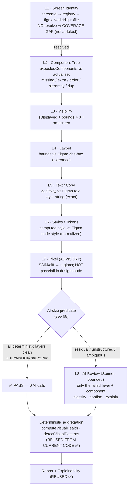
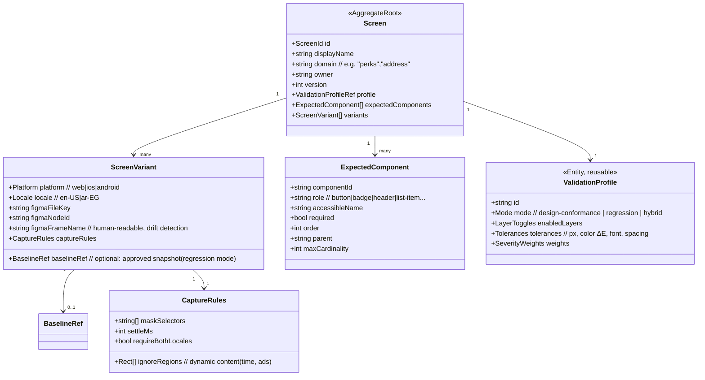
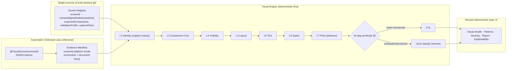

# ADR-002 Rev.2 — Visual Testing Engine: Final Architecture (pre-implementation)

> **Status:** 🟢 **Proposed — FINAL architecture for approval. NOT implemented.** Supersedes [ADR-002 Rev.1](./adr-002-visual-testing-redesign.md).
> **⚠️ Superseded-in-part by [ADR-003](../../../docs/ai/architecture/adr-003-visual-conformance-engine-plugin-aligned.md) (2026-07-26):** the **methodology here is kept** (L1–L7 pyramid, Screen Registry model, AI-skip predicate, dynamic-vs-defect rules), but the engine's **home and invocation change** — it relocates out of the legacy `qa-platform` into the `breadfast-workflow` plugin (generic `lib/` core + `capabilities/visual/`), is reframed as *Conformance-instance #1*, and is invoked **deterministic-first** by both the worker and the primary Claude Code operator. **Read ADR-003 before implementing from this document.**
> **Author role:** Principal Test Architect (revision review)
> **Date:** 2026-07-21
> **Reference implementation:** **Selenium Java** (canonical framework at `D:\projects`). Architecture stays framework-independent; examples assume Selenium Java.
> **Governs:** the M3/M3.5 "Visual Testing Intelligence" pipeline.
> **Related:** [ADR-001 — AI Reasoning Frugality](../../ARCHITECTURE.md#adr-001) · [Rev.1 current-state analysis](./adr-002-visual-testing-redesign.md) (Parts 1–2 remain the accurate current-state record).

---

## How to read this document

Rev.1 established **what the system does today** (still accurate — see Rev.1 Parts 1–2) and a first redesign. Rev.2 is a **critical revision of the redesign** in response to eight review challenges. I did **not** rubber-stamp them: §0 is a decision log stating, for each, whether I **accept / accept-with-modification / reject**, with reasoning. The rest of the document is the architecture that results.

The headline change from Rev.1: **the more structured evidence we extract, the less AI we need.** Rev.1 kept AI as a residual classifier. Rev.2 shows that with a **Screen Registry** + **structured (non-OCR) extraction** + a **component-tree/layered validation pyramid**, AI collapses to **near-zero for well-instrumented screens** and is reserved for genuinely unstructured surfaces (canvas/image) and ambiguous judgment. That is a stronger expression of ADR-001 than Rev.1.

---

## §0 — Decision log (my verdict on each of the 8 challenges)

| # | Challenge | Verdict | One-line rationale |
|---|-----------|---------|--------------------|
| 1 | Screen Registry as single source of truth (vs `figmaNodeId` on every test case) | ✅ **Accept** | Removes duplicated volatile metadata; makes `figmaNodeId` an infrastructure detail behind a stable `screenId` (DDD). Rev.1's per-test-case field was wrong. |
| 2 | Prefer structured extraction (DOM/a11y/Appium XML) over OCR | ✅ **Accept — self-correct** | OCR was the weakest part of Rev.1. Structured text/bounds/styles are exact and free; OCR demoted to fallback for unstructured surfaces only. |
| 3 | Component Tree Comparison as a primary deterministic stage | ✅ **Accept with modification** | Yes as a primary stage — but grounded in the registry's `expectedComponents`, **not** a naïve Figma-layer-tree ≟ DOM-tree equality (that impedance mismatch is unsolvable deterministically). |
| 4 | 8-layer Validation Pyramid instead of one comparison | ✅ **Accept with modification** | Adopt the pyramid, but (a) **pixel is advisory, not a gate** in design-conformance mode, (b) layers run **per-component** and **collect all findings** (not global hard-stop), (c) fail-fast only gates the *AI decision*. |
| 5 | Deterministic criteria for skipping AI (not a vague "PASS") | ✅ **Accept** | Define an explicit, testable AI-skip predicate over the pyramid's layer results. |
| 6 | Fully design the Screen Registry domain model | ✅ **Accept with one rejection** | Full aggregate designed. **Reject** storing `supportedTestCases` as an authored field — it must be a *derived reverse-index* (avoid bidirectional duplication). |
| 7 | Selenium Java as canonical reference | ✅ **Accept** | Core architecture unchanged (still manifest-driven); refines the extraction layer to Selenium 4 / Appium APIs and a TestNG listener as the manifest emitter. Notes real Selenium limitations honestly. |
| 8 | Self-challenge; change anything that should change | ✅ **Done** | Biggest change: AI → near-zero for structured screens; **severity + root-cause become deterministic**; pixel demoted; registry drift is now the #1 risk. See §8. |

**Net:** all eight challenges improve the design. Two carry a substantive disagreement I want on record: **§3** (component tree must be registry-grounded, not Figma-tree-matched) and **§6** (`supportedTestCases` is derived, not stored). One Rev.1 recommendation is **reversed**: OCR-as-primary (§2), and one is **downgraded**: pixel comparison as a gate (§4).

---

## §1 — Screen Identity: adopt the Screen Registry

### Verdict: the registry wins on every axis. Rev.1 was wrong to put `figmaNodeId` on the test case.

A single logical screen (say, *Address list*) is exercised by many test cases and rendered in many variants (EN/AR × iOS/Android/Web). Rev.1's "`figmaNodeId` on every test case" means the same volatile Figma id is copied across dozens of test cases and platform rows.

| Axis | `figmaNodeId` on each test case (Rev.1) | **Screen Registry (Rev.2)** |
|---|---|---|
| Maintainability | Update N test cases per change | Update **1** registry entry |
| Scales when Figma changes | O(test cases) edits, easy to miss some | O(1) edit; drift-detectable |
| Duplicated metadata | High (id repeated everywhere) | **None** (id lives once) |
| Traceability | Test case → Figma only | Screen → Figma **and** → test cases **and** → coverage, one hub |
| Clean Architecture / DDD | Domain object leaks an infrastructure id | **`screenId` = stable identity (domain); `figmaNodeId` = infrastructure detail** behind the aggregate |

**DDD framing.** `Screen` is an aggregate root; `screenId` is its identity and **never changes**. `figmaNodeId`, baseline snapshots, tolerances are attributes that *may* change without affecting identity. Test cases and automation depend only on the **abstraction (`screenId`)** — the Dependency Inversion Principle applied to test metadata. This also mirrors the platform's own pattern: it already has a **Prompt Registry** and **Workflow Registry** as declarative single-sources-of-truth (ARCHITECTURE.md). A **Screen Registry** is the same idea, and belongs in **shared git** (like `docs/ai/**`), not per-tester DB — it is shared knowledge.

```
Screen ID (stable, semantic)
      │  referenced by
      ├──────────────► BrowserStack Test Case  (screen field = screenId)
      ├──────────────► Selenium Automation      (@VisualScreen("address-list"))
      │  resolved via
      └──► Screen Registry ──► { figmaNodeId per variant, expectedComponents,
                                 validationProfile, captureRules, baselineRef }
                                          │
                                          ▼
                         Evidence Manifest (emits screenId; engine resolves the rest)
                                          │
                                          ▼
                                   Visual Engine
```

**Trade-off / cost (honest):** the registry must be maintained and can drift (a `screenId` referenced but absent, or a `figmaNodeId` that Figma deleted). Mitigations in §8: a registry-validation diagnostic (pre-execution gate), and progressive adoption — a registry entry may start as just `screenId → figmaNodeId` and grow.

---

## §2 — Deterministic extraction: structured first, OCR last

### Verdict: accept and self-correct. OCR was the weakest recommendation in Rev.1.

The actual app already exposes its ground truth structurally. Reading pixels with OCR to recover text we can query directly is strictly worse (OCR error, font/RTL failures, cost). **Structured extraction is exact, deterministic, and free.**

**Extraction priority (per platform):**

| Signal | Selenium Web (reference) | Appium (iOS/Android) | Fallback |
|---|---|---|---|
| Element existence / hierarchy | DOM tree + roles | page source XML tree | — |
| Text | `WebElement.getText()` / `getDomProperty("textContent")` | `text` / `label` / `name` attr | **OCR** |
| Bounds / visibility | `getRect()`, `isDisplayed()`, CDP layout | `bounds` attr, `displayed` | screenshot region |
| Computed styles | `getCssValue()` + CDP `getComputedStyle` | limited (font/color via attrs) | pixel sample |
| Attributes / test-ids | `getDomAttribute`, `data-testid` | `resource-id`, `content-desc`, `accessibility id` | — |
| Accessibility tree | Selenium 4 `getAriaRole` / `getAccessibleName`, CDP a11y snapshot | native a11y tree | — |

**OCR is reserved for exactly three cases** (as the challenge proposed): (1) `<canvas>` content, (2) text baked into raster images, (3) native-drawn content with no structured metadata (some game/Flutter surfaces). Everywhere else, OCR is off.

**Honest Selenium caveats** (design must absorb these):
- `getCssValue()` returns browser-computed values with inconsistent formats (`rgb()` vs hex, shorthand expansion, `px` vs `rem`) → a **normalization layer** with tolerances is mandatory before comparing to Figma tokens.
- Full a11y/computed-style trees need **CDP (Chrome DevTools Protocol)** via Selenium 4 `DevTools`; non-Chromium drivers degrade to ARIA attributes only. Design assumes Chromium for web richness; degrades gracefully.
- Mobile structured quality depends on the app setting `accessibility id`/`content-desc` — an **app-instrumentation dependency** (risk in §8).

---

## §3 — Component Tree Comparison (primary stage, registry-grounded)

### Verdict: accept as a primary stage — but I reject the implied Figma-layer-tree ≟ actual-DOM-tree comparison. Ground it in the registry instead.

Component-structure defects (missing Delete button, Edit/Status reordered, duplicated card, unexpected banner) are the **highest-value** visual defects and the ones pixel diff and free-hand AI handle worst. Making structure a **primary deterministic stage** is correct.

**The trap I'm avoiding:** Figma's layer tree and the runtime DOM/a11y tree are **not isomorphic** — Figma has design-time groups/auto-layout frames; the DOM has divs, portals, virtualized lists. A naïve tree-equality is a false-positive machine. So Rev.2 does **not** compare raw trees.

**What Rev.2 compares:** the registry's **`expectedComponents`** (a curated, semantic contract: role + accessible name + required + order) against the **actual extracted component set** (roles + accessible names + test-ids from §2). This is deterministic, stable across cosmetic DOM refactors, and detects exactly the target defects:

| Defect class | Detection (deterministic) |
|---|---|
| Missing component | expected `required` component absent from actual set |
| Unexpected component | actual component not in expected set (configurable strictness) |
| Wrong ordering | expected `order` vs actual DOM order of matched components |
| Wrong hierarchy | expected `parent` vs actual ancestor of matched component |
| Duplicate | actual count > expected cardinality |

Figma may *seed* `expectedComponents` (import named components/auto-layout order once), but the **registry entry is the contract**, human-reviewed — this converts an unsolvable matching problem into a maintainable curation problem, and reuses the curation effort the registry already requires.

---

## §4 — The Validation Pyramid (adopted, with three modifications)

### Verdict: adopt the layered pipeline; it gives fail-fast economics and precise diagnosis. But pixel is advisory, layers run per-component, and findings are collected across all layers.



**Modification 1 — pixel is advisory, not a gate.** In **design-conformance mode** (app vs Figma) two render sources never pixel-align; a pixel diff cannot be a pass/fail gate without drowning in noise. So L7 **locates regions** to focus L8, and contributes findings only for gross deltas. In **regression mode** (app vs an approved baseline of the *same* app — see §6 `baselineRef`) pixel **becomes a reliable gate**. The registry's `validationProfile` selects the mode. This two-mode split is a Rev.2 addition.

**Modification 2 — per-component, collect-all.** Layers run **per matched component** where applicable, and the pipeline **accumulates findings across layers** rather than hard-stopping at the first failure — otherwise you report one defect and hide the rest. *Short-circuit is local:* if L2 says a component is **missing**, L4–L7 for *that* component are skipped (meaningless), but other components proceed.

**Modification 3 — fail-fast gates only the AI decision.** The deterministic layers always run to completion for diagnosis; "fail-fast" only means *once any layer flags a residual, that component becomes an AI candidate.* Cheap layers still gate whether the expensive L8 runs.

**Why this beats Rev.1's single comparison:** precise diagnosis (you know it's an L5 text defect, not "something's off"), cheapest-and-most-diagnostic-first ordering, deterministic severity per layer, and AI shrinks to the true residual.

---

## §5 — Deterministic AI-skip predicate

### Verdict: accept. Replace "PASS → 0 AI" with an explicit, testable predicate.

**AI is skipped for a (screen, variant) when ALL hold:**

1. **Identity resolved** — `screenId` maps to a registry entry with a `figmaNodeId`/baseline for this variant.
2. **Component tree clean** — no missing/unexpected/reordered/duplicated components (L2).
3. **Visibility clean** — every required component displayed with non-zero, on-screen bounds (L3).
4. **Text identical** — every compared string exact-matches its Figma text layer / baseline after Unicode-normalization (L5).
5. **Styles within tolerance** — computed vs token deltas under the `validationProfile` thresholds (L6).
6. **Layout within tolerance** — bounds deltas under threshold (L4).
7. **Surface fully structured** — no canvas/image/native-unstructured region on this screen (else that region → AI/OCR).

**AI is invoked only for:** the specific components/regions failing 2–6 that deterministic logic flagged but cannot *classify* (is this delta a real defect or acceptable rendering variance?), plus unstructured surfaces from (7). Everything that deterministic logic can both detect **and** decide (missing component, exact text mismatch) is reported **without AI** — deterministic findings with deterministic severity.

**Plus a bounded audit sample:** a small, `log()`-ed random sample of PASS screens is still sent to AI periodically to catch deterministic blind spots — no silent 100% suppression.

---

## §6 — Screen Registry domain model

### Verdict: designed in full. One rejection: `supportedTestCases` is *derived*, not stored.



**Key modeling decisions:**
- **`figmaNodeId` lives on the *variant*, not the screen** — because EN and AR (and iOS/Android/Web) are different frames. Rev.1's flat model missed this.
- **`ValidationProfile` is a separate reusable entity** — tolerances/severity/mode are shared across many screens; DRY, and tunable centrally.
- **`baselineRef` enables regression mode** alongside design-conformance — the registry is the seam where the platform grows from "vs Figma" to "vs approved baseline" with no architecture change.
- **`supportedTestCases` — REJECTED as an authored field.** Storing the association on both the test case (`screenId`) *and* the registry duplicates it and invites divergence. The registry exposes `supportedTestCases` as a **derived reverse-index** computed from test cases that reference the `screenId`. Single owner of the association (the test case), single direction.

**Interactions:**

| Collaborator | Interaction |
|---|---|
| **BrowserStack Test Case** | Carries a `screen` field = `screenId` (custom field / label). The registry derives coverage from it. |
| **Selenium Automation** | Declares `@VisualScreen("address-list")` at the assertion point — **no Figma id in code**; resolution is the engine's job. |
| **Evidence Manifest** | Emits `{ screenId, platform, locale, screenshotPath, structuredDump }`. The engine resolves `figmaNodeId`/profile/expectedComponents from the registry — the manifest stays thin and framework-agnostic. |
| **Figma** | `figma_analysis` exports by `figmaNodeId` (it already exports by node-id). `figmaFrameName` enables drift detection. |
| **Visual Engine** | Reads the registry to drive pairing (L1), the component contract (L2), tolerances/mode (L4–L7), and the AI-skip predicate (§5). |

---

## §7 — Selenium Java as the reference implementation

### Verdict: accept. Core architecture unchanged (manifest-driven); the extraction layer and manifest emitter become Selenium/Appium-concrete.

**What does NOT change:** the manifest contract, the registry, the pyramid, the AI-skip predicate — all framework-independent. Any framework that emits the manifest plugs in.

**What becomes Selenium-Java-concrete (design-level, not code):**
- **Manifest emitter = a TestNG `ITestListener` / method interceptor** that, at each `@VisualScreen`-annotated assertion, captures `getScreenshotAs(OutputType.BYTES)` + a **structured dump** + the `screenId`, and appends a manifest row. This slots into the existing `D:\projects` TestNG framework with no new runner.
- **Structured dump (web):** DOM/a11y snapshot via Selenium 4 `DevTools` (CDP `DOMSnapshot`/`Accessibility`) with `getRect()`/`getCssValue()` fallbacks; `data-testid` conventions feed `componentId`.
- **Structured dump (mobile):** `driver.getPageSource()` XML + per-element `resource-id`/`content-desc`/`bounds`.
- **Annotation carries only `screenId`** (optionally `platform`/`locale` if not inferable from the run matrix) — keeping Figma ids out of source (§1).

**Design decisions this *does* affect:**
- Web richness assumes **Chromium/CDP**; other browsers degrade to ARIA attributes → the pyramid's L6 (styles) auto-downgrades to advisory when CDP is unavailable. Design must branch on capability, not assume it.
- `getCssValue()` format inconsistency makes the **normalization layer non-optional** (§2 caveat).
- Mobile structured quality depends on app-side accessibility ids → the registry's `captureRules`/diagnostics must flag screens where the structured dump is too sparse to validate deterministically (those fall to L8/OCR).

---

## §8 — Self-challenge: remaining weaknesses & what I changed

**What I reversed/downgraded from Rev.1 (per "don't preserve decisions just because written"):**
- **OCR-as-primary → rejected** (§2). Structured extraction is primary.
- **Pixel comparison as a gate → downgraded to advisory** in design mode (§4).
- **AI as the standing residual classifier → shrunk to near-zero for structured screens** (§5). With structured extraction, most findings are now **deterministic, including severity and root-cause** (we know the layer + component + token, so `rootCauseFor`-style templating already covers explanation without a model). AI is genuinely needed only for unstructured surfaces and ambiguous variance judgment.
- **`figmaNodeId` on test cases → replaced by the registry** (§1).
- **Flat screen model → variant-aware aggregate** (§6).

**Remaining weaknesses (honest):**

| Risk | Type | Severity | Mitigation |
|---|---|---|---|
| **Registry drift** (screenId referenced but missing; figmaNodeId deleted in Figma) | Maintenance | **High — the new central risk** | Pre-execution **registry-validation diagnostic** (fits the existing Diagnostics gate); `figmaFrameName` cross-check against Figma; CI lint on unresolved `screenId`s. |
| Figma node-id volatility | Maintenance | Med | Prefer named frames/component keys; drift job pings Figma REST and reports renamed/missing nodes. |
| `expectedComponents` curation burden | Maintenance | Med | Progressive adoption — start with L1+L5 (identity+text), add `expectedComponents` per high-value screen; Figma-seed the first draft. |
| Cross-source style normalization (Figma tokens vs computed CSS: units, color space, font fallback) | Correctness | Med | Dedicated normalization + ΔE color tolerance + font-stack aware compare; ambiguous deltas fall to L8. |
| Mobile structured-dump sparsity (app not instrumented) | Correctness | Med | `captureRules` detects sparsity → route to OCR/AI; report as an instrumentation coverage gap, not a false pass. |
| CDP/Chromium dependency for web richness | Portability | Low-Med | Graceful degradation of L6 to advisory; document capability matrix. |
| AI still doing deterministic work? | Waste | Low (now) | Severity + root-cause moved to deterministic; audit the L8 prompt so it only *classifies/decides*, never re-detects what L2–L6 already found. |

**Scalability / performance / token at hundreds of stories:**
- **Performance:** structured extraction + tree/text/style compares are fast; the only slow op (pixel/SSIM) is advisory and can be skipped per profile. Wall-clock is dominated by capture, not comparison.
- **Token:** approaches **~0 for well-instrumented structured screens**; residual spend is bounded by unstructured-surface count, still capped by `QA_VISUAL_MAX_SCREENS`.
- **Scale enabler:** the registry is the artifact that makes hundreds of stories tractable — it *is* the coverage matrix, deterministic and diff-able in git.

**Where deterministic replaces AI (final tally):** pairing, component presence/order/hierarchy, visibility, exact text/copy, style/token deltas (within tolerance), layout bounds, **severity** (diff-magnitude × category × layer), **root-cause explanation** (template from layer+component+token), health/patterns/coverage/report. **AI remains only for:** canvas/image/unstructured text (with OCR), and the ambiguous "real defect vs acceptable render variance" judgment — a small, bounded residual.

---

## §9 — Updated token analysis

| | Rev.1 proposal | **Rev.2** |
|---|---|---|
| AI calls / story (structured screens) | 1–4 | **~0** |
| AI calls / story (with unstructured surfaces) | 1–4 | bounded by unstructured-region count |
| Model | Sonnet | Sonnet (Haiku for simple classify); Opus never default |
| Static prompt caching | yes | yes (only when L8 runs) |
| Est. tokens / story | ~10k–40k | **~0–15k** (dominated by whether canvas surfaces exist) |
| vs current (~150k–300k, Opus×12) | ~70–90% ↓ | **~90–99% ↓** for structured stories |

**Never sent to Claude:** full Jira source, `JSON.stringify(prior outputs)`, whole frame sets, full-res images when a crop suffices, the generic design-system vocabulary, and **anything a structured layer already resolved deterministically.**

---

## §10 — Final architecture (approval recommendation)



**Recommendation: APPROVE Rev.2 for implementation planning.** It is deterministic where possible (identity, structure, text, styles, layout, severity, root-cause), AI-assisted only where valuable (unstructured surfaces, ambiguous judgment), scalable (registry = coverage source of truth), maintainable (single-source metadata, DDD aggregate), framework-independent (manifest contract), and optimized for Selenium Java (TestNG listener + CDP/page-source extraction).

**Two decisions still owed by a human before freeze:**
1. **Registry location & ownership** — recommend shared git (`docs/ai/screens/` or a `screen-registry.*`), owned by QA leads, validated by the Diagnostics gate. *(Confirm placement + owner.)*
2. **Vision-step transport** (carried over from Rev.1, now lower-stakes because L8 is rare) — when L8 *does* run on a canvas surface, use direct-image delivery. That may need the Messages API for that one call vs the subscription `claude` CLI (`Read`-path). Because L8 is now near-zero-frequency, a scoped per-tester API key is far more palatable than in Rev.1 — **but it still touches a locked decision** and must be ratified, not assumed.

**AI Impact Statement (ADR-001):** new AI invocations per story **decrease toward zero** for structured stories; no new reasoning *step type* is added (AI is narrowed further than Rev.1); tokens **~90–99% ↓** vs current; runtime ↓; and the capability is **derived deterministically wherever reasonable** — AI survives only where structured extraction is impossible (unstructured pixels) or the judgment is inherently non-deterministic (acceptable-variance calls). This is the fullest expression of ADR-001 to date.

**Kept verbatim from the existing codebase:** `computeVisualHealth`, `detectVisualPatterns`, `rootCauseFor`, `explainVisualFinding`, the `VisualComparison`/`VisualFinding` schemas, `renderReport`, and the citation/explainability wiring — all remain downstream of the new front-half and require no change.

---

### Appendix — Rev.1 → Rev.2 change ledger

| Topic | Rev.1 | Rev.2 |
|---|---|---|
| Screen identity | `figmaNodeId` per test case | **Screen Registry** (aggregate; variant-aware) |
| Text extraction | OCR (primary) | **Structured DOM/a11y/XML**; OCR fallback only |
| Structure check | implicit in AI | **Component Tree stage** (registry-grounded) |
| Pipeline | pre-diff → AI | **8-layer pyramid**; pixel advisory; per-component; collect-all |
| AI-skip | vague "PASS" | **explicit 7-clause predicate** + audit sampling |
| Severity / root-cause | AI-graded | **deterministic** (magnitude × category × layer; template) |
| Domain model | flat | **variant-aware aggregate**; `ValidationProfile`; `baselineRef`; derived `supportedTestCases` |
| Reference impl | Playwright | **Selenium Java** (TestNG listener + CDP/page-source) |
| Regression vs design | design only | **both modes** via `validationProfile` + `baselineRef` |
| Tokens | ~70–90% ↓ | **~90–99% ↓** (structured) |
| #1 risk | pairing | **registry drift** (mitigated by diagnostics) |
