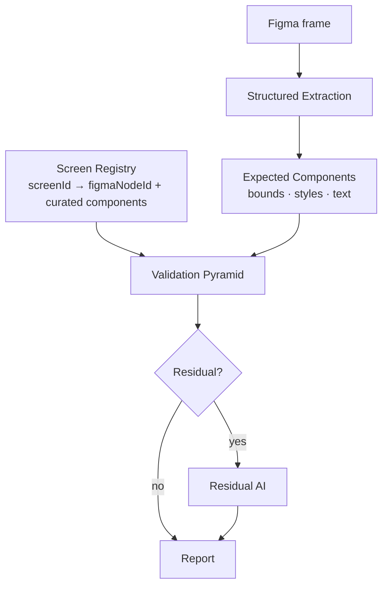
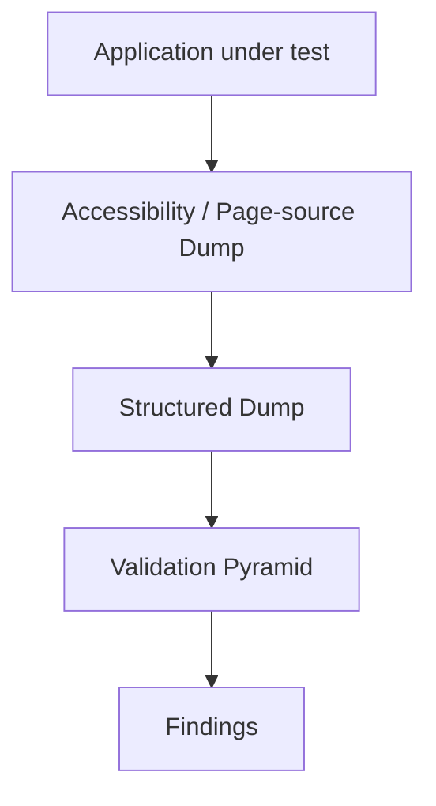
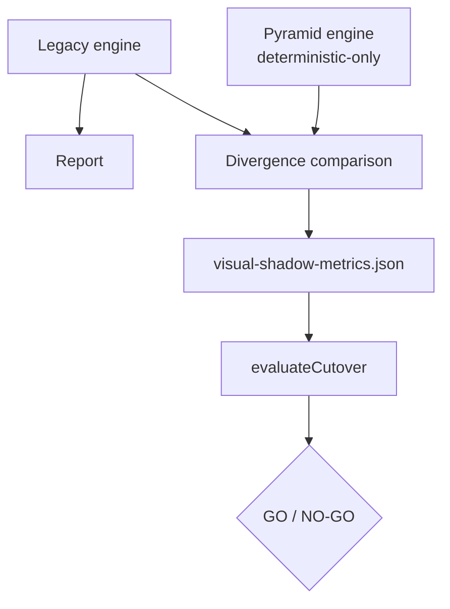
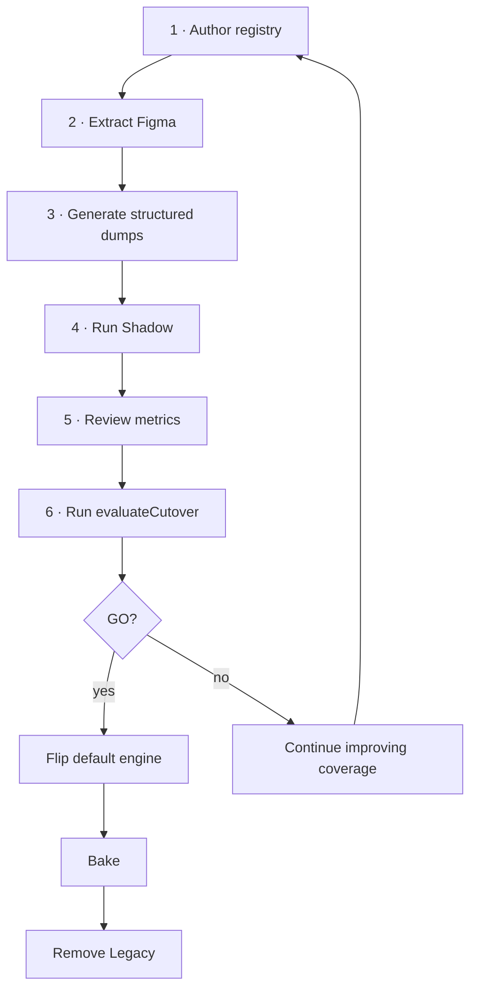

# Visual Testing — Operations Manual

> **Audience:** QA engineers and developers operating the Visual Testing system in a live environment.
> **Scope:** how to *run* the system — not how it's built. You do **not** need to read source code to use this manual.
> **Golden rule:** **Legacy is the production engine and stays the default until `evaluateCutover()` returns GO.** Everything else (pyramid, shadow, producers) is opt-in and safe.

---

## 1. Overview

The Visual Testing system checks that a screen the app actually renders matches **both** its Figma design and its Acceptance Criteria.

**Deterministic-first philosophy.** Wherever a difference can be found by exact comparison (is the button present? is the label text right? is the color within tolerance?), the system does that in code — reproducibly, with no AI. AI is used **only** where deterministic comparison is impossible or ambiguous. This makes results repeatable, cheap, and explainable.

**The Validation Pyramid.** Deterministic checks are organized as layers, cheapest and most structural first: identity → component tree → visibility → layout → text → styles → pixel. Each layer looks at one kind of difference and produces findings. (Full detail in §7.)

**Residual AI.** After the deterministic layers run, AI is invoked only for the *residual* — screens the layers could not fully evaluate (e.g. no structured data was captured, or an unstructured/canvas surface). A fully-evaluated screen consumes **zero** AI.

**Shadow mode.** A safe way to run the new deterministic engine *alongside* the current production (legacy) engine. Legacy still produces the report; the new engine runs quietly and its results are compared to legacy's. This produces **evidence** without any risk to production output.

**Cutover evaluation.** `evaluateCutover()` reads the shadow evidence and returns **GO** or **NO-GO** using fixed thresholds. It is the *only* sanctioned basis for making the new engine the default. Until it returns GO, **legacy remains the production engine.**

> **⚠️ Remember:** Turning on shadow mode, Figma extraction, or the pixel comparator does **not** change what your reports show. Those are evidence-gathering switches. Only flipping the default engine (after a GO) changes production behavior.

---

## 2. System Architecture (High Level)

### Expected side (the design)



### Actual side (the app)



### Shadow mode (evidence gathering)



**How the two sides meet:** for each screen, the system pairs the **expected** Figma frame with the **actual** screenshot (see §7 L1). It compares the expected components against the actual structured dump through the pyramid, and renders findings into the run report.

---

## 3. Environment Variables

All visual-testing behavior is controlled by environment variables (a few also have Settings-UI equivalents). **Defaults are production-safe** — with nothing set, you get the legacy engine and no extra work.

| Variable | Purpose | Allowed values | Default |
|---|---|---|---|
| `QA_VISUAL_ENGINE` | Which comparison engine runs | `legacy` · `shadow` · `pyramid` | `legacy` |
| `QA_VISUAL_ABSTAIN` | Let pairing abstain (report a coverage gap) instead of force-pairing a weak match | `true` · `false` | `false` |
| `QA_VISUAL_MATCH_FLOOR` | Minimum pairing confidence (0–1) before the heuristic abstains | number `0`–`1` | `0.3` |
| `QA_VISUAL_MAX_SCREENS` | Cap on how many frames are compared per story | integer | `12` |
| `QA_VISUAL_AI_AUDIT_RATE` | Fraction of *clean, fully-evaluated* screens that still get an AI spot-check | number `0`–`1` | `0` |
| `QA_VISUAL_PIXEL` | Enable the advisory L7 pixel comparator | `true` · `false` | `false` (off) |
| `QA_FIGMA_EXTRACT` | Extract structured design data (bounds/styles/text) from Figma during analysis | `true` · `false` | `false` (off) |
| `QA_FIGMA_EXTRACT_DEPTH` | How deep to traverse each Figma frame during extraction | integer | `6` |
| `QA_SCREEN_REGISTRY_DIR` | Override the registry folder location | path | `docs/ai/screens` |

> **Settings-UI equivalents:** `QA_VISUAL_ENGINE` ↔ Settings `visual.engine`; `QA_VISUAL_ABSTAIN` ↔ Settings `visual.abstain` (both under the AI group, "advanced"). The rest are env-only. A Settings value overrides the env var; env overrides the default.

**Per-variable guidance:**

### `QA_VISUAL_ENGINE`
- **Example:** `QA_VISUAL_ENGINE=shadow`
- **When to use:** `shadow` while collecting cutover evidence; `pyramid` only after a GO.
- **When NOT to use:** do **not** set `pyramid` in production before `evaluateCutover()` returns GO — the pyramid under-detects until the registry + dumps are populated.

### `QA_VISUAL_ABSTAIN`
- **Example:** `QA_VISUAL_ABSTAIN=true`
- **When to use:** turn on with shadow/pyramid so weak filename matches become **coverage gaps** instead of misleading comparisons.
- **When NOT to use:** leave off for pure legacy runs (keeps legacy byte-for-byte).

### `QA_VISUAL_MATCH_FLOOR`
- **Example:** `QA_VISUAL_MATCH_FLOOR=0.4`
- **When to use:** raise it if you see wrong screens paired; lower it (e.g. `0.2`) if too many screens abstain to coverage gaps while you're still authoring the registry.
- **When NOT to use:** don't set extreme values (`0` disables abstention → forced pairs; `1` abstains almost everything).

### `QA_VISUAL_MAX_SCREENS`
- **Example:** `QA_VISUAL_MAX_SCREENS=20`
- **When to use:** raise for stories with many screens; keep modest to bound AI cost/runtime on the legacy engine.
- **When NOT to use:** avoid very large values on the legacy engine (each screen is an AI call).

### `QA_VISUAL_AI_AUDIT_RATE`
- **Example:** `QA_VISUAL_AI_AUDIT_RATE=0.1` (spot-check ~1 in 10 clean screens)
- **When to use:** during shadow/pyramid, to periodically double-check that "clean" deterministic passes really are clean.
- **When NOT to use:** leave at `0` for zero extra AI cost; don't set high (defeats the token savings).

### `QA_VISUAL_PIXEL`
- **Example:** `QA_VISUAL_PIXEL=true`
- **When to use:** when expected and actual images share dimensions (regression/matched captures) and you want an advisory pixel signal.
- **When NOT to use:** for design-vs-app comparisons where sizes differ (it will simply skip); leave off to avoid decoding cost.

### `QA_FIGMA_EXTRACT`
- **Example:** `QA_FIGMA_EXTRACT=true`
- **When to use:** while building deterministic coverage — it populates the expected side (L4/L6) from the design.
- **When NOT to use:** leave off during normal legacy operation; the Figma REST path is **rate-limited**, so only enable it deliberately.

### `QA_FIGMA_EXTRACT_DEPTH`
- **Example:** `QA_FIGMA_EXTRACT_DEPTH=8`
- **When to use:** deepen if expected components are nested and not being captured.
- **When NOT to use:** avoid very large values (larger REST payloads, more rate-limit pressure).

### `QA_SCREEN_REGISTRY_DIR`
- **Example:** `QA_SCREEN_REGISTRY_DIR=/abs/path/screens`
- **When to use:** only if your registry lives outside the repo default.
- **When NOT to use:** normally leave unset (default `docs/ai/screens`).

---

## 4. Registry Authoring Guide

### What is a Screen Registry?
The registry is the **single source of truth** that maps a stable, human-meaningful `screenId` to its Figma frames (per platform/locale), its expected components, and its validation profile. It is what makes pairing **deterministic** and what activates the deterministic layers for a screen.

- **Location:** `docs/ai/screens/` (shared in git; QA-lead owned).
- **Loaded files:** every `*.json` in that folder — **except** files starting with `_` (those are templates/examples and are ignored).
- **Reference material:** `docs/ai/screens/README.md`, `_template.json`, `_example.address-list.json`.

### How to add a new screen
1. Copy `_template.json` → `<domain>.<screen>.json` (e.g. `address.address-list.json`). **No leading underscore.**
2. Give it a **stable `id`** (the `screenId`) — semantic, lowercase-kebab, and **never change it** once used.
3. Add one **variant per platform × locale**, each with the **`figmaNodeId`** taken from the Figma URL (`/design/<fileKey>/…?node-id=<id>`) and the `figmaFileKey`.
4. Author **`expectedComponents`** using the app's **real test-ids** as `componentId` (so matching is exact).
5. Optionally reference a shared **`ValidationProfile`** via `profileId`.

### Naming conventions
| Item | Convention | Example |
|---|---|---|
| Screen file | `<domain>.<screen>.json` | `perks.perk-details.json` |
| `screenId` | lowercase-kebab, stable | `perk-details` |
| `componentId` | the real app test-id | `perk-redeem-button` |
| `profileId` | lowercase-kebab | `standard-mobile` |

### Validation profiles
A profile is reusable comparison configuration referenced by many screens:
- `mode`: `design-conformance` (vs Figma), `regression` (vs approved baseline), or `hybrid`.
- `enabledLayers`: which layers run (`identity`, `component-tree`, `visibility`, `layout`, `text`, `styles`, `pixel`, `ai`).
- `tolerances`: `px`, `colorDeltaE`, `fontPx`, `spacingPx`.

If a screen has no `profileId`, a built-in default profile (all layers, sensible tolerances) is used.

### Expected Components
Each component you list becomes checkable:
| field | drives | notes |
|---|---|---|
| `componentId` | matching | prefer the real test-id |
| `role` | matching | e.g. `button`, `heading`, `group` |
| `accessibleName` | **L5 text** | the expected copy |
| `required` | **L2** | `true` ⇒ "missing" is flagged |
| `order` | **L2 ordering** | relative position |
| `maxCardinality` | **L2 duplicates** | max allowed count |
| `bounds` | **L4 layout** | usually Figma-extracted |
| `styles` | **L6 styles** | e.g. `{ "color": "#fff", "font-size": "16px" }` |

### How to validate registry files
The validator runs automatically in the **pre-execution Diagnostics gate** (check id `core.screenRegistry`). Open Diagnostics in the web app (or the diagnostics report) and read that check.

### How to interpret validator errors
| Message | Meaning | Fix |
|---|---|---|
| `Duplicate screenId "X"` | Two screens share an id | Rename one; ids must be unique |
| `Duplicate ValidationProfile id "X"` | Two profiles share an id | Rename one |
| `Screen "X" references unknown profileId "Y"` | `profileId` typo / missing profile | Fix the reference or add the profile |
| `Screen "X" has no variants` (warning) | No platform/locale defined | Add at least one variant |
| `… variant …/… has no figmaNodeId` (warning) | Heuristic pairing only for that variant | Add the `figmaNodeId` from the Figma URL |

### Common mistakes
- ❌ Using a Figma layer name as `componentId` instead of the app test-id → weak matches.
- ❌ Changing a `screenId` after it's in use → breaks history/coverage.
- ❌ Forgetting a variant per locale (EN/AR are **different frames**).
- ❌ Marking auto-derived design layers `required` → false "missing" findings.

### Complete worked example
See `docs/ai/screens/_example.address-list.json` (a full, schema-valid, validator-clean screen with three variants and four expected components). Copy its shape into a real (non-`_`) file and substitute your project's real ids and node-ids.

---

## 5. Figma Structured Extraction

Extraction reads each Figma frame's structure (text, bounds, colors, fonts) so the **expected side** of L4/L5/L6 has data.

### Required credentials
- **Figma Personal Access Token** — configured in **Settings → Figma → "Figma Personal Access Token" (`figma.token`)**. The extractor uses it to call the Figma REST API.
- **Figma File key + node ids** — taken **per story** from the Figma URL in the Jira ticket (`/design/<fileKey>/…?node-id=<id>`). You do not set these globally.

### How to run extraction
Extraction is **not** a separate command — it runs **inside the `figma_analysis` step** of a normal story run when enabled:

```
QA_FIGMA_EXTRACT=true
# optional: QA_FIGMA_EXTRACT_DEPTH=6
```
Run (or re-run) the story's Figma analysis with that set.

### Expected outputs & folder structure
```
<story workspace>/
  figma-analysis/
    <frame images>.png            ← exported frames (existing behavior)
    extract/
      <nodeId>.json               ← NEW: structured dump per frame (producer #1)
```
Each `extract/<nodeId>.json` is a structured dump of that frame (elements with roles, bounds, styles, text).

### Cache behaviour
- One file per frame node id, overwritten on re-run.
- The pyramid loads `extract/<nodeId>.json` for a frame **when the registry has no curated components** for that screen (registry always wins).

### How to verify extraction succeeded
1. Check the run log for `figma structured extraction: N/M frame(s) cached`.
2. Confirm `figma-analysis/extract/` contains one JSON per frame.
3. Open one file — it should list elements with `bounds` and `styles`.

### Common failure scenarios & recovery
| Symptom | Likely cause | Recovery |
|---|---|---|
| Log: `figma extract … failed: … 429 / Retry-After` | Figma REST **rate limit** | Wait and re-run; extraction is best-effort and never blocks the run |
| Log: `exporter not loadable` | Exporter helper path wrong | Check `QA_FIGMA_EXPORTER_PATH` / the automation helpers location |
| No `extract/` folder created | `QA_FIGMA_EXTRACT` not set to `true` | Set it and re-run figma analysis |
| Empty/198 tiny extracts | Frame has no text/among depth | Increase `QA_FIGMA_EXTRACT_DEPTH` |
| Auth errors (401/403) | Missing/invalid token | Set a valid `figma.token` in Settings |

> **Note:** Extraction being off or failing is **safe** — the system falls back to whatever expected data the registry provides (or degrades that screen to residual/coverage-gap). It never fails the run.

---

## 6. Structured Dump Generation

A **structured dump** is the machine-readable structure of the *actual* rendered screen. It is what the deterministic layers compare against. Dumps are captured **best-effort** by the execution agent during a run and referenced from the Evidence Manifest.

- **Where stored:** alongside each screenshot in the story's `screenshots/` folder, named `<index>_<short-slug>.dump.json` (or `.txt`).
- **How referenced:** the run writes `evidence-manifest.json` in the story workspace; each row's `structuredDumpPath` points at the dump.
- **How consumed:** the pyramid reads the dump for a screen and runs L2–L6 against it. **No dump ⇒ that screen is treated as residual** (deterministic layers can't evaluate it).

### Playwright (web)
- **How produced:** the execution agent captures the accessibility snapshot (`browser_snapshot`) and saves it as the dump next to the screenshot.
- **Format:** accessibility tree text (roles + names + hierarchy).

### Appium — Android
- **How produced:** the mobile driver captures `getSource()` (page-source XML) and saves it as the dump.
- **Format:** XML with `resource-id`, `content-desc`, `text`, `bounds="[x1,y1][x2,y2]"`.

### Appium — iOS
- **How produced:** same `getSource()` capture.
- **Format:** XML with `name`, `label`, `value`, and `x`/`y`/`width`/`height`.

### How to inspect a dump
Open the `<index>_<slug>.dump.json` file. Web dumps are a11y text; mobile dumps are XML. The system auto-detects the format — you don't convert anything.

### Common issues & recovery
| Symptom | Cause | Recovery |
|---|---|---|
| No `.dump.*` files | Agent skipped capture (best-effort) | Re-run execution; ensure the app was reachable |
| Dump present but pyramid finds nothing | Dump is sparse (app not instrumented with test-ids / a11y) | Improve app accessibility ids; until then the screen stays residual |
| `structuredDumpPath` missing in manifest | Dump wasn't saved next to the screenshot | Check the screenshots folder + re-run |

> **Note:** Missing dumps never break a run — the screen just routes to residual AI (pyramid engine) or is unaffected (legacy engine).

---

## 7. The Validation Pyramid

Each layer inspects one kind of difference. Layers run cheapest/most-structural first; a component flagged **missing** by L2 is not re-checked by later layers (no duplicate noise). All deterministic findings carry `source: deterministic`; severities are computed by rule, not by AI.

| Layer | Name | Purpose (operational) |
|---|---|---|
| **L1** | Identity | Pair the correct Figma frame with the correct screenshot |
| **L2** | Component Tree | Are the right components present, once, in the right order/nesting? |
| **L3** | Visibility | Are required components actually visible (non-zero size)? |
| **L4** | Layout | Are components within tolerance of their expected position/size? |
| **L5** | Text / Copy | Does the visible copy exactly match the expected copy? |
| **L6** | Styles / Tokens | Are colors, fonts, sizes within tolerance? |
| **L7** | Pixel | Advisory whole-image difference (only when sizes match) |
| **L8** | Residual AI | Judge what the deterministic layers couldn't evaluate |

### L1 — Identity (pairing)
- **Inputs:** exported Figma frames, captured screenshots, the Evidence Manifest (`screenId`), the registry.
- **Output:** a frame↔screenshot pair, or a **coverage gap** if no confident pair exists.
- **Operational meaning:** if you see many *coverage-gap* results, identity is failing — the registry isn't populated or filenames don't match. This is **not** a UI defect.
- **Example finding:** verdict `coverage-gap` — "No actual screenshot could be confidently paired to this Figma frame."

### L2 — Component Tree
- **Inputs:** expected components (registry/Figma) + actual dump.
- **Output:** missing / unexpected-duplicate / wrong-order / wrong-hierarchy findings.
- **Severity:** missing & duplicate = **major**; ordering & hierarchy = **minor**.
- **Example:** *major · components/missing-component* — "Required component 'Pay Button' is missing from the screen."

### L3 — Visibility
- **Inputs:** matched required components + their bounds.
- **Output:** present-but-not-visible findings.
- **Severity:** **major**.
- **Example:** *major · states/component-visibility* — "'Add Address' is present but not visible (zero-area bounds)."

### L4 — Layout
- **Inputs:** expected bounds (usually Figma-extracted) + actual bounds.
- **Output:** position/size-out-of-tolerance findings.
- **Severity:** by magnitude — ≥3× tolerance = **major**, otherwise **minor**.
- **Example:** *minor · layout/position* — "'Title' is 20px off its expected box (tolerance 2px)."

### L5 — Text / Copy
- **Inputs:** expected `accessibleName` + actual text.
- **Output:** exact-copy mismatch findings.
- **Severity:** **major** (copy matters).
- **Example:** *major · content/exact-text* — expected "Save", actual "Submit".

### L6 — Styles / Tokens
- **Inputs:** expected styles (Figma/registry) + actual styles.
- **Output:** color/size/font mismatches (color via perceptual ΔE; lengths via px tolerance).
- **Severity:** by magnitude — ≥3× tolerance = **major**, otherwise **minor**.
- **Root cause:** names the token (e.g. a color-token issue on a component).
- **Example:** *major · color/color* — "'Pay Button' color is #000000 but expected #ffffff."

### L7 — Pixel (advisory)
- **Inputs:** expected frame image + actual screenshot (**only if same dimensions**).
- **Output:** an **info** advisory with the % of differing pixels; skipped on size mismatch.
- **Severity:** **info** (never a gate in design-conformance).
- **Example:** *info · layout/pixel-diff* — "Advisory: 12% of pixels differ from the design."

### L8 — Residual AI
- **Inputs:** the frame + screenshot + AC, for screens the deterministic layers couldn't fully evaluate (no dump / unstructured surface), plus any audit sample.
- **Output:** AI-detected findings (`source: ai`).
- **Operational meaning:** as registry + dump coverage grows, L8 fires less — that's the intended trajectory toward cutover.

> **Coverage gaps vs findings:** a *coverage-gap* means "we couldn't check this screen," not "this screen is wrong." Coverage gaps are non-penalizing (severity info) and are reported separately so they don't distort visual health.

---

## 8. Shadow Mode

### Purpose
Run the new deterministic engine **beside** legacy to gather comparison evidence — **without changing the report** (legacy still drives it). This is how you build the case for cutover safely.

### How to enable
```
QA_VISUAL_ENGINE=shadow
# recommended companions while building coverage:
QA_VISUAL_ABSTAIN=true
QA_FIGMA_EXTRACT=true
# optional:
QA_VISUAL_AI_AUDIT_RATE=0.1
```
(Or set Settings `visual.engine=shadow`.)

### How to execute
Run stories normally. In shadow mode the legacy engine produces the report as usual, and the pyramid runs **deterministic-only** (no AI cost) purely to compute divergence.

### Expected output files
Per story workspace:
```
visual-shadow-metrics.json     ← the divergence metrics for that run
```
The same metrics are also attached to the run state.

### How to interpret `visual-shadow-metrics.json`
| Field | Meaning | What "good" looks like |
|---|---|---|
| `legacyScreens` / `pyramidScreens` | screens each engine produced | similar counts |
| `legacyFindings` / `pyramidFindings` | total findings each engine produced | pyramid ≥ ~90% of legacy |
| `legacyBySeverity` / `pyramidBySeverity` | findings by severity | comparable distributions |
| `screensCompared` | screens present in **both** (matched by name) | grows toward ≥20 across runs |
| `verdictAgreements` | of those, how many share a verdict | high |
| `verdictAgreementRate` | agreement fraction (0–1) | ≥ 0.90 |

**Reading the three headline signals:**
- **Agreement rate** = `verdictAgreementRate`. Low ⇒ engines disagree on pass/fail.
- **Finding regression** = `pyramidFindings ÷ legacyFindings`. Well below 1 ⇒ pyramid is under-detecting (usually missing data).
- **Coverage** = `screensCompared` accumulated across runs. Low ⇒ not enough evidence yet.

### Common reasons for disagreement
| Observation | Likely cause |
|---|---|
| Pyramid finds far fewer findings | Registry not authored / no structured dumps (residual) |
| Pyramid flags "missing" that legacy didn't | Registry marks components `required` that the app names differently → fix identities |
| Many coverage gaps | Identity/registry incomplete or match floor too high |
| Pyramid finds *more* (real) issues | Deterministic layers catching things AI missed — verify, then celebrate |

### Troubleshooting
- **No `visual-shadow-metrics.json`:** the story had no frames or no screenshots; check figma_analysis + execution produced evidence.
- **Agreement stuck low:** work the registry (identities/copy) and confirm dumps are being captured.
- **`screensCompared` stays 0:** legacy and pyramid screen **names** don't line up — ensure the registry `displayName`/frame names are consistent.

---

## 9. `evaluateCutover()`

### Purpose
Turn the accumulated shadow metrics into a single reproducible **GO / NO-GO** verdict. It is the **only** approved basis for flipping the default engine or removing legacy.

### Inputs
One or more `visual-shadow-metrics.json` results (aggregated across your shadow window).

### Thresholds (defaults)
| Threshold | Default | Meaning |
|---|---|---|
| `minScreensCompared` | **20** | need enough evidence to decide |
| `minVerdictAgreement` | **0.90** | pyramid must agree with legacy on ≥90% of compared screens |
| `maxFindingRegression` | **0.10** | pyramid may find at most 10% fewer findings than legacy |

### GO / NO-GO
- **GO:** all thresholds met — pyramid is at or above legacy parity. Safe to plan cutover.
- **NO-GO:** one or more thresholds failed — keep improving coverage; **stay on legacy.**

### How to run it (aggregate your metrics)
`evaluateCutover` is available from `@qa/shared`. A minimal operator harness that reads every `visual-shadow-metrics.json` you've collected and prints the verdict:

```js
// save as check-cutover.mjs in qa-platform/, then: node check-cutover.mjs <dir-of-metrics>
import { readFileSync, readdirSync } from 'node:fs';
import path from 'node:path';
import { evaluateCutover } from './packages/shared/dist/index.js';
const dir = process.argv[2] ?? '.';
const divergences = readdirSync(dir)
  .filter((f) => f.endsWith('visual-shadow-metrics.json'))
  .map((f) => JSON.parse(readFileSync(path.join(dir, f), 'utf8')));
console.log(JSON.stringify(evaluateCutover(divergences), null, 2));
```

### Example outputs
**NO-GO (no evidence yet):**
```json
{ "verdict": "no-go",
  "reasons": ["Insufficient evidence: 0/20 screens compared across 0 shadow run(s)."],
  "metrics": { "shadowRuns": 0, "screensCompared": 0, "verdictAgreementRate": 0, "findingRatio": 0 } }
```
**GO:**
```json
{ "verdict": "go",
  "reasons": ["All cutover thresholds met — pyramid is at or above legacy parity."],
  "metrics": { "shadowRuns": 8, "screensCompared": 34, "verdictAgreementRate": 0.94, "findingRatio": 0.97 } }
```

### Meaning of every failure reason
| Reason | Meaning | Action |
|---|---|---|
| `Insufficient evidence: X/20 screens compared…` | Not enough shadow data | Run more shadow stories covering more screens |
| `Verdict agreement X% < required 90%` | Engines disagree too often | Investigate disagreements (§8); fix registry/identities |
| `Pyramid produced X% of legacy findings … under-detection risk` | Pyramid misses too much | Populate registry + ensure structured dumps are captured |

---

## 10. Operational Workflow



**Practical checklist:**
1. **Author registry** — add the highest-traffic screens (`docs/ai/screens/`); pass the Diagnostics `core.screenRegistry` check.
2. **Extract Figma** — set `QA_FIGMA_EXTRACT=true`, run figma analysis, confirm `figma-analysis/extract/*.json`.
3. **Generate structured dumps** — run execution; confirm `<index>_*.dump.*` files + `structuredDumpPath` in `evidence-manifest.json`.
4. **Run shadow** — set `QA_VISUAL_ENGINE=shadow` (+ `QA_VISUAL_ABSTAIN=true`); run a window of real stories.
5. **Review metrics** — read each `visual-shadow-metrics.json` (agreement, finding ratio, screens compared).
6. **Run `evaluateCutover()`** — aggregate metrics (§9 harness).
   - **GO →** flip `QA_VISUAL_ENGINE=pyramid` as default, **bake** for one release (keep legacy reachable via flag), then remove legacy.
   - **NO-GO →** act on the reasons, add coverage, return to step 1.

> **⚠️ Never flip the default to `pyramid` without a GO.** Doing so regresses detection until the registry + dumps are populated.

---

## 11. Migration Checklist

Copy this into your cutover ticket:

```
Coverage
  □ Registry authored for the target screens (highest-traffic first)
  □ Diagnostics core.screenRegistry = pass (no errors)
  □ Figma extraction verified (figma-analysis/extract/*.json present)
  □ Structured dumps verified (dump files + manifest structuredDumpPath)

Evidence (shadow window)
  □ Shadow window run across real stories
  □ screensCompared ≥ 20
  □ verdictAgreementRate ≥ 0.90
  □ finding regression ≤ 10% (findingRatio ≥ 0.90)

Decision
  □ evaluateCutover() == GO

Cutover
  □ Flip default QA_VISUAL_ENGINE=pyramid
  □ Production bake (one release; legacy still reachable via flag)
  □ Legacy removed (post-bake)
```

---

## 12. Troubleshooting

| Problem | Symptom | Cause | Recovery |
|---|---|---|---|
| **Missing registry** | Diagnostics `core.screenRegistry` = skip; everything pairs heuristically | No screens authored yet | Author screens (§4); this is expected early on |
| **Missing dumps** | Pyramid finds nothing on real screens | Execution didn't capture dumps | Re-run execution; verify `screenshots/*.dump.*`; improve app a11y ids |
| **Failed extraction** | Log `figma extract … failed` | Figma rate limit / bad token / bad URL | Wait & retry; check `figma.token`; check the story's Figma URL |
| **Figma auth failure** | 401/403 during extraction | Missing/expired token | Set a valid `figma.token` in Settings |
| **Pixel comparison disabled** | No L7 findings | `QA_VISUAL_PIXEL` off, or image sizes differ | Set `QA_VISUAL_PIXEL=true`; note it skips on size mismatch (expected) |
| **AI unexpectedly invoked** | AI runs on the pyramid engine | Screen was **residual** (no dump/expected) or audit-sampled | Populate registry + dumps; lower `QA_VISUAL_AI_AUDIT_RATE` |
| **AI not running when expected** | 0 AI calls | Screen was fully evaluated deterministically (by design) | Nothing to fix — that's the goal |
| **Shadow disagreement** | Low `verdictAgreementRate` | Registry identities/copy off; missing data | Fix identities/copy (§8); add coverage |
| **`evaluateCutover()` NO-GO** | Verdict no-go | A threshold unmet | Read the reason (§9); act accordingly |
| **Validation failures** | Diagnostics `core.screenRegistry` = fail | Duplicate ids / bad profile ref | Fix per §4 error table |

---

## 13. FAQ

**Q: Why isn't AI running?**
A: On the pyramid engine, a screen that was fully evaluated deterministically (structured dump + expected data present) needs no AI — that's the intended token saving. Legacy always uses AI.

**Q: Why is AI still running (on the pyramid engine)?**
A: The screen was a **residual** — no structured dump was captured, or there was no expected data (registry/Figma), or it was picked by the audit sample (`QA_VISUAL_AI_AUDIT_RATE`). Populate the registry + dumps to reduce residual AI.

**Q: Why is `evaluateCutover()` NO-GO?**
A: One of three thresholds failed — insufficient evidence (<20 screens), agreement <90%, or under-detection (>10% fewer findings). The verdict's `reasons` tell you exactly which; §9 maps each to an action.

**Q: Can I remove Legacy now?**
A: Only after `evaluateCutover()` returns **GO**, you've flipped the default to `pyramid`, and completed a production bake. Until then, **no.**

**Q: How do I add a new screen?**
A: §4 — copy `_template.json` to a real `<domain>.<screen>.json`, set a stable `screenId`, add variants with `figmaNodeId`, author `expectedComponents` with real test-ids, and pass the validator.

**Q: How do I debug a failed comparison?**
A: Read the finding's `layer` (which pyramid layer), `expected` vs `actual`, and `differenceDescription`. Check that the screen is registered, that a structured dump exists, and (for L4/L6) that Figma extraction ran. Coverage-gap ≠ defect.

**Q: Does turning on shadow/extract/pixel change my reports?**
A: No. Those gather evidence. Only flipping the default engine after a GO changes production output.

---

## 14. Future Work (officially deferred)

These are recorded, sanctioned follow-ups (see BACKLOG-002). Nothing here is required to operate the system today.

- **Advanced Figma extraction** — richer design-token/variable extraction to further populate expected styles (deepens L6).
- **Additional registry coverage** — ongoing authoring of more screens (the main lever toward GO).
- **Pixel comparator improvements** — image normalization/resize so L7 can compare design-vs-app across differing dimensions (today it skips on size mismatch).
- **Raw-dump parser breadth** — extend actual-side parsing to more capture formats as needed.
- **Classify-mode L8 prompt** — a narrowed AI prompt that *verifies* deterministic findings (activates once deterministic coverage is high); today L8 detects on residuals.
- **Cutover harness/endpoint** — a first-class command/endpoint to aggregate shadow metrics and print the `evaluateCutover()` verdict (today via the §9 snippet).

---

*Operations manual for the Visual Testing system. For the architecture and rationale, see the ADR/AIP/BACKLOG under `qa-platform/docs/design/`. For registry authoring specifics, see `docs/ai/screens/README.md`.*
