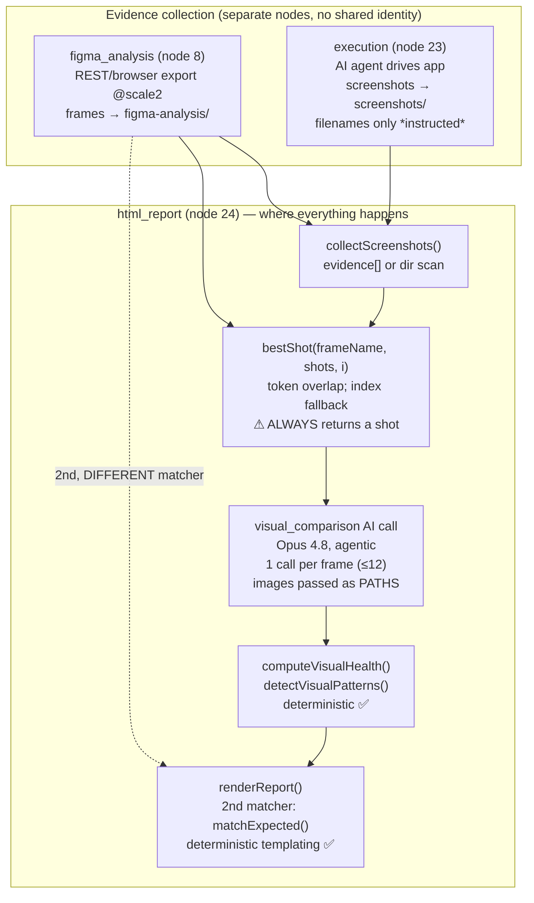
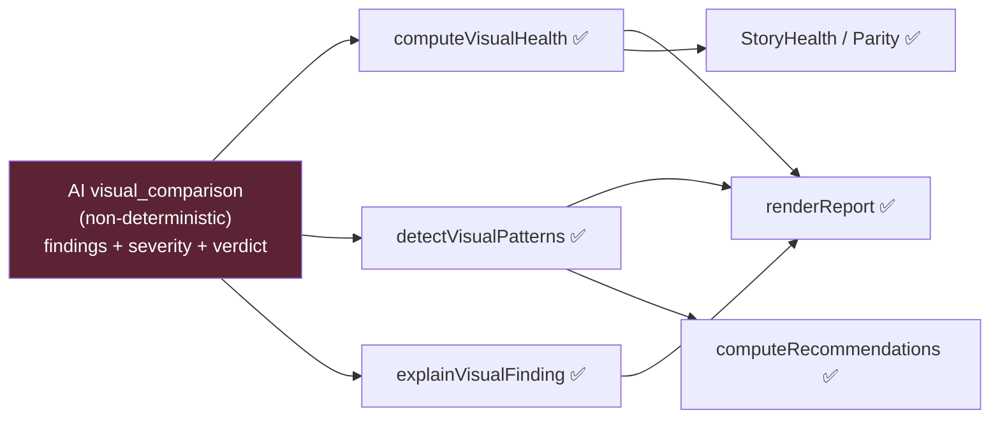
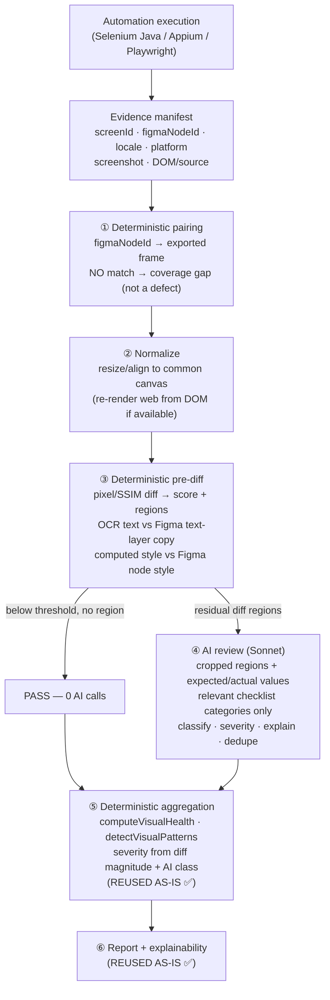

# ADR-002 — Visual Testing Engine: Architecture Design Review & Redesign

> **Status:** ⏭️ **Superseded by [ADR-002 Rev.2](./adr-002-visual-testing-redesign-rev2.md)** (2026-07-21). Kept for history — Rev.2 is the architecture to implement. The findings in Part 1/2 (how the system behaves today) remain the accurate current-state record; the *recommendation* (Parts 4/6) is revised in Rev.2.
>
> **Original status:** 🟡 **Proposed / Draft — for review, NOT accepted, NOT implemented.**
> **Author role:** Principal Test Architect (design review)
> **Date:** 2026-07-21
> **Supersedes candidate for:** the M3 / M3.5 "Visual Testing Intelligence" pipeline
> **Related:** [ADR-001 — AI Reasoning Frugality](../../ARCHITECTURE.md#adr-001--ai-reasoning-frugality-one-reasoning-step--many-deterministic-capabilities) · [phase2-platform-intelligence.md §M3/M3.5](./phase2-platform-intelligence.md)
>
> This document **describes the current implementation as it actually behaves in code** (Part 1), reviews it honestly (Part 2), compares it to the industry (Part 3), proposes a redesign (Part 4), quantifies token impact (Part 5), and gives a final recommendation (Part 6). **No code was written and nothing was implemented.** Every factual claim carries a `file:line` citation.

---

## Executive summary (read this first)

The current Visual Testing system is **architecturally inverted**: the one thing that *must* be deterministic — deciding **which Figma frame is the expected design for a given screenshot** — is done by a **fuzzy filename-token heuristic that always returns a match even when there is zero evidence of a match**; and the one thing AI is uniquely good at — *judging* a correctly-paired design-vs-implementation delta — is asked to *also* fetch its own inputs by opening file paths through an agentic tool loop.

The consequence: **a large fraction of "findings" are pairing artifacts** — Claude is handed the wrong two images and faithfully reports the (real, but irrelevant) differences between two unrelated screens. The deterministic layer *around* the AI call (health score, pattern grouping, severity aggregation, report) is genuinely good and should be kept almost verbatim. The problem is entirely in **evidence pairing** and **evidence delivery**, not in the aggregation math.

**The redesign in one sentence:** make screen identity an explicit contract carried by the test case (deterministic pairing), do a deterministic pixel/structural/text pre-diff to decide *whether* AI is even needed, and invoke Claude only on genuine, correctly-paired residual differences — with images delivered directly and the static checklist cached.

**Bottom line recommendation:** adopt the redesign (Part 6). It removes the dominant class of false positives, cuts visual-testing token spend by an estimated **~70–90%**, and is framework-independent (works for the Selenium Java canonical framework) — while *preserving* the entire deterministic intelligence layer that already exists.

---

# PART 1 — How the Visual Testing pipeline ACTUALLY works today

> This is *observed behavior from the code*, not the design intent. Where the design doc and the code disagree, the code wins and is noted.

### 1.0 There is no "visual" node

The canonical workflow is 27 nodes (`packages/shared/src/domain.ts:209-237`). **None of them is a visual-comparison node.** Visual comparison is a *sub-capability* (`packages/shared/src/prompts.ts:581` — `PROMPT_SUBCAPABILITIES = ['visual_comparison']`) invoked *inside* the `html_report` **code** node, best-effort, only if `ctx.state.visual` is still null (`apps/worker/src/nodes.ts:1560-1567`). It never blocks the report and is easy to silently skip.

Three nodes contribute evidence:

| # | Node | Type | Role in visual testing |
|---|------|------|------------------------|
| 8 | `figma_analysis` | ai | Exports Figma frames → `figma-analysis/` (`nodes.ts:735-943`) |
| 23 | `execution` | code | Drives the live app, captures actual screenshots → `screenshots/` (`nodes.ts:1402-1533`) |
| 24 | `html_report` | code | Calls `runVisualComparison(ctx)`; pairs, invokes AI per pair, aggregates, renders (`nodes.ts:1815-1859`, `1861-2470`) |



### 1.1 How ACTUAL app screenshots are captured

- Captured **by the platform**, not supplied externally. In `execution` (`nodes.ts:1402-1533`), a headless Claude agent drives the live app and saves image files.
  - **Web:** Playwright MCP; the agent is told *"Use `browser_take_screenshot` with a filename under the screenshots dir"* (`prompts.ts:466-467`).
  - **Mobile:** BrowserStack App Automate via `bs_helper.js` with `Bash`/`Read`/`Write`; *"saves a screenshot per case into the screenshots dir"* (`prompts.ts:471-473`).
- **Filenames are *instructed*, not enforced:** *"name it `<index>_<short-slug>.png`"* (`prompts.ts:429`). The naming that later pairing depends on is at the mercy of the agent's compliance.
- **Locale reality:** execution runs **en-US only**; Arabic is deferred (`nodes.ts:1419-1420`, `prompts.ts:474`). So the AR/EN parity that the comparison prompt talks about is not even produced at capture time.
- **Metadata:** none structured. A screenshot is just a path inside each executed case's `evidence: string[]`. **No screen name, locale, platform, or Figma node-id is attached to a screenshot.**

**Inputs:** live app + tester guidance. **Output:** loose PNG files + `evidence[]` paths. **AI vs deterministic:** capture is AI-agent-driven (non-deterministic filenames, non-deterministic coverage).

### 1.2 How Figma frames are exported

`figma_analysis` node (`nodes.ts:735-943`) → `figma-analysis/`. Three-tier fallback (`nodes.ts:820-855`, `figma.ts:4-12`):

1. **Primary** — Playwright MCP batch export (Ctrl+Shift+E → ZIP → extract) (`nodes.ts:379-475`).
2. **Secondary** — **Figma REST API** (`FigmaExporter`, `exportStoryFrames`) at **`scale: 2`** (`figma.ts:132,136`), only if batch export yields 0 frames.
3. **Tertiary** — Playwright screenshot of each frame URL → `figma_frame_<N>.png` (`nodes.ts:482-527`).

File key from the story's URL (`figma.ts:112`); node-ids from the URL (`figma.ts:119`). If no URL, the node **pauses and asks** (`nodes.ts:780-793`).

**Frame selection** (`figma.ts:117-137`): start from the URL's node-ids; if a node is a `SECTION`/`CANVAS`, **expand one level** into its screen-type children (`SCREEN_TYPES = FRAME|SECTION|COMPONENT|COMPONENT_SET|GROUP|INSTANCE`, `figma.ts:56,64-96`); dedupe by id, preserve order. If no node-id, fall back to **the first page's frames** (`figma.ts:133-136`). Selection is purely structural — **nothing ties a frame to an AC, a test case, or a screen name.**

**Inputs:** story Figma URL. **Output:** `FigmaFrame { id, name, file, bytes }` (`figma.ts:26-31`) + `fileKey` in `ctx.state.figma`. **AI vs deterministic:** export is deterministic; *which* frames are relevant is unmanaged (you get everything under the pointed container — potentially dozens).

### 1.3 How the "expected" frame is determined for a screenshot — **the crux**

There are **two independent, different pairing mechanisms**, both fuzzy keyword heuristics, neither using an explicit map, neither using locale/platform.

**Mechanism A — drives the AI comparison data** (`runVisualComparison`, `nodes.ts:1815-1859`). The loop is **frame-anchored**: for each Figma frame, pick the best screenshot via `bestShot` (`nodes.ts:1790-1804`):

```
function bestShot(frameName, shots, index) {
  const frameTokens = new Set(norm(frameName));
  let best = shots[index % shots.length];   // positional fallback
  let bestScore = -1;                        // ⚠ starts at -1
  for (const s of shots) {
    const overlap = norm(basename(s)).filter(t => frameTokens.has(t)).length;
    if (overlap > bestScore) { bestScore = overlap; best = s; }
  }
  return best;                               // ⚠ ALWAYS returns a shot
}
```

Because `bestScore` starts at `-1` and every candidate scores `≥ 0`, **a screenshot is always returned even with zero token overlap** — ties resolve to the first shot, i.e. effectively arbitrary/positional pairing whenever names don't share tokens. The AI never chooses the pair; it only judges the pair it is handed (`nodes.ts:1834-1845`).

**Mechanism B — drives the report's embedded Expected-vs-Actual images** (`matchExpected`, `nodes.ts:1945-1956`). This one is **test-case-title-anchored**, scores case-title+evidence tokens against on-disk Figma filenames (read from `figma-analysis/`, excluding `header|section` banners, `nodes.ts:1935-1941`), and **requires ≥1 shared keyword or shows nothing** (`bestScore >= 1 ? best : null`).

So the pair the **AI judged** (Mechanism A) and the pair the **report shows the human** (Mechanism B) **can be different frames.** There is no single source of truth for "expected screen."

### 1.4 How the "actual" screenshot is chosen

`collectScreenshots` (`nodes.ts:1777-1788`): prefer image paths from execution `evidence[]`; else scan `screenshots/`. Then `bestShot` picks one per frame. If none exist, comparison returns `compared:false` with *"No actual screenshots captured…"* (`nodes.ts:1821-1822`).

### 1.5 What data is sent to Claude, and how

One AI call **per frame**, bounded by `QA_VISUAL_MAX_SCREENS` (default **12**, `nodes.ts:1828`), on **Opus 4.8** (`MODEL` default `claude-opus-4-8`, `nodes.ts:101`; no cheaper-model override for this call), agentic, `attempts:1` (no retry on schema failure — a failed screen is logged and skipped, `task.ts:76`, `nodes.ts:1846-1848`).

**The prompt** (`prompts.ts:506-539`, verbatim shape) gives Claude:
- Role ("Senior QA Engineer … review of ONE screen"), the screen name, a free-text `combo` string.
- **The two images as Windows file *paths* with the literal instruction "(READ it)"** (`prompts.ts:516-517`).
- **Acceptance Criteria inline** (`acText`, `prompts.ts:518`; built from `st.acceptanceCriteria`, `nodes.ts:1824-1826`) — *and again* inside the context blob.
- The full **checklist** (11 categories, ~50 checks, `visual.ts:43-110`), injected so coverage is reproducible.
- The **RTL/per-platform parity rule as prose** (`prompts.ts:521-522`) — *instruction only, not enforced by code.*
- A **generic design-system vocabulary** — `UI_COMPONENTS.slice(0,10)` examples + `DESIGN_TOKEN_KINDS` (`schemas.ts:299-308`). **Not the project's real Figma variables/components** — the code comments call this a future "seam" (`schemas.ts:296-298`).
- The wrapper `Context:` block (`buildContext`, `nodes.ts:244-255`): tester guidance + KB reminder + **Jira source truncated to 7000 chars** + **prior outputs `JSON.stringify` truncated to 4000 chars** (`nodes.ts:252-253`).

**What Claude does NOT reliably get:** BrowserStack test-case detail (only whatever survives inside the 4000-char prior-outputs blob — in practice truncated away); real design tokens; image *pixels* unless it chooses to call `Read`.

**How images actually reach the model:** they don't, directly. `claude -p` is invoked with a **text-only argument vector** — `['-p', opts.prompt, '--output-format','json', …]` — **there is no image/attachment flag anywhere** (`claude-runner.ts:178-204`). Pixels enter *only* if the agent calls the `Read` tool on the paths (`allowedTools:['Read']`, `nodes.ts:1840-1842`). If the model doesn't call `Read`, it "reviews" images it never saw.

### 1.6 One-to-one vs search

**One frame ↔ one screenshot per call.** The pair is selected by code *before* the AI call; Claude is never shown alternatives to choose among (`nodes.ts:1830-1837`; prompt says "ONE screen").

### 1.7 How findings, severities, health, and the report are produced

- **Findings:** produced **directly by the AI** as `VisualFinding[]` (`schemas.ts:324-338`). Deterministic code creates **no new findings**; it only enriches (`visual.ts:4-6`, `schemas.ts:263-264`).
- **Per-finding severity + per-screen verdict:** **the AI's** (`VisualFinding.severity` default `minor`, `schemas.ts:327`; verdict `pass|minor|major|no-frame`, `schemas.ts:340-349`).
- **Visual Health:** **deterministic** (`computeVisualHealth`, `visual.ts:133-179`): `visualHealth = clamp(0..100, 100 − Σ penalty)`, `SEVERITY_PENALTY = {critical:25, major:10, minor:3, info:0}` (`visual.ts:113`); level ≥80 high / ≥50 medium / else low. Pass rate = passed ÷ validated. Purely a function of the AI's findings.
- **Pattern detection:** **deterministic** (`detectVisualPatterns`, `visual.ts:242-276`): group by `category|dimension|component|token`, ≥2 occurrences → one `VisualPattern` with max grouped severity + root-cause sentence (`rootCauseFor`, `visual.ts:211-235`).
- **Report:** **deterministic templating** (`renderReport`, `nodes.ts:1861-2470`), no AI — KPI tiles, health badge, patterns, per-finding cards, and the Expected-vs-Actual embed (paired by Mechanism B).



**Split:** the AI both **detects** and **grades**; everything else is deterministic and, in isolation, well-built and tested.

---

# PART 2 — Honest architectural review (brutal)

The deterministic aggregation layer is good. The two things that decide whether any of it is *meaningful* — **correct pairing** and **reliable evidence delivery** — are the weakest links, and they sit upstream of everything.

### 2.1 Why the WRONG Figma frame gets compared

1. **`bestShot` never abstains** (`nodes.ts:1794-1801`). `bestScore` starts at `-1`; with zero keyword overlap the first screenshot is returned. There is no confidence floor and no "no-match" branch. **Every frame is force-paired to some screenshot**, correct or not.
2. **Pairing keys off *instructed* filenames** that a Claude agent produced during execution (`prompts.ts:429`) and human-authored Figma layer names — two independently unreliable naming schemes with no shared vocabulary. Token overlap between "`3_checkout_review.png`" and a Figma frame named "Order summary – v2" is often zero.
3. **Frame-anchored iteration over an over-broad frame set.** Selection expands a whole `SECTION`/`CANVAS` into *all* its children (`figma.ts:64-96`) — often far more frames than the story touched. The loop pairs the first 12 of those (`nodes.ts:1830`), so frames the test never exercised get paired to whatever screenshot scores least-badly.
4. **No locale/platform keying at all.** The prose parity rule (`prompts.ts:521-522`) is unenforced; an EN screenshot can be paired to an AR frame purely on token overlap. (Moot today since capture is en-US only, but the rule is a lie the report tells.)
5. **Two matchers disagree.** The AI judged pair A (`bestShot`) while the report shows the human pair B (`matchExpected`, `nodes.ts:1945-1956`). A reviewer can look at a correct Expected/Actual embed while the findings above it were computed against a *different* frame.

### 2.2 Why Claude reports "mismatched screens" / why many findings are pairing artifacts

Given two unrelated screens, an honest vision reviewer **will** enumerate real differences — different headers, different buttons, different content. Those become `critical`/`major` findings. **The model is not wrong; the inputs are.** The system has no mechanism to detect "these two images are not the same screen" and abort — instead a mispair silently manufactures a pile of high-severity findings, which then inflate the (deterministic, faithful) severity penalties and *tank* Visual Health. So a *pairing* bug degrades a *quality* score. This is the single largest source of noise.

### 2.3 Where hallucination is possible

- **Silent no-read.** Images arrive as paths + "(READ it)" (`prompts.ts:516-517`); pixels exist only if the agent calls `Read` (`claude-runner.ts:180`, `nodes.ts:1840`). A model that skips `Read` (or reads one of two) will still emit a schema-valid `VisualScreenComparison` — **findings about images it never saw.** Nothing verifies both reads happened.
- **No retry on the vision call** (`attempts:1`, `task.ts:76`) — a malformed or partial result is dropped, not repaired.
- **Fabricated design-system attribution.** The prompt asks the model to name the component and the "root-cause token" from a *generic* vocabulary (`schemas.ts:299-308`), with **no real tokens supplied**. Component/token fields are therefore plausible guesses, and `detectVisualPatterns` (`visual.ts:242-276`) faithfully groups by those guesses — deterministic grouping over non-deterministic, ungrounded keys.

### 2.4 AI-guessing vs deterministic vs fragile

| Step | Nature | Verdict |
|------|--------|---------|
| Figma export | deterministic | OK (over-broad selection) |
| Frame **selection** (which frames matter) | structural, unmanaged | **fragile** |
| Screenshot capture + naming | AI-agent, instructed | **fragile** (non-deterministic filenames/coverage) |
| Frame ↔ screenshot **pairing** | fuzzy heuristic, never abstains | **broken** — root cause of noise |
| Image **delivery** to model | agentic `Read` of paths | **fragile** (silent no-read) + token-heavy |
| Finding **detection** | AI vision | inherently non-deterministic (acceptable *if* inputs are right) |
| Severity / verdict | AI | acceptable, but unanchored to diff magnitude |
| Component/token attribution | AI guess vs generic vocab | **fragile / ungrounded** |
| Health / patterns / coverage / report | deterministic | **good — keep** |

### 2.5 Token waste

- **Up to 12 Opus-4.8 agentic calls per story** (`nodes.ts:828,1830`), the **most expensive model**, with **no cheaper-model tiering** for what is largely a perception task.
- **No prompt caching.** Each call is a fresh `claude -p` process (`claude-runner.ts:199`) re-sending the *static* checklist (~50 checks) + role + Jira source (≤7000 chars) + prior outputs (≤4000 chars) every time.
- **Agentic multi-turn inflation.** `Read image1` → `Read image2` → answer means the growing conversation (incl. rendered images) is re-sent across turns.
- **Wasted spend on mispaired screens.** Tokens are burned producing findings that are pairing artifacts (§2.2) and will be discarded by a human — the worst kind of spend.
- **Truncated context is paid-for but useless.** 4000 chars of `JSON.stringify(prior outputs)` is sent every call yet is too small to carry test cases and too large to be free.

### 2.6 What will not scale to hundreds of stories

- **Fuzzy pairing accuracy degrades with frame count.** A story pointing at a 71-screen section (a real case per the code comments) makes token collisions and arbitrary ties far more likely, and the ≤12 cap means coverage is both incomplete *and* mispaired.
- **Opus × 12 × hundreds of stories** is a cost profile that only moves the wrong direction.
- **No baseline/history.** Every run is a from-scratch design-conformance pass; there is no approved-baseline regression concept, so the same design deltas re-surface every run with no "already triaged / accepted" memory. At hundreds of stories this is unmanageable triage.
- **No abstain/verify gate** means human trust erodes — after enough pairing-artifact findings, reviewers stop reading the section, which destroys the feature's value regardless of its deterministic polish.

---

# PART 3 — Industry comparison (architecture, not marketing)

| | **Applitools** | **Percy** | **Chromatic** | **Argos** | **Our system today** |
|---|---|---|---|---|---|
| Compare *what* | checkpoint vs **approved baseline** | checkpoint vs baseline | story vs baseline | checkpoint vs baseline | **app vs Figma design** |
| Pairing / identity | **stable test/step name** | **stable snapshot name** | **story ID** | **stable name/fingerprint** | **fuzzy filename token overlap** |
| Capture | **DOM+CSS snapshot**, re-rendered on their grid | **DOM snapshot**, re-rendered server-side @ widths | real-browser render per story | uploaded screenshots | AI-agent screenshots |
| Diff engine | **Visual AI** (structure-aware) | pixel diff + sensitivity | pixel diff + TurboSnap | pixel diff (odiff/pixelmatch) | **AI vision describes deltas** |
| Uses layout/structure | **yes** (Layout match level) | yes (re-render normalizes env) | via DOM render | no (pixels) | no |
| Uses AI | yes — to **classify diffs / suppress noise** | minimal | no | no | yes — to **detect from scratch** |
| False-positive control | match levels, ignore regions, AI noise model, consistent render env | consistent render env, sensitivity, ignore regions | TurboSnap, viewport pinning | thresholds, ignore regions | none (no threshold, no abstain) |
| Wrong-screen risk | **≈0** (identity-keyed) | **≈0** | **≈0** | **≈0** | **high** (heuristic) |

**The three lessons that matter:**

1. **Identity is deterministic and explicit, everywhere.** No serious tool *guesses* which baseline a checkpoint corresponds to. The snapshot/story/test **name is the key**; pairing is a dictionary lookup. Our fuzzy matcher is the thing the entire industry designed *away from*.
2. **The environment is normalized before comparison.** Applitools/Percy capture DOM+CSS and **re-render** to kill browser/font/AA noise; the pixel diff then means something. We compare raw device screenshots to raw Figma exports with no normalization, so even correct pairs carry environmental deltas.
3. **AI is a *filter on the diff*, not the *detector of the diff*.** Applitools' Visual AI decides *whether a pixel delta is a real, human-relevant change* and does root-cause against the DOM. It does not free-hand "describe the differences." Deterministic diffing finds *where*; AI decides *whether it matters and why*.

**Caveat — we solve a different problem.** These tools do **regression** (today's build vs an approved snapshot of the *same* app). We do **design conformance** (app vs Figma), which is genuinely harder (two different rendering sources, no pixel-alignment guarantee). That justifies *more* AI than a pixel-diff tool — but it does **not** justify abandoning deterministic identity or deterministic pre-diffing. It raises the bar for both.

---

# PART 4 — Proposed architecture

**Design goals:** deterministic where possible · AI only where it adds value · fewer hallucinations · lower tokens · scalable · maintainable · framework-independent (must fit Selenium Java) · aligned with ADR-001.

### 4.1 The core inversion

| Concern | Today | Proposed |
|---|---|---|
| Which frame is "expected"? | fuzzy heuristic, guessed at report time | **explicit identity from the test case** (lookup) |
| Is there a difference? | AI free-hand detection | **deterministic pre-diff** (pixel/structural/text) |
| Does the difference matter & why? | (folded into detection) | **AI, only on flagged residuals** |
| Health / patterns / severity aggregation | deterministic ✅ | **deterministic ✅ (unchanged)** |

### 4.2 The screen-identity contract (the keystone)

**Every test case explicitly knows its expected screen. Frame mapping comes from the test case, not from filenames.** This is the single most important decision and it directly answers the review questions:

- *How do we identify the correct expected Figma frame?* → From an explicit `figmaNodeId` declared on the test case / screen descriptor.
- *Should frame mapping come from the BrowserStack test case?* → **Yes.** The BrowserStack test case (or automation annotation) is the natural home for `screenId` + `figmaNodeId` + `locale` + `platform`. It already exists per story and is human-curated.
- *Should every test case explicitly know its expected screen?* → **Yes.** Pairing degrades from a probabilistic heuristic to a deterministic key lookup.

Concretely, the automation run emits an **evidence manifest** (one row per captured screen) — a data contract, framework-agnostic:

| field | source | purpose |
|---|---|---|
| `testCaseId` | test framework | traceability |
| `screenId` | test case | stable identity |
| `figmaNodeId` | test case metadata | **deterministic expected-frame key** |
| `locale`, `platform` | run matrix | **deterministic parity keying** |
| `screenshotPath` | capture | actual pixels |
| `domOrSource` (optional) | Selenium `getPageSource` / Appium XML / DOM+CSS | structural + text ground truth |
| `viewport`/`dpr` | capture | normalization |

Because it's a manifest, **any framework** that emits it works — Selenium Java (`getScreenshotAs` + `getPageSource` + a `@VisualScreen("checkout", figmaNode="123:45")` annotation), Appium, Playwright. The visual engine consumes the manifest and **never touches filenames again**.

### 4.3 Pipeline (execution → evidence → deterministic diff → AI review → findings)



**① Deterministic pairing.** `figmaNodeId` → the frame already exported by `figma_analysis` (which exports *by node-id* anyway, `figma.ts:117-122`). If a test case declares no `figmaNodeId`, or the frame wasn't exported, that is a **coverage gap surfaced as a coverage finding — never a UI defect.** No fuzzy fallback, no force-pair. This alone eliminates class §2.1/§2.2.

**② Normalize.** Resize/letterbox both images to a common canvas; where a web DOM snapshot exists, prefer re-rendering (Percy/Applitools model) to remove environment noise before diffing.

**③ Deterministic pre-diff** (Java/pipeline, no AI):
- **Pixel/structural diff** (pixelmatch/odiff/SSIM) → a normalized diff score + bounding boxes of changed regions. Below a tuned threshold ⇒ **PASS with zero AI**.
- **Text/copy** — the largest deterministic win: extract Figma **text-layer strings** via REST (already have the file key + node-ids) and compare to **OCR of the screenshot** (or DOM text for web). Exact-copy, sentence-case, placeholder, button-label checks become **deterministic string comparisons** — no model needed, no hallucination possible.
- **Design tokens (where obtainable)** — for web, compare DOM computed styles to the Figma node's style (color/font/spacing) deterministically; this is the *real* design-token grounding the current prompt only pretends to have.

**④ AI review — only on residuals.** For regions the deterministic layer flagged but couldn't classify, call Claude with: the **cropped region** (or the aligned pair), the **relevant checklist categories only**, and the **expected vs actual values already extracted** (Figma copy/style + OCR/DOM). The model's job shrinks to what it's uniquely good at: *is this a real, human-relevant discrepancy, how severe, and why (root cause)* — plus deduping. Images delivered **directly** (base64 content block), single call, static system prompt **cached**.

**⑤/⑥ Aggregation + report — reused verbatim.** `computeVisualHealth`, `detectVisualPatterns`, `rootCauseFor`, `explainVisualFinding`, `renderReport` all consume the same `VisualComparison`/`VisualFinding` shapes and are already deterministic and tested (`visual.ts:133-316`, `nodes.ts:1861-2470`). Severity gains a deterministic anchor: derive a baseline severity from **diff magnitude × category weight**, let AI adjust within bounds — instead of pure AI grading.

### 4.4 Answering the review's design questions directly

- *Should screenshots be compared directly?* — **Only after deterministic pairing + normalization + pre-diff.** Direct raw-vs-raw AI comparison is what we do today and is the problem.
- *Should UI structure / DOM / component hierarchy be extracted first?* — **Yes where available** (web DOM/CSS; Appium page source; Figma layer tree). Structure is the cheapest, most reliable signal and enables normalization + deterministic token/text checks.
- *Should Claude receive screenshots only, or semantic UI info?* — **Both, but minimally:** the cropped diff region + the *extracted expected/actual values*. Never the whole Jira blob, never truncated prior-outputs, never the full frame set.
- *Should Java perform deterministic comparisons first, and should Claude only review detected differences?* — **Exactly. Yes to both.** That is the whole point of the redesign and the literal expression of ADR-001.

### 4.5 Determinism boundary (explicit)

| Deterministic (no AI) | AI (bounded, on residuals only) |
|---|---|
| Pairing (id lookup) | Classify ambiguous visual delta as defect / acceptable |
| Normalization / re-render | Assign/adjust severity within bounds |
| Pixel/SSIM diff + regions | Human-readable root-cause explanation |
| OCR/DOM text vs Figma copy | Dedup semantically-equivalent regions |
| Computed-style vs Figma token | |
| Coverage-gap detection | |
| Health, patterns, severity aggregation, report | |

---

# PART 5 — Token optimization

### 5.1 Current (measured from code behavior)

Per story: **up to 12 Opus-4.8 agentic calls** (`nodes.ts:828,1830`), each re-sending static checklist + role + Jira (≤7000 chars) + prior outputs (≤4000 chars), plus 2 images pulled in over agentic turns, **no caching**, on the priciest model.

Rough order-of-magnitude (input-heavy, compounded by agentic turns and image re-sends): **~12–25k input tokens/call × up to 12 ≈ 150k–300k input tokens/story**, Opus-priced, a meaningful share of it spent on **mispaired screens whose findings are discarded**.

### 5.2 Proposed

- **Most screens never reach AI** — deterministic pre-diff PASSes clean screens (0 tokens). Only residual-diff screens invoke Claude.
- **Text/copy/typography-copy checks are 100% deterministic** (OCR/DOM vs Figma text) — a large finding category leaves the token budget entirely.
- **Model tiering** — Sonnet (or Haiku for simple classification) instead of Opus for perception.
- **Prompt caching** on the static checklist + system prompt.
- **Direct image delivery** (single content block) — no agentic multi-turn re-sends; **crops**, not full frames, where regions are localized.
- **Lean context** — send extracted expected/actual values, *not* the Jira source or truncated prior-outputs blob.

Estimate: **~1–4 AI calls/story × ~5–15k tokens, Sonnet-priced ≈ 10k–40k tokens/story** → **~70–90% reduction**, with *higher* accuracy because the model only sees correctly-paired, genuinely-different regions.

### 5.3 What should NEVER be sent to Claude

- The **full Jira source** and **`JSON.stringify(prior outputs)`** blob (`nodes.ts:252-253`) — irrelevant to a pixel/region judgment.
- **Whole frame sets** or full-resolution images when a **crop** suffices.
- **A generic design-system vocabulary as if it were the real tokens** — send *extracted* tokens/copy or send nothing.
- **Screens the deterministic layer already PASSed.**

### 5.4 What must ALWAYS be deterministic

Pairing · normalization · pixel/structural diff · text/copy comparison · style/token comparison (where obtainable) · coverage-gap detection · health/severity aggregation · patterns · report. (Most already are — the gap is pairing + pre-diff + text extraction.)

### 5.5 Minimize context while improving accuracy

Give the model **less but better**: a correctly-paired crop + the exact expected value + the exact actual value + only the relevant checklist lines. Precision comes from *grounding*, not from *volume* — the current design maximizes volume (Jira + checklist + prior outputs) and starves grounding (guessed pairs, guessed tokens, path-only images).

---

# PART 6 — Final recommendation

**Redesign the evidence + comparison front-half; keep the deterministic aggregation back-half.** Do not preserve the current pairing or the path-based image delivery.

**Recommended target architecture:**

1. **Screen-identity contract.** Every test case carries `screenId` + `figmaNodeId` + `locale` + `platform`; automation emits an **evidence manifest**. Pairing becomes a deterministic lookup. *(Kills the dominant false-positive class.)*
2. **Deterministic pre-diff gate** (pixel/SSIM + OCR-vs-Figma-copy + style-vs-token). Clean screens PASS with **zero AI**; text/copy findings are fully deterministic.
3. **AI as a residual classifier**, not a detector — Sonnet, direct-image, cached static prompt, cropped regions, extracted expected/actual values, relevant checklist only. Add an **abstain/verify** path (explicitly detect "not the same screen" → coverage/pairing error, not a defect).
4. **Reuse the entire deterministic layer** (`computeVisualHealth`, `detectVisualPatterns`, `rootCauseFor`, `explainVisualFinding`, `renderReport`) unchanged; anchor severity to diff magnitude × category.
5. **Framework-independent + Selenium-Java-ready** via the manifest contract (annotation + `getScreenshotAs` + `getPageSource`).
6. **Coverage gaps are findings, never UI defects.** No force-pairing, ever.

**Trade-offs (honest):**
- Requires test cases to declare `figmaNodeId` — **upfront curation cost**, but it is a one-time, high-leverage investment that also improves traceability everywhere else. This is the cost that buys correctness.
- Deterministic pre-diff needs a normalization/threshold-tuning effort (design-vs-implementation never pixel-aligns perfectly) — mitigated by DOM re-render (web) and by using the diff only as a *gate*, not a verdict.
- Local `claude` CLI cannot take direct image content blocks (`claude-runner.ts:178-204`); realizing "direct image + caching + model tiering" for the vision step may require the **Messages API** for that one call — which tensions with the subscription-only decision (ARCHITECTURE.md). **Decision needed:** accept a per-tester API key for the bounded vision step, or keep the CLI `Read` path but at minimum add a **read-confirmation guard** and crops. *(This is the one place the redesign touches a locked decision and must be raised explicitly per the governance protocol.)*

**Risks & mitigations:**
- *Test-case metadata not populated* → engine reports coverage gaps loudly; roll out per-profile.
- *OCR/text-extraction accuracy* → high-confidence exact-match only; ambiguous copy falls through to AI.
- *Over-suppression by the pre-diff gate* → conservative threshold + periodic full-AI audit sampling; `log()` everything the gate dropped (no silent caps).

**AI Impact Statement (required by ADR-001):**
1. **New AI invocations per story:** **decreases** (from ≤12 to ~1–4, often 0 on clean stories); no new *reasoning step type* is added — AI is *narrowed* to residual classification.
2. **Token change:** **~70–90% reduction** (Part 5); bounded by residual-region count, still honoring `QA_VISUAL_MAX_SCREENS`.
3. **Runtime:** deterministic diff is fast; wall-clock **drops** as most screens skip the model; agentic multi-turn re-sends removed.
4. **Could it be deterministic instead?** The redesign moves detection *toward* deterministic (pairing, diff, text, tokens) and keeps AI **only** where deterministic classification of an ambiguous visual delta is genuinely not reasonable — the exact spirit of ADR-001.

**What to keep verbatim:** `visual.ts` (health, patterns, root-cause, explain), the `VisualComparison`/`VisualFinding` schemas, the report section, the citation/explainability wiring. They are the strong part of the system and the redesign is *upstream* of them.

---

### Appendix — primary evidence index

| Claim | Location |
|---|---|
| No visual node; runs in `html_report` | `domain.ts:209-237`; `nodes.ts:1560-1567` |
| `runVisualComparison`, MAX=12, per-frame loop | `nodes.ts:1815-1859`, `:1828`, `:1830` |
| `bestShot` never abstains (`bestScore=-1`, always returns) | `nodes.ts:1790-1804` |
| Second, different matcher for report images | `nodes.ts:1935-1956` |
| Prompt template; images as paths "(READ it)"; parity rule prose | `prompts.ts:506-539`, `:516-517`, `:521-522` |
| CLI has no image flag; paths only; `Read` tool | `claude-runner.ts:178-204`; `nodes.ts:1840-1842` |
| Opus 4.8 model; `attempts:1` agentic | `nodes.ts:101`; `task.ts:76`; `nodes.ts:1846-1848` |
| Context blob (Jira 7000 / prior-outputs 4000 chars) | `nodes.ts:244-255`, `:252-253` |
| Figma export tiers; scale 2; container expansion | `nodes.ts:735-943`, `figma.ts:56,64-96,112,132,136` |
| Capture (web/mobile), instructed filenames, en-US only | `nodes.ts:1402-1533`, `:1419-1423`; `prompts.ts:429,466-474` |
| `computeVisualHealth`; SEVERITY_PENALTY | `visual.ts:133-179`, `:113` |
| `detectVisualPatterns`; `rootCauseFor` | `visual.ts:242-276`, `:211-235` |
| `VisualFinding` schema; generic vocab | `schemas.ts:324-338`, `:299-308` |
| Report rendering (deterministic) | `nodes.ts:1861-2470` |
