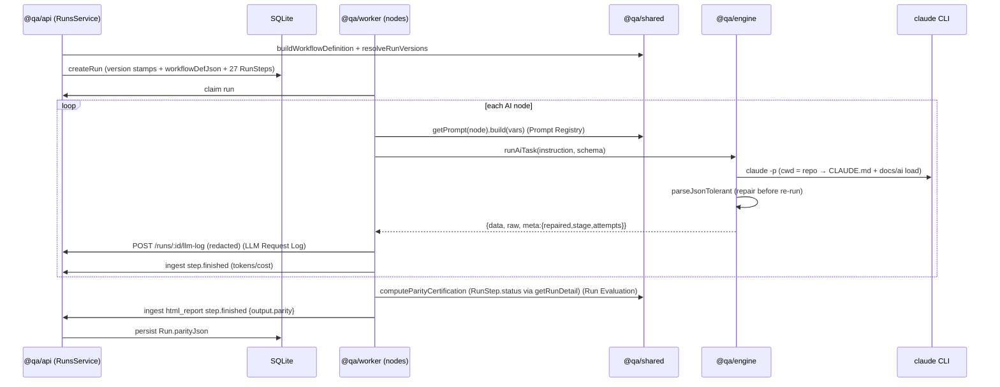
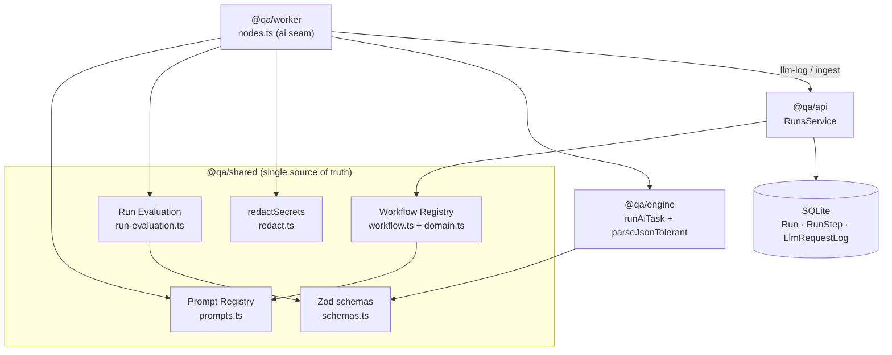

# Phase 1 Foundation — Prompt Registry · Workflow Registry · Run Evaluation · LLM Request Log

> Phase 1 hardens the platform foundation with iTestFlow-inspired engineering practices, **without changing the canonical 27-node workflow or Platform Parity**. Everything here is additive: prompts are byte-identical, all new schema fields are optional/nullable, no node or control-flow changed. Validation: [phase-reports/phase1-acceptance.md](./phase-reports/phase1-acceptance.md).

All four foundations live in **`@qa/shared`** so both the API (stamping/persisting) and the worker (execution) read one source of truth — deliberately avoiding worker↔API logic duplication.

---

## 1. Prompt Registry

**Where:** [`packages/shared/src/prompts.ts`](../../packages/shared/src/prompts.ts). **Single source of truth for every AI prompt.**

Each prompt is a versioned, owned, changelogged asset:

```ts
interface PromptDef<V> {
  key: string;            // == the lifecycle node it serves (invariant-locked in tests)
  name: string;
  version: string;        // semver — bump on any change to build/schemaName/schemaHint
  purpose: string;
  owner: string;
  changelog: { version; date; note }[];
  schemaName: string;     // name of the JSON object the model returns
  schemaHint: string;     // compact JSON shape example (must itself be valid JSON)
  build: (vars: V) => string;   // renders the instruction from runtime data
}
```

- **15 entries**, keyed by lifecycle node name: the 12 reasoning nodes plus the three that carry agentic sub-prompts (`figma_analysis`, `exploratory_testing`, `automation_generation` — mode-aware) and `execution`. **All prompt text now lives here**; nothing is inlined in `nodes.ts`.
- Mode-aware builds cover a node's variants byte-identically, e.g. `figma_analysis.build({mode:'frames'|'spec'})`, `exploratory_testing.build({mode:'plan'|'probe'})`, `automation_generation.build({mode:'plan'|'write'})`.
- `getPrompt(key)` returns the typed def; the worker's `aiOptsP()` helper sources instruction + schemaName + schemaHint from it.
- **`PROMPT_REGISTRY_VERSION`** — a deterministic FNV-1a hash of every `key@version`, stamped on each run (see Workflow Registry). Changes whenever any single prompt version bumps → adding/evolving a prompt needs no workflow change.
- Guard tests ([`prompts.test.mjs`](../../packages/shared/prompts.test.mjs)): metadata completeness, `schemaHint` is valid JSON, **golden byte-identical** builds, and the invariant *every key ∈ `LIFECYCLE_NODES`*.

**Extensibility:** add a `PromptDef`, register it under its node key — the aggregate version recomputes automatically; no consumer changes.

---

## 2. Workflow Registry & Versioning

**Where:** [`packages/shared/src/workflow.ts`](../../packages/shared/src/workflow.ts) + constants in [`domain.ts`](../../packages/shared/src/domain.ts).

A **declarative, versioned manifest** derived from the existing `LIFECYCLE_GRAPH` + `GATE_SOURCE` + `NODE_REQUIREMENTS`. It **describes and versions** the workflow — it does **not** drive execution (the runner still walks `LIFECYCLE_GRAPH`). Dynamic/registry-driven execution is intentionally deferred.

```ts
buildWorkflowDefinition(enabledNodes?) -> WorkflowDefinition {
  workflowVersion, promptVersion, platformVersion,
  nodeCount, enabledCount,
  requiredApprovals[],       // gate-type nodes
  requiredIntegrations[],    // jira | figma | browserstack | playwright
  requiredCredentials[],     // e.g. browserstack.username
  nodes: [{ name, type, label, enabled, requiresApproval, gateSource?, requiresCredentials[], requiresIntegrations[] }]
}
```

- `LIFECYCLE_VERSION` (bump when the graph changes) and `PLATFORM_VERSION` are the static inputs; `NODE_REQUIREMENTS` encodes per-node credential/integration needs (approvals are derived from `type==='gate'`).
- **`resolveRunVersions()`** bundles `{ workflow, prompt, platform, knowledge, framework }`. `knowledge`/`framework` are null placeholders today (filled by a later increment).
- **Stamping:** `RunsService.createRun` writes `workflowVersion`, `promptVersion`, `platformVersion`, `knowledgeVersion`, `frameworkVersion`, and a `workflowDefJson` snapshot onto the `Run` (all nullable → old runs unaffected). The HTML report footer shows the versions.

**Coexistence:** different phase selections produce distinct manifests; each run carries its own snapshot, so future workflow versions coexist with historical runs.

---

## 3. Run Evaluation Engine (Parity Certification)

**Where:** [`packages/shared/src/run-evaluation.ts`](../../packages/shared/src/run-evaluation.ts). **Pure, deterministic, side-effect-free.** The shared substrate that Phase 2's Review Confidence, Story Health, and Analytics reuse **without new inputs**.

```ts
computeParityCertification(input) -> ParityCertification {
  score, certification: 'certified'|'partial'|'not-certified',
  requiredCombos[], executedCombos[],
  missingWorkflowStages[], missingAcCoverage[], missingVisualCoverage[], missingAutomationCoverage[],
  acCoverageRate, comboCoverageRate, notes
}
```

- **Required combos** = `platformNeeds(platform) × locales` (e.g. `android · ar-EG`). **Executed** from the execution matrix/per-case combos.
- **Score** = weighted `AC-coverage (0.6) + combo-coverage (0.4)` — documented, tunable constants, never a black box.
- **Certification:** `certified` (score ≥ 90, no missing stages, no missing AC) · `partial` (≥ 60) · else `not-certified`.
- **Completed nodes come from authoritative `RunStep.status`** (execution truth): `html_report` fetches live run detail via `getRunDetail()` and derives completed nodes from steps with `status==='succeeded'` (falls back to state-key inference only if the fetch fails). AC coverage is measured from test-case citations (`sources` of kind `ac`); when no citations exist it is reported as *unmeasured*, never falsely *missing*.
- **Consumed:** computed in the `html_report` node, rendered in the report, and persisted to `Run.parityJson` by `RunsService.ingest` when the step returns a `parity` payload.

Tests: [`run-evaluation.test.mjs`](../../packages/shared/run-evaluation.test.mjs) (determinism, all dimensions, certification transitions).

---

## 4. LLM Request Log

**Where:** model in [`schema.prisma`](../../packages/db/prisma/schema.prisma) (`LlmRequestLog`); capture at the worker's `ai()` seam ([`nodes.ts`](../../apps/worker/src/nodes.ts)); route `POST /runs/:id/llm-log` → `RunsService.logLlmRequest`.

One row per AI call — the durable record behind Phase 2's Story Replay + AI Explainability, and the source of exact per-call token/cost:

```
prompt (redacted) · promptVersion · workflowVersion · model · schemaName ·
rawResponse · validatedOutput · status(ok|repaired|…) · repaired · repairStage ·
tokens · costUsd · durationMs · attempt · node · runId · runStepId
```

- **Every AI interaction is captured** — both schema-validated `ai()` calls (prompt version looked up from the registry by node name) and direct `runClaude()` calls (e.g. automation spec-writing, logged manually with the same node's prompt version).
- **Secret redaction** via [`redact.ts`](../../packages/shared/src/redact.ts) (`redactSecrets`) masks `password/otp/token/apikey/…: value` pairs and bounds length before storage. Local-first — values live only in the local DB.
- **Fire-and-forget:** an audit write can never fail a run; a down API drops the log silently by design (Story Replay tolerates gaps).
- **JSON repair diagnostics** (`repaired`, `repairStage`, `attempt`) come from `@qa/engine`'s `runAiTask`, which repairs common JSON defects ([`json.ts`](../../packages/engine/src/json.ts)) before ever re-invoking Claude.

**Powers (no further schema change):** Story Replay, AI Explainability, Cost Analytics (sum `costUsd`/`tokens` per run), and debugging.

---

## 5. Execution flow (how they connect at runtime)



## 6. Component relationships



- **Prompt Registry** feeds the worker's prompts and the Workflow Registry's `promptVersion`.
- **Workflow Registry** feeds `RunsService.createRun` version stamps.
- **Run Evaluation** consumes run outputs + authoritative `RunStep.status`; feeds `Run.parityJson` and the report; is the substrate for Phase 2 (Review Confidence, Story Health, Analytics).
- **LLM Request Log** captures at the worker `ai()` seam → API → DB; powers Phase 2 Replay/Explainability/Cost.

## Deferred (roadmap, not required before Phase 2)
- LLM Request Log retention/pruning policy.
- Typed parity event (replaces `ingest` output-shape sniffing).
- `knowledgeVersion` / `frameworkVersion` resolvers (currently null placeholders).
