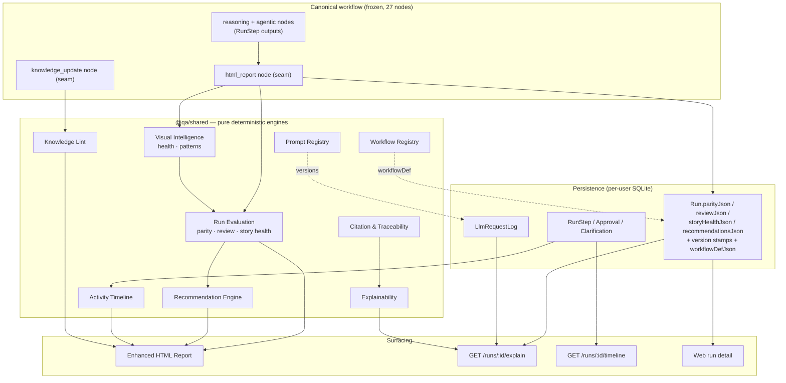
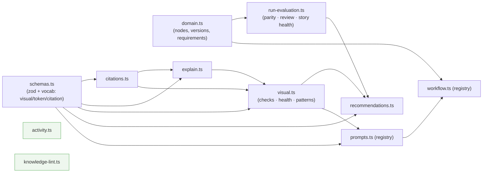

# Phase 2 — Validation & Architecture Review

> Formal closure review for **Phase 2 · Platform Intelligence** (M1–M8). Companion to the milestone log in [phase2-platform-intelligence.md](./phase2-platform-intelligence.md) and the locked decisions in [../../ARCHITECTURE.md](../../ARCHITECTURE.md). Prepared 2026-07-15.

---

## 1. Executive Summary

Phase 2 adds a **Platform Intelligence layer** on top of the Phase 1 foundation without altering the canonical product. Eight milestones deliver traceability, explainability, visual-design intelligence, story health, recommendations, an activity timeline, a consolidated report, and knowledge-governance linting.

The defining architectural achievement is **AI Reasoning Frugality** ([ADR-001](../../ARCHITECTURE.md#adr-001--ai-reasoning-frugality-one-reasoning-step--many-deterministic-capabilities)): every new capability is derived **deterministically** from outputs the canonical workflow already produces. The only new AI touchpoint introduced across all of Phase 2 is the M3 `visual_comparison` sub-capability (bounded, best-effort, off the critical path). Everything else — parity, review confidence, story health, recommendations, timeline, knowledge lint, report — is pure computation.

- **Frozen 27-node workflow:** unchanged. All intelligence runs inside the existing `html_report` and `knowledge_update` seams.
- **Platform Parity:** preserved and, in fact, measured by the platform itself (Parity Certification).
- **Tests:** 81 passing (0 failing); full monorepo build green including web.
- **Backward compatibility:** every new schema field is additive/optional or nullable; old runs validate and render unchanged.

**Verdict: Phase 2 Approved (see §15).**

---

## 2. Delivered Capabilities (M1–M8)

| Milestone | Capability | AI calls added | Determinism | Surfaced in |
|-----------|-----------|:--------------:|-------------|-------------|
| **M1** | Citation & Traceability (emit + resolve + render) | 0 (enriched existing prompts) | Resolver deterministic | Report chips, explain |
| **M2** | Explainability + Review Confidence | 0 | Fully deterministic | `explain()`, report, web panel |
| **M3** | Visual Testing Intelligence (11 categories, ~47 checks, AC+Figma) | **1 sub-capability** (`visual_comparison`, per frame, bounded) | Framework deterministic; detection is AI | Report, explain, web |
| **M3.5** | Design-System Awareness + Pattern Detection | 0 | Fully deterministic | Report, explain, web |
| **M4** | Story Health (6-dimension roll-up) | 0 | Fully deterministic | `Run.storyHealthJson`, explain, report, web |
| **M5** | Recommendation Engine (Layers 1+2) | 0 | Fully deterministic | `Run.recommendationsJson`, explain, report, web |
| **M6** | Activity Timeline | 0 | Fully deterministic | `timeline()`, report, web |
| **M7** | Enhanced HTML Reports (exec band, TOC, consolidation) | 0 | Fully deterministic | Report artifact |
| **M8** | Knowledge Lint (governance §6) | 0 | Fully deterministic | Report, node state |

---

## 3. Architecture Review

Phase 2 is implemented as a set of **pure engines in `@qa/shared`**, invoked from two existing worker seams, persisted on the `Run` row, and surfaced through the API and web. This layering is the source of its properties:

- **Pure engines** (`packages/shared/src/*.ts`) — no I/O, no AI, no framework coupling. Trivially unit-testable with `node --test`; deterministic by construction.
- **Composition at the seam** — the worker `html_report` node computes parity → review → visual health → story health → recommendations from one shared `RunEvaluationInput`, then persists. `knowledge_update` runs the lint. No graph node was added.
- **Persistence as the reuse substrate** — results land in nullable `Run.*Json` columns and the `LlmRequestLog`, so the API `explain()` / `timeline()` endpoints, the report, and (future) analytics all read the same persisted data with no recomputation and no new AI.
- **Separation of AI vs deterministic** — reasoning (schema-validated AI output) is cleanly separated from aggregation (pure engines around it). Review Confidence and Story Health are explicitly *not* model-estimated.

**Observed strengths:** single-responsibility engines; one evaluation input reused by three engines; consistent "compute in `html_report` → persist → surface" pattern; every artifact explainable and traceable.

**Observed weaknesses (tracked in §12):** knowledge-lint corpus is filesystem-best-effort rather than DB-backed; `knowledgeVersion`/`frameworkVersion` remain null placeholders; SQLite JSON columns are unindexed (matters for Phase 3 analytics); schema is applied via `db push` (no migration history).

---

## 4. Platform Intelligence — Architecture Overview

**Flow:** canonical nodes write `RunStep` outputs → `html_report` composes the deterministic engines from one evaluation input and persists snapshots → `explain()`/`timeline()`/report/web read persisted data. The Prompt Registry stamps the version that actually ran into the LLM Request Log; the Workflow Registry snapshots the executed definition onto the Run.

---

## 5. Engine Dependency Diagram

`activity.ts` and `knowledge-lint.ts` are **fully standalone** (no intra-package deps) — the cleanest possible modules. `run-evaluation.ts` is the substrate three capabilities share (parity, review, story health). No cycles.

---

## 6. AI Impact Summary

| Engine | New AI invocations | Token impact | Notes |
|--------|:------------------:|--------------|-------|
| Citation & Traceability | 0 | + small input on 4 existing prompts (directive) | M1 prompt version bumps |
| Explainability | 0 | 0 | Pure over persisted data |
| Review Confidence | 0 | 0 | Deterministic, not model-estimated |
| Visual Testing Intelligence | **1 sub-capability** | bounded by `QA_VISUAL_MAX_SCREENS` (default 12), best-effort | The only new AI touchpoint in Phase 2 |
| Story Health | 0 | 0 | Reuses parity + review + visual health |
| Recommendation Engine | 0 | 0 | Layers 1+2 only; Layer 3 (AI) designed, not built |
| Activity Timeline | 0 | 0 | Reads persisted steps |
| Enhanced Reports | 0 | 0 | String assembly |
| Knowledge Lint | 0 | 0 | Lexical over docs/ai |

**Net:** across eight milestones, exactly **one** new AI touchpoint (M3 visual comparison), bounded and off the critical path. Every other engine is deterministic. This is ADR-001 upheld in practice.

---

## 7. Performance Observations

- **Deterministic engines** are O(n) over small in-memory structures (findings, signals, steps, proposals) — sub-millisecond in practice; all run once, in `html_report`/`knowledge_update`, after the run's real work is done.
- **Visual comparison** is the only cost driver: one vision call per matched Figma frame↔screenshot pair, hard-capped by `QA_VISUAL_MAX_SCREENS` and wrapped best-effort so it never blocks or fails the report.
- **Knowledge Lint** is O(proposals × corpus) lexical (Jaccard); corpus reads are capped at ~2 KB/file. Negligible for realistic doc counts.
- **LLM Request Log** adds one fire-and-forget write per AI call (redacted); no synchronous cost on the run.
- **Report** is pure string building; the added timeline requires one extra `getRunDetail` read.
- **API read endpoints** (`explain`/`timeline`) run pure builders over already-loaded rows.

No performance regressions observed; the intelligence layer is effectively free relative to the AI reasoning the workflow already performs.

---

## 8. Backward Compatibility Assessment

- **Schema:** all new `Run` columns (`storyHealthJson`, `recommendationsJson`; Phase 1 `parityJson`/`reviewJson`) are **nullable**; `StepDetail` timing fields are optional. Old runs load and render without them.
- **Zod result schemas:** new fields (`sources`, visual `component`/`token`, widened enums) are optional/defaulted — a model omitting them still validates.
- **Prompts:** version bumps are additive (citation directive, design-system directive); baseline instructions preserved (golden tests assert this).
- **API:** new endpoints are additive; existing shapes gained optional fields (`storyHealth`, `recommendations` on `explain()`).
- **Report:** sections render only when their data is present; a run with no visual/knowledge data simply omits those sections.

**Assessment: fully backward compatible.** No breaking change to any persisted shape, API contract, or prompt behavior.

---

## 9. Platform Parity Assessment

- The **frozen 27-node workflow** is unchanged — no nodes added, removed, or reordered. All intelligence executes within existing seams.
- The canonical companion (`CLAUDE.md` + `docs/ai/**`) remains the source of truth; Phase 2 adds an orchestration/intelligence layer over it, never a redesign.
- Parity is now **self-measured**: `computeParityCertification` scores required vs executed platform×locale combos, AC coverage, visual coverage, and missing stages on every run.
- The M5 decision to compute recommendations in `html_report` (superseding the earlier "terminal AI node") was made **specifically to preserve** the frozen workflow.

**Assessment: Platform Parity fully preserved and now continuously certified.**

---

## 10. Test Coverage Summary

**81 tests passing, 0 failing** (`node --test` on compiled `dist`, zero-dependency).

| Suite | Tests | Focus |
|-------|:-----:|-------|
| engine/json | 13 | Tolerant JSON repair (Phase 1) |
| shared/prompts | 8 | Registry metadata, golden strings, invariant lock |
| shared/run-evaluation | 9 | Parity, **Story Health** (roll-up, applicability, defect weighting) |
| shared/citations | 7 | Resolve every kind, links, labels |
| shared/explain | 6 | Grouping, explicit reason, applicability |
| shared/visual | 9 | Checklist completeness, health, **patterns**, explain precision |
| shared/recommendations | 7 | Determinism, root-cause priority, grouping, no-AI |
| shared/activity | 6 | Ordering, durations, gates/clarifications, milestones, in-progress |
| shared/knowledge-lint | 8 | Placement, duplicate, conflict, quality, in-batch, fallback |
| scripts/phase1-validate | 7 | Live DB: versions + parity + LLM log |
| scripts/phase2-validate | 1 | Live end-to-end: explain + review + story health + recommendations + visual + timeline |

**Coverage character:** every deterministic engine is unit-tested for determinism and correctness; the live integration test exercises the full persist→explain→timeline path through the real API service + SQLite. The AI *detection quality* of visual comparison is explicitly out of headless scope (validated in live runs) — the deterministic framework around it is fully tested.

---

## 11. Extensibility Assessment

- **Recommendations Layer 3 (AI)** — the `Recommendation[]` shape + pipeline are the documented seam for a future AI recommender; it appends to the same array with its own AI Impact Statement. No rework.
- **Visual comparators** — pixelmatch / OCR / axe / cross-browser / theme append `VisualFinding`s to the same `VisualComparison`; health/patterns/explain consume them unchanged. Figma Variables populate the existing `DesignTokenRef` seam.
- **Story Health dimensions** — adding a dimension is one entry; weights are documented constants.
- **Report sections** — the `sectionDefs` registry means a new section is one array entry (auto-added to the TOC).
- **Explainability** — `ExplainArtifactKind` already reserves `recommendation`; new artifact kinds slot in.
- **Analytics (Phase 3)** — persisted per-run JSON snapshots are the ready-made data source; no new AI or schema needed to aggregate across runs.

**Assessment: strongly extensible** — the module boundaries anticipated the follow-on phases.

---

## 12. Remaining Technical Debt

| Item | Impact | Recommended phase |
|------|--------|-------------------|
| `knowledgeVersion` / `frameworkVersion` resolvers are null placeholders | Explainability shows `—` for these | Phase 3 |
| Knowledge-lint corpus is filesystem best-effort (path assumptions), not DB-backed | Corpus may be empty in some deployments → weaker duplicate detection | Phase 3 |
| `LlmRequestLog` has no retention/pruning | Table grows unbounded over time | Phase 3 |
| SQLite JSON columns unindexed | Fine per-run; matters when Phase 3 queries across runs | Phase 3 (analytics) |
| Schema applied via `db push` (no migration files) | Drift risk across testers' local DBs | Phase 3 |
| Story Health weights are equal/flat | Acceptable + documented; may want tuning | When data informs it |
| Report has no golden-snapshot test | Rendering regressions caught only by build | Low priority |

None of these block Phase 2 closure; all are additive follow-ons.

---

## 13. Risks

| Risk | Likelihood | Severity | Mitigation |
|------|:----------:|:--------:|-----------|
| Visual AI **detection quality/cost** in live runs | Medium | Medium | Bounded by `QA_VISUAL_MAX_SCREENS`; best-effort; deterministic framework tested; validate in live runs |
| Knowledge-corpus path coupling yields empty corpus | Medium | Low | Graceful degradation (placement/quality still run); move to DB-backed corpus in Phase 3 |
| Cross-run analytics on unindexed JSON (Phase 3) | Medium | Medium | Add indexes / a projection table in Phase 3 |
| `db push` schema drift across local DBs | Low | Medium | Adopt migrations before multi-tester scale-up |
| Report size growth (embedded screenshots + sections) | Low | Low | Sections render conditionally; screenshots already bounded |

No high-severity risks. The residual items are operational and land naturally in Phase 3.

---

## 14. Recommendations

1. **Phase 3 first:** add a lightweight analytics projection (indexed table or view) over the persisted `Run.*Json` snapshots — do not query raw JSON columns at scale.
2. Resolve `knowledgeVersion` / `frameworkVersion` so explainability version envelopes are complete.
3. Move the knowledge-lint corpus to a DB-backed source (`KnowledgeDoc` rows) for reliable duplicate/conflict detection, keeping the filesystem path as a fallback.
4. Introduce Prisma **migrations** before onboarding more testers; add `LlmRequestLog` retention.
5. Add a golden-snapshot test for the report HTML to lock rendering.
6. Keep enforcing the **AI Impact Statement** on every Phase 3 feature (ADR-001) — Phase 3 analytics should remain deterministic aggregation.

---

## 15. Final Verdict

**PHASE 2 APPROVED — cleared for closure.**

Phase 2 delivers the Platform Intelligence layer in full while upholding every non-negotiable principle: Platform Parity preserved, the 27-node workflow frozen, ADR-001 followed to the letter (one bounded new AI touchpoint across eight milestones), strong reuse of existing engines, and a modular/explainable/traceable/tested implementation (81/81 tests, full build green). Backward compatibility is complete. The remaining items are additive follow-ons appropriate for Phase 3, not defects.

Recommended status: **Phase 2 Approved (no changes required).** On sign-off, proceed to **Phase 3 — QA Analytics (incl. Team Insights)**, reusing the persisted per-run intelligence as its data source.
